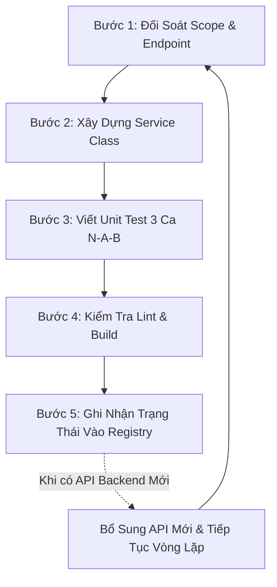

# SAGA — Quy Chuẩn Tích Hợp & Kiểm Soát API (API Integration Policy & Rule)

> ⚠️ **QUY ĐỊNH BẮT BUỘC CHO MỌI LẬP TRÌNH VIÊN & AI AGENT**:
> - Mọi thành viên trong nhóm phát triển (Dev 1, Dev 2, Dev 3) và bất kỳ AI Agent nào khi tham gia dự án **BẮT BUỘC PHẢI ĐỌC FILE NÀY TRƯỚC TIÊN**.
> - Trước khi bắt tay viết code gọi bất kỳ API nào, phải đối chiếu với tài liệu gốc [FE_API_GUIDE.md](file:///d:/Capstone/saga%20workspace/saga-fe/docs/FE_API_GUIDE.md) và sổ bộ 127 API chi tiết [API_INTEGRATION_REGISTRY.md](file:///d:/Capstone/saga%20workspace/saga-fe/docs/API_INTEGRATION_REGISTRY.md).
> - Sau khi hoàn thành tích hợp bất kỳ API nào, **BẮT BUỘC PHẢI CẬP NHẬT TRẠNG THÁI** vào tài liệu để bảo toàn ngữ cảnh xuyên suốt mọi phiên làm việc tiếp theo.

---

## 1. Vòng Lặp Vận Hành & Đối Soát Bắt Buộc (Perpetual Verification Loop)

Bất kể là lập trình viên nào hay AI Agent nào, quy trình gọi API phải tuân thủ nghiêm ngặt **Vòng lặp 5 bước**:

### Chi tiết từng bước:
1. **Bước 1 - Đối soát Scope & Endpoint**:
   - Tra cứu endpoint trong [FE_API_GUIDE.md](file:///d:/Capstone/saga%20workspace/saga-fe/docs/FE_API_GUIDE.md) và [API_INTEGRATION_REGISTRY.md](file:///d:/Capstone/saga%20workspace/saga-fe/docs/API_INTEGRATION_REGISTRY.md).
   - Xác định rõ API này đã có trên Backend chưa và do Dev nào phụ trách (Dev 1, Dev 2 hay Dev 3).
   - Tuyệt đối không gọi các API thuộc danh mục **Out-of-Scope (Mục 6)**.
2. **Bước 2 - Xây dựng Service Class**:
   - Viết API Service trong thư mục tương ứng: `src/features/<feature>/api/<service-name>.ts`.
   - Sử dụng duy nhất `apiClient` từ [axios.ts](file:///d:/Capstone/saga%20workspace/saga-fe/src/lib/axios.ts) (tự động gắn Redis Session Cookie `SAGA_SESSION` và CSRF token `X-XSRF-TOKEN`).
   - Tuyệt đối không dùng `fetch()` trực tiếp và không gửi JWT Bearer.
3. **Bước 3 - Viết Unit Test (Chuẩn FPT Decision Matrix)**:
   - Tạo file test tương ứng: `src/features/<feature>/api/<service-name>.spec.ts`.
   - Phân tích đủ 3 nhóm ca kiểm thử: `[N]` Normal, `[A]` Abnormal, `[B]` Boundary bằng helper `fptTest`.
   - Chạy `npm run test` đảm bảo 100% Passed.
4. **Bước 4 - Kiểm tra Lint & Build**:
   - Chạy `npm run lint` đạt **0 Error, 0 Warning**.
   - Chạy `npm run build` pass 100%.
5. **Bước 5 - Ghi nhận vào Master Registry**:
   - Cập nhật trạng thái từ `CHƯA TÍCH HỢP` thành `ĐÃ TÍCH HỢP` trong [API_INTEGRATION_REGISTRY.md](file:///d:/Capstone/saga%20workspace/saga-fe/docs/API_INTEGRATION_REGISTRY.md).

---

## 2. Bản Đồ Phân Chia Trách Nhiệm 3 Lập Trình Viên (Task Assignment)

Theo tài liệu [02-api-integration-task-assignment.md](file:///d:/Capstone/saga%20workspace/saga-fe/docs/02-api-integration-task-assignment.md), khối lượng công việc được phân chia cân bằng tải:

| Lập Trình Viên | Miền Nghiệp Vụ Phụ Trách | Nhánh Git Quy Chuẩn | Thư Mục Mã Nguồn |
| :--- | :--- | :--- | :--- |
| **Dev 1** | **HỌC THUẬT & MINH CHỨNG TASK** *(Subject, Syllabus, Semester, Classes, Courses, Roster & Task Evidence: web-links, files, work sessions)* | `feat/SAGA-43-admin-academic-and-task-evidence` | `src/features/admin/*` `src/features/student/sprint-progress/*` `src/app/(dashboard)/admin/*` |
| **Dev 2** | **LỚP HỌC, PHÂN NHÓM & TOÀN BỘ TRỌNG SỐ** *(Lecturer Courses, Roster active, Chia nhóm Excel, Trọng số lớp, Trọng số nhóm & Đánh giá đóng góp DEC-002)* | `feat/SAGA-44-lecturer-course-and-team-management` | `src/features/lecturer/*` `src/features/student/courses/*` `src/app/(dashboard)/lecturer/*` |
| **Dev 3** | **DỰ ÁN, TÍCH HỢP GH/JIRA & ĐỒNG BỘ** *(Dự án nhóm, Tích hợp GitHub App, Jira OAuth, OAuth Callbacks & Chiếu đồng bộ dữ liệu ngầm Projections)* | `feat/SAGA-45-project-and-tool-integrations` | `src/features/student/project/*` `src/features/integrations/*` `src/features/student/commits/*` |

---

## 3. Bản Đồ Chuỗi Định Danh (ID Chain Map)

Tất cả các Dev và Agent khi gọi API phải truyền đúng chuỗi UUID theo quan hệ phụ thuộc:

$$\text{subjectId} \xrightarrow{\text{Tạo/Publish}} \text{syllabusVersionId}$$
$$\text{semesterId} \xrightarrow{\text{Tạo}} \text{academicClassId}$$
$$\text{academicClassId} + \text{subjectId} + \text{syllabusVersionId} + \text{lecturerId} \xrightarrow{\text{Tạo}} \text{courseId}$$
$$\text{courseId} \xrightarrow{\text{Roster/Import}} \text{teamId}$$
$$\text{courseId} + \text{teamId (Chỉ Leader)} \xrightarrow{\text{Tạo}} \text{projectId}$$
$$\text{projectId} \xrightarrow{\text{Tích hợp}} \text{GitHub Repositories} + \text{Jira Project/Board} \xrightarrow{\text{Chiếu}} \text{Tasks \& Commits}$$

> ⚠️ **LƯU Ý CỐT LÕI**:
> - `lecturerId` trong API tạo Khóa học **bắt buộc là `lecturerProfileId`**, lấy từ `GET /api/admin/lecturers`. Tuyệt đối **không dùng `userId`**.
> - Vai trò sinh viên `myRole` (`LEADER` hoặc `MEMBER`) **bắt buộc lấy từ `GET /api/student/courses/{courseId}/team`**. Không có trong `GET /api/student/courses`.

---

## 4. Bảng Tổng Hợp Tiến Độ 127 API Hệ Thống (Master API Status Matrix)

> 📖 **Tra cứu chi tiết từng endpoint trong 127 API:** Xem tại [API_INTEGRATION_REGISTRY.md](file:///d:/Capstone/saga%20workspace/saga-fe/docs/API_INTEGRATION_REGISTRY.md).

| Phân Hệ Nghiệp Vụ | Tổng Số Endpoints | Phụ Trách | Service File / Component Chính Phía Frontend | Tình Trạng Tích Hợp |
| :--- | :---: | :---: | :--- | :---: |
| **1. Xác thực & Phiên làm việc (Auth)** | 11 | Core | [auth-service.ts](file:///d:/Capstone/saga%20workspace/saga-fe/src/features/auth/api/auth-service.ts) | ✅ **9/11 ĐÃ TÍCH HỢP** (2 API Re-auth Step-up thuộc hạ tầng BE) |
| **2. Hồ sơ cá nhân (User Profile)** | 2 | Dev 3 | [user-profile-service.ts](file:///d:/Capstone/saga%20workspace/saga-fe/src/features/profile/api/user-profile-service.ts) | ✅ **2/2 ĐÃ TÍCH HỢP** |
| **3. Quản trị viên (Admin Academic & Roster)** | 34 | Dev 1 | [subject-service.ts](file:///d:/Capstone/saga%20workspace/saga-fe/src/features/admin/subjects/api/subject-service.ts), [syllabus-service.ts](file:///d:/Capstone/saga%20workspace/saga-fe/src/features/admin/subjects/api/syllabus-service.ts), [academic-service.ts](file:///d:/Capstone/saga%20workspace/saga-fe/src/features/admin/academic/api/academic-service.ts), [course-service.ts](file:///d:/Capstone/saga%20workspace/saga-fe/src/features/admin/academic/api/course-service.ts), [roster-service.ts](file:///d:/Capstone/saga%20workspace/saga-fe/src/features/admin/academic/api/roster-service.ts), [admin-lecturer-service.ts](file:///d:/Capstone/saga%20workspace/saga-fe/src/features/admin/academic/api/admin-lecturer-service.ts) | ✅ **33/34 ĐÃ TÍCH HỢP** (1 API Dev email-test thuộc hạ tầng BE) |
| **4. Giảng viên & Tổ chức Nhóm (Courses, Teams & Weights)** | 18 | Dev 2 | [lecturer-course-service.ts](file:///d:/Capstone/saga%20workspace/saga-fe/src/features/lecturer/courses/api/lecturer-course-service.ts), [lecturer-team-service.ts](file:///d:/Capstone/saga%20workspace/saga-fe/src/features/lecturer/teams/api/lecturer-team-service.ts), [student-course-service.ts](file:///d:/Capstone/saga%20workspace/saga-fe/src/features/student/courses/api/student-course-service.ts), [lecturer-weights-service.ts](file:///d:/Capstone/saga%20workspace/saga-fe/src/features/lecturer/contribution/api/lecturer-weights-service.ts), [team-contribution-service.ts](file:///d:/Capstone/saga%20workspace/saga-fe/src/features/lecturer/contribution/api/team-contribution-service.ts) | ✅ **18/18 ĐÃ TÍCH HỢP** (Đã tích hợp API mới `GET .../progress`) |
| **5. Dự án & Tích hợp GitHub/Jira (Project & Integrations)** | 29 | Dev 3 + Dev 2 | [student-project-service.ts](file:///d:/Capstone/saga%20workspace/saga-fe/src/features/student/project/api/student-project-service.ts), [github-integrations-service.ts](file:///d:/Capstone/saga%20workspace/saga-fe/src/features/integrations/api/github-integrations-service.ts), [jira-integrations-service.ts](file:///d:/Capstone/saga%20workspace/saga-fe/src/features/integrations/api/jira-integrations-service.ts), [user-integrations-service.ts](file:///d:/Capstone/saga%20workspace/saga-fe/src/features/integrations/api/user-integrations-service.ts), [project-weights-service.ts](file:///d:/Capstone/saga%20workspace/saga-fe/src/features/lecturer/contribution/api/project-weights-service.ts) | ✅ **27/29 ĐÃ TÍCH HỢP** (2 API OAuth System Callback thuộc hạ tầng BE) |
| **6. Quản lý Jira Sprints (Sprint Lifecycle)** | 5 | Dev 3 | [project-sprint-service.ts](file:///d:/Capstone/saga%20workspace/saga-fe/src/features/student/sprint-progress/api/project-sprint-service.ts) | ✅ **5/5 ĐÃ TÍCH HỢP** |
| **7. Quản lý Jira Tasks & Kanban Board** | 10 | Dev 3 | [project-task-service.ts](file:///d:/Capstone/saga%20workspace/saga-fe/src/features/student/sprint-progress/api/project-task-service.ts), [project-projection-service.ts](file:///d:/Capstone/saga%20workspace/saga-fe/src/features/student/project/api/project-projection-service.ts) | ✅ **10/10 ĐÃ TÍCH HỢP** |
| **8. Chiếu Dữ Liệu, Tiến Độ & Realtime Stream** | 6 | Dev 3 | [project-projection-service.ts](file:///d:/Capstone/saga%20workspace/saga-fe/src/features/student/project/api/project-projection-service.ts), [use-project-realtime.ts](file:///d:/Capstone/saga%20workspace/saga-fe/src/features/student/project/hooks/use-project-realtime.ts) | ✅ **6/6 ĐÃ TÍCH HỢP** |
| **9. Thu thập Chứng cứ Phiên làm việc (Task Evidence)** | 10 | Dev 1 | [task-evidence-service.ts](file:///d:/Capstone/saga%20workspace/saga-fe/src/features/student/sprint-progress/api/task-evidence-service.ts) | ✅ **10/10 ĐÃ TÍCH HỢP** |
| **10. Hạ Tầng Webhooks Nhà Cung Cấp (Provider Webhooks)** | 2 | Core | `Backend Ingestion Controller` | ⚙️ **2/2 HẠ TẦNG BE** (GitHub & Jira Webhooks) |
| **TỔNG CỘNG TOÀN HỆ THỐNG** | **127** | **Core + 3 Devs** | **Đầy đủ Service Classes + Unit Test Specs** | ✅ **120/127 ĐÃ TÍCH HỢP PHÍA FE** (7/127 API Hạ tầng Webhooks/Callbacks/Re-auth phía BE) |

---

## 5. Quy Chuẩn Kỹ Thuật Khi Gọi API (Technical Standards)

### 5.1. Cấu Trúc Axios & Session
- Mọi service bắt buộc import: `import { apiClient } from "@/lib/axios";`
- Không sử dụng `fetch()` gốc hay Axios instance riêng lẻ.
- Cơ chế xác thực: `SAGA_SESSION` Cookie (Redis Session), `withCredentials: true`.
- Thao tác thay đổi dữ liệu (`POST`, `PUT`, `PATCH`, `DELETE`) tự động đính kèm `X-XSRF-TOKEN`.
- Tuyệt đối không tự ý thêm header `Authorization: Bearer <token>`.

### 5.2. Chuẩn Hóa Bắt Lỗi (Error Envelope Handling)
- Backend trả lỗi dưới dạng `{ "code": "STRING_ERROR_CODE", "message": "Human readable message" }`.
- Phía Frontend bắt buộc kiểm tra trường **`error.response?.data?.code`** để hiển thị thông báo tương ứng.

### 5.3. Lưu Ý Xung Đột Dữ Liệu Tích Hợp Jira (Constraint uk_jira_cloud_project)
- Khi gọi `PUT /api/projects/{projectId}/integrations/jira`, nếu server trả về mã lỗi HTTP 500 kèm payload Spring Boot mặc định:
  Nguyên nhân là do Jira Project đó đã được liên kết với một Dự án khác trong database (`UNIQUE KEY uk_jira_cloud_project (cloud_id, jira_project_id)`), dẫn đến `DataIntegrityViolationException` chưa được bọc try-catch phía backend. Lập trình viên và kiểm thử viên cần chọn Jira Project độc lập chưa từng được gán cho nhóm khác.

---

## 6. Danh Mục Tính Năng Tuyệt Đối Không Được Gọi (Out-of-Scope Guardrails)

> 🚫 **CẢNH BÁO CHO MỌI DEV & AGENT**:
> Các trường hợp dưới đây thuộc hạ tầng Backend hoặc ngoài phạm vi gọi trực tiếp của Frontend client:
> 1. **Chỉnh sửa / Xóa Project** (`PATCH` hoặc `DELETE /api/student/courses/{id}/project` - Backend chưa cung cấp).
> 2. **Provider Webhook endpoints** (`/api/webhooks/github`, `/api/webhooks/jira` - là endpoint tiếp nhận ngầm sự kiện từ Atlassian/GitHub webhook, client không gọi).
> 3. **Provider OAuth System Callbacks** (`/api/integrations/github/setup/callback`, `/api/integrations/jira/team/callback` - do máy chủ Backend xử lý chuyển hướng trực tiếp từ Provider).
> 4. **Step-up Re-auth** (`/api/auth/reauth/*` - chức năng Sudo mode dự phòng của Backend).
> 5. **Dev Smoke Test Email** (`/api/admin/dev/email-test` - kiểm thử nội bộ Backend).
> 6. **Neo4j Graph Snapshot / Delta API** (Đang tính toán ở phân hệ Graph Engine tiếp theo).
> 7. **Assessment Scoring tự động** (Đang thiết kế ở pha đánh giá đồ án cuối kỳ).
