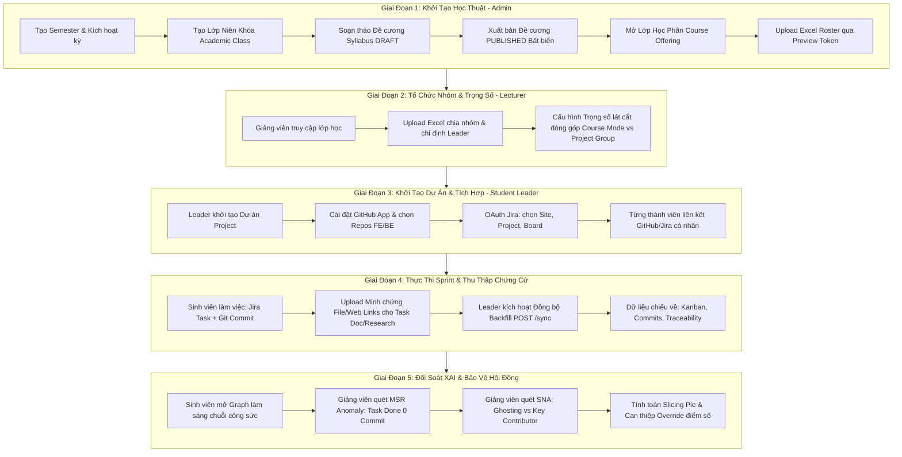

# Kiến Trúc Tổng Thể, Luồng Nghiệp Vụ Cốt Lõi & Case Study Đồ Án Tốt Nghiệp SAGA

Tài liệu này tổng hợp toàn bộ **Bản đồ nghiệp vụ xuyên suốt (End-to-End Main Flow)** và **Tình huống thực chiến (Case Study chuẩn mực)** của hệ thống **SAGA (Student Achievement & Governance Analytics)**. Đây là tài liệu cốt lõi giúp nhóm tự tin nắm chắc logic hệ thống và trình bày thuyết phục trước Hội đồng Đồ án Tốt nghiệp (Capstone Defense).

---

## 1. Bối Cảnh Thực Tế & Triết Lý Giải Pháp (The Problem & The Hook)

### 🚨 Nỗi Đau Lớn Nhất Trong Các Đồ Án Tốt Nghiệp CNTT (FPT University):
1. **Vấn nạn "Free-rider" (Ký sinh đồ án)**: Trong nhóm 4–5 sinh viên, luôn có nguy cơ 1–2 thành viên lười biếng, ỷ lại nhưng cuối kỳ vẫn nhận điểm ngang bằng với người gánh team.
2. **"Báo cáo khống" trên Jira**: Sinh viên kéo các thẻ công việc sang `DONE` vào đêm trước buổi bảo vệ Sprint mà thực chất không hề có dòng mã nguồn, bài kiểm thử hay tài liệu thực tế nào được bàn giao.
3. **Giảng viên bị quá tải giám sát**: Một giảng viên phụ trách 5–10 nhóm với hàng trăm commits và hàng nghìn đầu việc, không thể đủ thời gian đọc từng dòng Git commit để phân định công sức ai làm nhiều ai làm ít.
4. **Xung đột nội bộ khi chấm điểm chéo (Peer Review cảm tính)**: Sinh viên chấm điểm cho nhau dựa trên mức độ thân thiết thay vì dựa trên minh chứng năng lực thực tế.

### 💡 Triết Lý Giải Pháp Của SAGA: "Minh Bạch Dựa Trên Dữ Liệu (Data-Driven Transparency)"
Hệ thống SAGA không dựa vào lời khai báo của sinh viên, mà tự động thu thập và đối soát **Minh chứng kỹ thuật thực tế (Empirical Evidence)** từ:
- **Jira Software**: Sprint, Epic, User Story, Task, Trạng thái bàn giao.
- **GitHub**: Commit log, Thay đổi dòng code ($+/-$), Pull Request reviews, Tần suất push.
- **Đồ thị Tri thức Neo4j & Cytoscape.js**: Nối chuỗi minh chứng bất biến:
  $$\text{(:Student)} \xrightarrow{\text{[:ASSIGNED\_TO]}} \text{(:JiraTask)} \xleftarrow{\text{[:IMPLEMENTS]}} \text{(:Commit)}$$
- **Mô hình Cổ phần Động Slicing Pie (DEC-002)**: Đánh giá tỷ lệ phần trăm đóng góp công bằng theo trọng số công việc (Code, Test, Doc, Research).

---

## 2. Bản Đồ 5 Giai Đoạn Vận Hành Cốt Lõi (End-to-End Main Flow)

Toàn bộ vòng đời của hệ thống SAGA từ lúc bắt đầu học kỳ đến khi sinh viên bảo vệ trước hội đồng trải qua 5 giai đoạn liên tục:



---

### Chi Tiết Từng Giai Đoạn:

#### 🔹 Giai đoạn 1: Thiết lập nền tảng học thuật (Admin Academic Setup)
1. **Quản trị Học kỳ & Lớp niên khóa**: Admin tạo học kỳ (ví dụ `FA26`) và kích hoạt làm kỳ mặc định toàn hệ thống. Tạo lớp sinh viên niên khóa (`SE1705`).
2. **Đề cương chuẩn FLM (Syllabus Immutability)**:
   - Soạn đề cương môn học (`SWP391`) ở trạng thái `DRAFT`: Cấu hình Milestones, Deliverables, trọng số tiêu chí (tổng đúng 100%) và CLO mappings.
   - Bấm **"Xuất bản chính thức (PUBLISHED)"**: Đề cương bị **khóa bất biến (Immutable)** để bảo toàn tính toàn vẹn dữ liệu đánh giá của sinh viên.
3. **Mở lớp học phần & Import sinh viên**:
   - Admin tạo Course liên kết: `SE1705` + `SWP391` + `Syllabus PUBLISHED` + `Lecturer Profile ID`.
   - Tải file Excel mẫu Roster ➔ Upload xem trước lỗi qua `previewToken` ➔ Xác nhận Import danh sách sinh viên vào lớp.

#### 🔹 Giai đoạn 2: Phân nhóm đồ án & Cấu hình trọng số (Lecturer Team & Weights)
1. **Phân nhóm bằng Excel chuyên dụng**: Giảng viên tải template chia nhóm ➔ Upload xem trước danh sách nhóm, đề tài, Leader ➔ Xác nhận tạo nhóm đồng loạt.
2. **Điều phối linh hoạt**: Giảng viên có quyền chỉ định Trưởng nhóm mới (`PUT .../leader`) hoặc chuyển thành viên sang nhóm khác (`PATCH .../team`).
3. **Cấu hình Trọng số đóng góp (Slicing Pie Weights)**:
   - Giảng viên chọn chế độ `COURSE` (áp dụng chung 1 bộ trọng số Code/Test/Doc cho cả lớp) hoặc `PROJECT_GROUP` (cho phép từng nhóm cấu hình trọng số riêng phù hợp với đặc thù đề tài).

#### 🔹 Giai đoạn 3: Khởi tạo dự án & Tích hợp công cụ (Project Setup & Integrations Hub)
1. **Xác thực quyền Leader**: Hệ thống đọc `myRole` từ `GET /api/student/courses/{courseId}/team`. Chỉ tài khoản `LEADER` mới nhìn thấy nút "Khởi tạo Dự Án" (Member chỉ thấy thông báo chờ).
2. **Tích hợp GitHub Workspace**:
   - Leader khởi tạo kết nối GitHub App ➔ Cài đặt App vào Organization nhóm.
   - Chọn các Repository liên quan và gán nhãn: Repo nào là `FRONTEND`, Repo nào là `BACKEND`.
3. **Tích hợp Jira Software Workspace**:
   - Leader kết nối OAuth Jira ➔ Chọn Atlassian Cloud Site ➔ Chọn Jira Project ➔ Chọn Board Scrum/Kanban.
4. **Nhận diện danh tính cá nhân (Identity Mapping)**:
   - Mỗi sinh viên tự vào mục Hồ sơ cá nhân (`/integrations/me`), bấm liên kết tài khoản GitHub và Jira của mình để hệ thống map chính xác `authorExternalId` với `studentId`.

#### 🔹 Giai đoạn 4: Vận hành Sprint, Đồng bộ chiếu & Thu thập chứng cứ (Evidence Collection)
1. **Quy ước Commit chuẩn**: Sinh viên commit mã nguồn kèm mã Jira Task: `feat: [FE][SAGA-15] Xay dung UI Traceability Graph`.
2. **Thu thập chứng cứ đối với Task phi kỹ thuật (Non-code Tasks)**:
   - Với các đầu việc tài liệu (SRS, Architecture Design) hoặc khảo sát (Research/User Testing): Sinh viên sử dụng tính năng **Task Evidence** để đính kèm link web (`POST /api/tasks/{taskId}/web-links`) hoặc upload file tài liệu/ảnh minh chứng (`POST /api/tasks/{taskId}/files`).
3. **Kích hoạt đồng bộ chiếu ngầm (Sync Backfill)**:
   - Leader bấm nút "Đồng bộ dữ liệu" (`POST /api/projects/{projectId}/sync`).
   - Backend đưa vào hàng đợi xử lý ngầm và chiếu dữ liệu về: Bảng Kanban Jira tasks, Nhật ký Git commits và Cặp liên kết Task - Commit.

#### 🔹 Giai đoạn 5: Đối soát XAI, Đánh giá công bằng & Bảo vệ đồ án (Evaluation & Defense)
1. **Sinh viên chứng minh năng lực**: Mở màn hình đồ thị `/student/graph`, chọn tên mình ➔ Toàn bộ mạng lưới công việc sáng bừng minh chứng trực quan.
2. **Giảng viên phát hiện bất thường tự động**: Mở `/lecturer/courses/[id]/graph` để đồ thị XAI cảnh báo MSR Anomaly và Ghosting Anomaly.
3. **Chốt điểm số Slicing Pie**: Bảng đánh giá tự động tính toán tỷ lệ đóng góp của từng thành viên. Giảng viên xem xét và ghi đè điểm số cuối cùng nếu có trường hợp đặc biệt.

---

## 3. Case Study Thực Chiến: Đồ Án "SAGA Platform" (Nhóm 5 - Lớp SWP391)

Để minh họa sống động cho Hội đồng Đồ án, dưới đây là kịch bản Case Study mô phỏng một nhóm sinh viên gồm 4 thành viên với 4 kịch bản đóng góp điển hình:

```text
┌──────────────────────────────────────────────────────────────────────────────────┐
│                   CASE STUDY NHÓM 5: ĐỒ ÁN SAGA PLATFORM                         │
├──────────────────┬─────────────────┬───────────────────┬─────────────────────────┤
│ 👤 Thành viên A  │ 👤 Thành viên B │ 👤 Thành viên C   │ 👤 Thành viên D         │
│ (Trưởng nhóm)    │ (Frontend Dev)  │ (QA / Tester)     │ (Ký sinh Free-rider)   │
│ Code chính & Lead│ UI & Components │ Viết Test & Doc   │ Báo cáo khống trên Jira │
└──────────────────┴─────────────────┴───────────────────┴─────────────────────────┘
```

### 👤 1. Thành viên A (Team Leader — Nguyễn Văn An):
- **Hành vi thực tế**:
  - Tạo dự án, kết nối GitHub & Jira, phân chia nhiệm vụ cho cả nhóm.
  - Hoàn thành 14 Jira Tasks, thực hiện 52 Commits, đóng góp $+3,400 / -450$ dòng code, review 21 Pull Requests cho các bạn khác.
- **Minh chứng trên hệ thống SAGA**:
  - Đồ thị Cytoscape: Đỉnh của An có mật độ liên kết dày đặc nhất.
  - Thuật toán SNA: **Hệ số Trung tâm Bậc (Degree Centrality) = 0.94** ➔ Được hệ thống tự động gắn huy hiệu **`Key Contributor` (Nòng cốt gánh team)**.
  - Tỷ lệ cổ phần Slicing Pie dự kiến: **38.5%**.

### 👤 2. Thành viên B (Frontend Developer — Trần Thị Bình):
- **Hành vi thực tế**:
  - Nhận 8 Jira Tasks về giao diện người dùng.
  - Thực hiện 28 Commits, đính kèm liên kết Figma Design vào Task Evidence.
- **Minh chứng trên hệ thống SAGA**:
  - 100% các Jira Tasks chuyển sang `DONE` đều có ít nhất 2–4 Git Commits gắn kèm qua mã `SAGA-xx`.
  - Không có bất kỳ cảnh báo bất thường nào.
  - Tỷ lệ cổ phần Slicing Pie dự kiến: **28.0%**.

### 👤 3. Thành viên C (QA & Documentation — Lê Hoàng Cường):
- **Hành vi thực tế**:
  - Nhận 5 Tasks về Kịch bản kiểm thử (Test Cases) và Tài liệu đặc tả yêu cầu (SRS).
  - Vì không trực tiếp code nhiều, Cường chỉ có 6 commits cập nhật Markdown.
- **Minh chứng trên hệ thống SAGA**:
  - Cường upload file Excel kiểm thử `Test_Matrix_v2.xlsx` và file PDF `SRS_Signoff.pdf` trực tiếp vào hệ thống qua API Task Evidence (`POST .../files`).
  - Hệ thống tính trọng số đóng góp ở lát cắt **DOCUMENT & TEST**, ghi nhận đầy đủ công sức mà không bị đánh giá thấp như các hệ thống đếm dòng code truyền thống.
  - Tỷ lệ cổ phần Slicing Pie dự kiến: **21.5%**.

### 🚨 4. Thành viên D (Free-rider / Gian lận — Phạm Văn Dũng):
- **Hành vi thực tế**:
  - Nhận 3 Jira Tasks: `SAGA-28` (Tối ưu cơ sở dữ liệu), `SAGA-32` (Viết Unit Test bảo mật), `SAGA-35` (Tích hợp Cache Redis).
  - Trước buổi bảo vệ Sprint 2 ngày, Dũng âm thầm lên Jira kéo cả 3 tasks sang trạng thái `DONE`.
  - Trong suốt Sprint, Dũng không tham gia review PR nào, không bình luận trao đổi, và không push bất kỳ commit nào lên GitHub.
- **Hệ thống SAGA bóc trần gian lận tự động**:
  1. **Bắt lỗi Báo cáo khống (MSR Anomaly Alert)**:
     - Trên đồ thị Cytoscape, 3 đỉnh Task `SAGA-28`, `SAGA-32`, `SAGA-35` có trạng thái `DONE` nhưng có **0 commits linked** (không có bất kỳ cạnh `[:IMPLEMENTS]` nào trỏ về).
     - Hệ thống tự động đổi màu đỉnh thành **Đỏ cam**, viền nhấp nháy đỏ (`animate-pulse`) và gắn cờ cảnh báo nghi vấn báo cáo khống.
  2. **Bắt lỗi Mất tương tác (Ghosting Anomaly Alert)**:
     - Trên ma trận SNA, số lượt PR Review và Comment của Dũng bằng 0 ➔ **Degree Centrality $\approx 0$**.
     - Hệ thống gắn nhãn cảnh báo đỏ: `Ghosting Member Detected`.
  3. **Xử lý công minh**:
     - Slicing Pie tự động tính toán mức đóng góp của Dũng chỉ đạt **12.0%** (do không có bằng chứng mã nguồn).
     - Giảng viên mở giao diện `/lecturer/courses/[id]/graph`, bấm vào nút can thiệp điểm số (`POST /api/teams/{teamId}/contribution-override`), hạ điểm đồ án của Dũng và giữ trọn điểm cao xứng đáng cho An, Bình và Cường!

---

## 4. Kịch Bản Trình Bày Demo Trước Hội Đồng (10 – 12 Phút)

Khi trình bày trước các Thầy/Cô Hội đồng, nhóm thực hiện theo kịch bản 4 bước chuẩn xác:

| Thời Lượng | Nội Dung Trình Bày | Thao Tác Trực Tiếp Trên Giao Diện (Screen Action) |
| :--- | :--- | :--- |
| **Phút 1 – 2** | **Đặt vấn đề & Giới thiệu SAGA** | Chiếu slide vấn nạn Free-rider và Báo cáo khống. Nêu tuyên ngôn giải pháp minh chứng thực tế từ Jira & GitHub. |
| **Phút 3 – 5** | **Góc nhìn Sinh viên (Minh chứng công sức)** | - Đăng nhập tài khoản Sinh viên An.<br>- Vào `/student/graph`, rê chuột vào tên An ➔ Hiển thị hiệu ứng **Neighborhood Dimming** làm sáng chuỗi `An ➔ JiraTask ➔ Commit`.<br>- Mở bảng Ma trận đối soát (Traceability Matrix Table) chỉ rõ từng commit hash, số dòng code $+/-$. |
| **Phút 6 – 9** | **Góc nhìn Giảng viên (Phát hiện gian lận XAI & SNA)** | - Đăng nhập tài khoản Giảng viên ➔ Mở `/lecturer/courses/[id]/graph`.<br>- **Demo MSR Anomaly**: Chỉ vào Task của Dũng đang nhấp nháy đỏ vì "Done nhưng 0 commit linked".<br>- **Demo SNA Matrix**: Mở đồ thị phân tích mạng xã hội, chỉ ra Dũng bị cô lập ở góc ngoài (Degree Centrality = 0) đối lập với An ở vị trí trung tâm (**Key Contributor**).<br>- Mở bảng Slicing Pie và thực hiện thao tác **Override điểm số** trực tiếp. |
| **Phút 10 – 12**| **Kiến trúc Kỹ thuật & Q&A** | - Tóm tắt kiến trúc: Next.js 16 + Spring Boot + Polyglot (PostgreSQL, Neo4j AuraDB, Redis, MongoDB).<br>- Mời Thầy/Cô Hội đồng đặt câu hỏi phản biện. |
