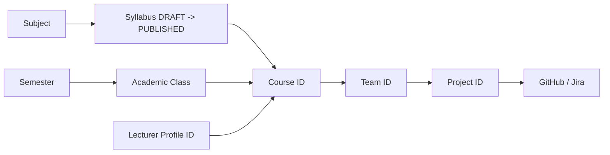

# SAGA Frontend API Integration Guide (Hướng Dẫn Tích Hợp API Chuẩn Chỉnh)

Tài liệu quy chuẩn ngắn gọn, chuẩn xác dành cho lập trình viên Frontend (FE) để tích hợp toàn bộ API của hệ thống SAGA từ đầu đến cuối.

> 📌 **Kế hoạch phân chia công việc cho 3 Devs:** Xem chi tiết tại [02-api-integration-task-assignment.md](file:///d:/Capstone/saga%20workspace/saga-fe/docs/02-api-integration-task-assignment.md).
> 📋 **Sổ bộ đăng ký & Đối soát trạng thái API (Live Registry):** Xem tại [.agents/rules/api-integration-registry.md](file:///d:/Capstone/saga%20workspace/saga-fe/.agents/rules/api-integration-registry.md). Mọi Dev và AI Agent bắt buộc phải đọc và cập nhật trạng thái tại đây sau mỗi lần gọi API.

---

## 1. Nguyên Tắc Cốt Lõi & Quy Chuẩn Request

### 1.1. Session & Xác thực (Không dùng JWT Bearer)
- Hệ thống sử dụng **Session Cookie Redis** (tên cookie: `SAGA_SESSION`).
- Mọi request từ Frontend **BẮT BUỘC** phải có cấu hình `credentials: "include"`.
- **KHÔNG GỬI** header `Authorization: Bearer <token>` (Backend không phát hành JWT Bearer).
- Vai trò người dùng (`role`) do Backend quản lý trong Session. **KHÔNG** tự ý gửi field `role` trong payload request.

### 1.2. Bảo vệ CSRF (Bắt buộc cho các thao tác ghi)
- Mọi request thay đổi dữ liệu (`POST`, `PUT`, `PATCH`, `DELETE`) **bắt buộc** phải đính kèm Header:
  ```http
  X-XSRF-TOKEN: <opaque-csrf-token>
  ```
- Lấy token này từ API `GET /api/auth/csrf` lúc khởi động ứng dụng hoặc đọc từ cookie `XSRF-TOKEN`.

### 1.3. Content-Type
- **JSON Request:** `Content-Type: application/json`
- **File Upload (Excel Roster/Team):** `multipart/form-data` với tên form-data field chính xác là **`file`**.
- **File Download (Template):** Nhận blob `application/vnd.openxmlformats-officedocument.spreadsheetml.sheet`.

### 1.4. Cấu trúc phản hồi lỗi chuẩn (Error Envelope)
Tất cả các lỗi nghiệp vụ đều trả về dạng JSON:
```json
{
  "code": "INVALID_CREDENTIALS",
  "message": "Authentication failed."
}
```
> FE phải parse trường **`code`** để hiển thị thông báo/điều hướng phù hợp, không phân tích chuỗi `message`.

---

## 2. Bản Đồ Chuỗi ID & Quan Hệ Dữ Liệu (ID Chains)

Để gọi API chính xác, FE cần lưu trữ và truyền đúng các chuỗi định danh (UUID) theo luồng:



- `subjectId` -> Tạo/Publish `syllabusVersionId`
- `semesterId` -> Tạo `academicClassId`
- `academicClassId` + `subjectId` + `syllabusVersionId` + `lecturerId` -> `courseId`
- `courseId` -> Roster sinh viên -> Phân nhóm `teamId`
- `courseId` + `teamId` (Chỉ Leader) -> `projectId`
- `projectId` -> Kết nối `github` và `jira`

---

## 3. State Machine Điều Hướng Cho Giao Diện Sinh Viên (Student Flow)

Giao diện sinh viên được điều hướng động dựa trên trạng thái dữ liệu thực tế từ Backend:

| FE State | Điều kiện nhận biết | Hành vi & Nút bấm hiển thị | Endpoint gọi tiếp theo |
| :--- | :--- | :--- | :--- |
| **`NO_ACTIVE_COURSES`** | `GET /api/student/courses` trả về mảng rỗng `[]` | Thông báo: "Chưa có môn học nào đang mở". Chờ Admin ghi danh. | Poll lại `GET /api/student/courses` |
| **`ACTIVE_COURSE_NO_TEAM`** | Môn học đang chọn có `teamId == null` | Thông báo: "Đang chờ Giảng viên phân nhóm". | Không gọi POST Project (nếu gọi `.../team` sẽ bị `404`). |
| **`TEAM_NO_PROJECT` (Leader)** | `teamId != null && projectId == null` và `GET .../team` trả về `myRole == "LEADER"` | **Hiển thị nút "Tạo Dự Án"** | `GET /api/student/project-types` rồi `POST /api/student/courses/{courseId}/project` |
| **`TEAM_NO_PROJECT` (Member)** | `teamId != null && projectId == null` và `myRole == "MEMBER"` | Thông báo: "Đang chờ Trưởng nhóm khởi tạo dự án". | `GET .../project` sẽ trả về `404` cho đến khi Leader tạo xong. |
| **`PROJECT_NO_GITHUB`** | `projectId != null` và `summary.github == null` | Leader: **Nút "Kết nối GitHub"**<br>Member: Thông báo "Chưa kết nối GitHub" | `POST /api/projects/{projectId}/integrations/github/connect` |
| **`PROJECT_GITHUB_NO_REPOS`** | `summary.github != null` nhưng danh sách `repositories` rỗng | Leader: **Nút "Chọn Repositories"** | `GET .../github/repositories` sau đó `PUT .../github/repositories` |
| **`PROJECT_NO_JIRA`** | `summary.github.status == "ACTIVE"` nhưng `summary.jira == null` | Leader: **Nút "Kết nối Jira"**<br>Member: Thông báo "Chưa kết nối Jira" | `POST .../jira/connect` (hoặc `POST /api/integrations/jira/link` cho tài khoản cá nhân trước) |
| **`PROJECT_FULLY_CONFIGURED`** | Cả `github.status` và `jira.status` đều là `"ACTIVE"` | Hiển thị Dashboard & Summary tích hợp hoàn tất | `GET /api/projects/{projectId}/integrations` để theo dõi trạng thái |

> **Lưu ý quan trọng:** `myRole` không nằm ở `GET /api/student/courses`. FE bắt buộc lấy `myRole` từ `GET /api/student/courses/{courseId}/team`.

---

## 4. Danh Mục API Chi Tiết Theo Phân Hệ

### 4.1. Phân Hệ Xác Thực & Phiên Làm Việc (Authentication)

#### 1. Lấy CSRF Token
- **Endpoint:** `GET /api/auth/csrf`
- **Quyền:** Mọi người dùng (Public)
- **Response (200):**
  ```json
  {
    "parameterName": "_csrf",
    "headerName": "X-XSRF-TOKEN",
    "token": "token-value-abc"
  }
  ```

#### 2. Kiểm tra phiên đăng nhập hiện tại
- **Endpoint:** `GET /api/auth/me`
- **Response (200):**
  ```json
  {
    "authenticated": true,
    "user": {
      "id": "uuid",
      "email": "student@fpt.edu.vn",
      "fullName": "Nguyen Van A",
      "role": "STUDENT"
    },
    "passwordSetupRequired": false
  }
  ```

#### 3. Đăng nhập mật khẩu cục bộ (Local Login)
- **Endpoint:** `POST /api/auth/login`
- **Request Body:**
  ```json
  {
    "identifier": "admin",
    "password": "mypassword"
  }
  ```
- **Response (200):** Tương tự cấu trúc `GET /api/auth/me`.

#### 4. Đăng ký tài khoản Sinh viên (Public Register)
- **Endpoint:** `POST /api/auth/register`
- **Quy tắc:** Chỉ chấp nhận email cá nhân (Gmail, Outlook,...), **không** chấp nhận email tổ chức FPT.
- **Request Body:**
  ```json
  {
    "email": "student.personal@gmail.com",
    "fullName": "Tran Van B",
    "studentCode": "SE170001",
    "password": "securePassword123",
    "confirmPassword": "securePassword123"
  }
  ```
- **Response (201):** `{ "registered": true, "user": { ... } }`

#### 5. Đăng nhập Google (Dành cho Sinh viên/Giảng viên FPT)
- **Cơ chế:** Điều hướng trực tiếp trình duyệt đến:
  ```http
  GET /oauth2/authorization/google
  ```
- Sau khi xác thực xong, Backend redirect về `/` hoặc trang chỉ định. Nếu là lần đầu đăng nhập tài khoản FPT, gọi tiếp `GET /api/auth/me` sẽ thấy `passwordSetupRequired: true`.

#### 6. Thiết lập mật khẩu lần đầu (Sau khi login Google)
- **Endpoint:** `POST /api/auth/password/setup`
- **Request Body:**
  ```json
  {
    "newPassword": "myNewPassword123",
    "confirmPassword": "myNewPassword123"
  }
  ```
- **Response (200):** Session được mở khóa đầy đủ quyền truy cập.

#### 7. Đăng xuất
- **Endpoint:** `POST /api/auth/logout`
- **Response (200):** Hủy cookie session.

---

### 4.2. Phân Hệ Quản Trị Viên (Admin Academic Setup & Roster)

#### 1. Quản lý Môn học (Subject)
- `POST /api/admin/subjects`: Tạo môn học mới.
  ```json
  { "code": "SWP391", "nameEnglish": "Software Development Project", "nameVietnamese": "Đồ án phát triển phần mềm" }
  ```
- `GET /api/admin/subjects`: Tìm kiếm/liệt kê môn học (query param: `?code=SWP391`, `?status=ACTIVE`, hoặc `?q=SWP`).
- `GET /api/admin/subjects/{subjectId}`: Xem chi tiết môn học (kèm danh sách các phiên bản đề cương).
- `PATCH /api/admin/subjects/{subjectId}`: Cập nhật thông tin môn học (`code`, `nameEnglish`, `nameVietnamese`, `status: "ACTIVE" | "INACTIVE"`).

#### 2. Quản lý Đề cương Chi tiết (Syllabus)
- `POST /api/admin/subjects/{subjectId}/syllabi`: Khởi tạo phiên bản đề cương nháp (DRAFT).
- `GET /api/admin/subjects/{subjectId}/syllabi`: Danh sách các phiên bản đề cương của môn học.
- `GET /api/admin/subjects/{subjectId}/syllabi/{syllabusVersionId}`: Xem chi tiết phiên bản đề cương kèm cấu trúc cây tiêu chí học thuật.
- `PATCH /api/admin/subjects/{subjectId}/syllabi/{syllabusVersionId}`: Cập nhật metadata của đề cương DRAFT (`titleEnglish`, `titleVietnamese`, `credits`, `versionLabel`,...).
- `PUT /api/admin/subjects/{subjectId}/syllabi/{syllabusVersionId}/structure`: Cập nhật cấu trúc học thuật (Milestones, Assessments, Criteria, CLO mapping). Tổng trọng số bắt buộc đúng 100%.
- `POST /api/admin/subjects/{subjectId}/syllabi/{syllabusVersionId}/publish`: Phát hành chính thức đề cương (chuyển sang `PUBLISHED` - Bất biến).
- `POST /api/admin/subjects/{subjectId}/syllabi/{syllabusVersionId}/archive`: Lưu trữ đề cương PUBLISHED (ngưng áp dụng, vẫn đọc được).

#### 3. Quản lý Học kỳ (Semester) & Lớp Sinh Viên (Academic Class)
- `POST /api/admin/semesters`: Tạo học kỳ mới (`code`, `name`, `startDate`, `endDate`).
- `GET /api/admin/semesters`: Danh sách học kỳ.
- `GET /api/admin/semesters/{semesterId}`: Xem chi tiết học kỳ.
- `PATCH /api/admin/semesters/{semesterId}`: Cập nhật mã, tên, ngày bắt đầu/kết thúc học kỳ.
- `GET /api/admin/semesters/active`: Lấy thông tin học kỳ đang hoạt động trên toàn hệ thống.
- `PUT /api/admin/semesters/active`: Thiết lập học kỳ kích hoạt (`{ "semesterId": "uuid" }`).
- `POST /api/admin/classes`: Tạo lớp sinh viên niên khóa (`{ "semesterId": "uuid", "classCode": "SE1705", "name": "SE1705" }`).
- `GET /api/admin/classes`: Danh sách lớp sinh viên (có thể lọc theo `?semesterId={semesterId}`).
- `GET /api/admin/classes/{classId}`: Xem chi tiết lớp sinh viên.
- `PATCH /api/admin/classes/{classId}`: Cập nhật mã hoặc tên lớp sinh viên (`{ "classCode": "SE1705", "name": "SE1705" }`).

#### 4. Quản lý Danh mục Giảng viên (Lecturer Directory)
- `GET /api/admin/lecturers`: Danh sách giảng viên đang hoạt động trong hệ thống (`active=true`, tìm kiếm qua `?search=...`).
  - **Lưu ý đặc biệt:** Trường `lecturerProfileId` trong response chính là giá trị dùng làm `lecturerId` khi tạo hoặc sửa Khóa học (`Course`). **Tuyệt đối không dùng `userId`**.

#### 5. Tạo & Cập nhật Khóa học (Course Offering)
- `POST /api/admin/courses`:
  ```json
  {
    "academicClassId": "uuid-class",
    "subjectId": "uuid-subject",
    "syllabusVersionId": "uuid-syllabus-published",
    "lecturerId": "uuid-lecturer-profile",
    "courseCode": "SWP391-SE1705-FA26",
    "name": "SWP391 · SE1705"
  }
  ```
- `GET /api/admin/courses`: Danh sách khóa học (lọc theo `?semesterId=...&academicClassId=...&subjectId=...&lecturerId=...`).
- `GET /api/admin/courses/{courseId}`: Xem chi tiết khóa học.
- `PATCH /api/admin/courses/{courseId}`: Cập nhật tên khóa học, giảng viên phụ trách hoặc đề cương áp dụng (chỉ được sửa khi chưa có dữ liệu hạ tầng phát sinh).

#### 6. Quản lý Danh sách Sinh viên Khóa học (Roster Import & Add Student)
- `GET /api/admin/courses/{courseId}/roster/template`: Tải file Excel mẫu danh sách sinh viên.
- `GET /api/admin/courses/{courseId}/roster`: Danh sách sinh viên đã vào lớp hoặc đang chờ mời (`PENDING_INVITATION`).
- `POST /api/admin/courses/{courseId}/roster/import/preview`: Tải file Excel lên xem trước (Form-data: `file: <binary>`). Nhận về:
  ```json
  {
    "previewToken": "opaque-token",
    "summary": { "totalRows": 30, "validRows": 30, "invalidRows": 0, "existingAccounts": 25, "newInvitations": 5 }
  }
  ```
- `POST /api/admin/courses/{courseId}/roster/import/confirm`: Xác nhận import:
  ```json
  { "previewToken": "opaque-token" }
  ```
- `POST /api/admin/courses/{courseId}/roster/students`: Thêm hoặc mời trực tiếp 1 sinh viên vào lớp:
  ```json
  {
    "fullName": "Nguyen Van C",
    "studentCode": "SE171234",
    "email": "studentc@fpt.edu.vn",
    "memberCode": "optional-code"
  }
  ```

#### 7. Tiện ích Dev & Test Email (Admin Local/Dev Only)
- `POST /api/admin/dev/email-test`: Đẩy một email thử nghiệm vào hàng đợi outbox và kích hoạt worker gửi mail ngay lập tức (`{ "to": "test@fpt.edu.vn", "subject": "Test", "body": "..." }`).

---

### 4.3. Phân Hệ Giảng Viên (Lecturer Management & Teams)

#### 1. Quản lý Khóa học của Giảng viên
- `GET /api/lecturer/courses`: Danh sách khóa học được phân công giảng dạy cho giảng viên hiện tại.
- `GET /api/lecturer/courses/{courseId}`: Xem chi tiết một khóa học được phân công.
- `GET /api/lecturer/courses/{courseId}/roster`: Danh sách sinh viên chính thức (`ACTIVE`) trong lớp học phần.

#### 2. Phân chia & Điều phối Nhóm sinh viên (Teams & Leadership)
- `GET /api/lecturer/courses/{courseId}/teams/template`: Tải file mẫu phân chia nhóm đồ án.
- `POST /api/lecturer/courses/{courseId}/teams/import/preview`: Tải file Excel phân nhóm lên xem trước (Form-data: `file: <binary>`). Nhận về `previewToken` và danh sách phân nhóm.
- `POST /api/lecturer/courses/{courseId}/teams/import/confirm`: Xác nhận lưu phân nhóm vào hệ thống:
  ```json
  { "previewToken": "opaque-token" }
  ```
- `GET /api/lecturer/courses/{courseId}/teams`: Danh sách các nhóm, đề tài và thành viên trong lớp.
- `PUT /api/lecturer/courses/{courseId}/teams/{teamId}/leader`: Chỉ định hoặc thay đổi Trưởng nhóm (Leader) mới. Trưởng nhóm cũ sẽ tự động trở thành thành viên thường (`MEMBER`):
  ```json
  { "teamMemberId": "uuid-team-member" }
  ```
- `PATCH /api/lecturer/courses/{courseId}/team-members/{teamMemberId}/team`: Chuyển một thành viên từ nhóm hiện tại sang một nhóm khác trong cùng lớp học phần:
  ```json
  { "targetTeamId": "uuid-target-team" }
  ```

#### 3. Cấu hình Trọng số Đóng góp Lớp học (Course Contribution Weights)
- `GET /api/lecturer/courses/{courseId}/contribution-slice-weights`: Lấy trọng số đóng góp mặc định của lớp học.
- `PUT /api/lecturer/courses/{courseId}/contribution-slice-weights`: Cập nhật trọng số đóng góp các lát cắt (chế độ COURSE).
- `PUT /api/lecturer/courses/{courseId}/contribution-config-mode`: Chuyển đổi chế độ trọng số giữa `COURSE` và `PROJECT_GROUP`.
- `GET /api/lecturer/courses/{courseId}/contribution-team-weights`: Kiểm tra danh sách các nhóm trong lớp đã có cấu hình trọng số nhóm riêng chưa.

#### 4. Đánh giá & Điều chỉnh Đóng góp Nhóm (Team Contribution)
- `GET /api/teams/{teamId}/contribution-evaluation`: Tính toán và đánh giá tỷ lệ % đóng góp thực tế của các thành viên trong nhóm (DEC-002 trên V2 schema).
- `POST /api/teams/{teamId}/contribution-override`: Giảng viên ghi đè tỷ lệ % đóng góp của một thành viên nếu có căn cứ điều chỉnh.

---

### 4.4. Phân Hệ Sinh Viên (Student Course, Team & Project)

#### 1. Thông tin Khóa học & Nhóm của Sinh viên
- `GET /api/student/courses`: Liệt kê các môn học đang theo học kỳ hiện tại (`status == ACTIVE`). Response chứa `courseId`, `teamId`, `projectId`.
- `GET /api/student/courses/{courseId}/team`: Xem thông tin nhóm, danh sách thành viên và vai trò cá nhân (`myRole: "LEADER"` hoặc `"MEMBER"`).
- `GET /api/student/courses/{courseId}/project`: Xem thông tin đồ án/dự án của nhóm (nếu chưa tạo sẽ trả về `404 PROJECT_NOT_FOUND`).

#### 2. Tạo Dự Án (Chỉ dành cho Team Leader)
- `GET /api/student/project-types`: Lấy danh mục các loại đồ án được phép tạo (phân loại đề tài).
- `POST /api/student/courses/{courseId}/project`:
  ```json
  {
    "name": "SAGA Learning Platform",
    "description": "Nền tảng hỗ trợ đánh giá minh chứng đồ án",
    "projectTypeId": "uuid-project-type"
  }
  ```
  *(Thành viên thường `MEMBER` gọi endpoint này sẽ nhận lỗi `403 ONLY_LEADER_CAN_CREATE_PROJECT`).*

---

### 4.5. Phân Hệ Tích Hợp Công Cụ Đồ Án (Project GitHub & Jira Integrations)

> Các API tích hợp yêu cầu **`projectId`** (lấy từ thông tin dự án sau khi tạo).

#### 1. Tích Hợp GitHub (GitHub App)
- `POST /api/projects/{projectId}/integrations/github/connect`: Khởi tạo liên kết GitHub App cho nhóm. Trả về `authorizationUrl` để chuyển hướng cài đặt App vào Organization/Repository.
- `GET /api/projects/{projectId}/integrations/github/repositories`: Liệt kê danh sách các repository mà GitHub App được cấp quyền truy cập.
- `PUT /api/projects/{projectId}/integrations/github/repositories`: **(Lưu ý: Payload là mảng JSON Array trực tiếp)**
  ```json
  [
    { "repositoryId": 1338790015, "role": "FRONTEND" },
    { "repositoryId": 1339720224, "role": "BACKEND" }
  ]
  ```
  *Trong đó `role` là enum: `"FRONTEND" | "BACKEND" | "OTHER"`. Trả về `204 No Content` khi thành công.*
- `DELETE /api/projects/{projectId}/integrations/github`: Hủy kết nối GitHub của dự án.

#### 2. Tích Hợp Jira Software (Atlassian OAuth)
- `POST /api/projects/{projectId}/integrations/jira/connect`: Bắt đầu luồng OAuth Jira cho nhóm. Trả về `authorizationUrl` đến Atlassian.
- `GET /api/projects/{projectId}/integrations/jira/sites`: Danh sách Jira Cloud Sites (Domains) mà tài khoản có quyền truy cập.
- `GET /api/projects/{projectId}/integrations/jira/projects?cloudId={cloudId}`: Danh sách Jira Projects trên site đã chọn.
- `GET /api/projects/{projectId}/integrations/jira/boards?cloudId={cloudId}&jiraProjectId={jiraProjectId}`: Danh sách Scrum/Kanban Boards thuộc project.
- `PUT /api/projects/{projectId}/integrations/jira`: Lưu cấu hình Jira chính thức cho nhóm:
  ```json
  {
    "cloudId": "aeb21465-f2da-4923-b356-f6f1cfa4fd13",
    "jiraProjectId": "10067",
    "boardId": "68"
  }
  ```
  *Lưu ý: `boardId` là tùy chọn (optional). Trả về `204 No Content` khi thành công.*
- `DELETE /api/projects/{projectId}/integrations/jira`: Hủy cấu hình Jira của dự án.

#### 3. Báo Cáo Tổng Hợp Trạng Thái Tích Hợp Dự Án
- **Endpoint:** `GET /api/projects/{projectId}/integrations`
- **Mục đích:** Cung cấp toàn bộ trạng thái kết nối GitHub & Jira để hiển thị Card/Badge trạng thái trên FE.

#### 4. Cấu hình Trọng số Đóng góp Nhóm Dự án (Project Group Weights)
- `GET /api/projects/{projectId}/group-weights`: Lấy trọng số đóng góp các tiêu chí của nhóm dự án (khi chế độ là `PROJECT_GROUP`).
- `PUT /api/projects/{projectId}/group-weights`: Tạo mới hoặc cập nhật toàn bộ trọng số đóng góp cho nhóm dự án.

---

### 4.6. Phân Hệ Quản Lý Dữ Liệu Chiếu & Đồng Bộ Dự Án (Project Projections & Sync)

> **Đây là cụm API cốt lõi** cung cấp dữ liệu thực tế cho Bảng tiến độ Jira Kanban, Nhật ký Git Commits, và Đồ thị Traceability Graph (Task <-> Commit Link).

#### 1. Kích hoạt Đồng bộ Dữ liệu Ngầm (Sync Backfill)
- **Endpoint:** `POST /api/projects/{projectId}/sync`
- **Quyền:** Chỉ dành cho Team Leader.
- **Mục đích:** Đưa yêu cầu phục hồi / đồng bộ backfill dữ liệu Jira và GitHub vào hàng đợi xử lý ngầm (không chặn request HTTP của người dùng).
- **Response (200):**
  ```json
  {
    "projectId": "uuid-project",
    "jira": "ENQUEUED",
    "github": "ENQUEUED"
  }
  ```

#### 2. Kiểm tra Tiến độ Đồng bộ (Sync Status)
- **Endpoint:** `GET /api/projects/{projectId}/sync-status`
- **Response (200):** Mảng trạng thái theo từng provider (`JIRA`, `GITHUB`):
  ```json
  [
    {
      "projectId": "uuid-project",
      "provider": "JIRA",
      "status": "COMPLETED",
      "startedAt": "2026-09-09T08:00:00Z",
      "completedAt": "2026-09-09T08:00:15Z",
      "itemsProcessed": 42,
      "itemsFailed": 0
    },
    {
      "projectId": "uuid-project",
      "provider": "GITHUB",
      "status": "COMPLETED",
      "startedAt": "2026-09-09T08:00:00Z",
      "completedAt": "2026-09-09T08:00:20Z",
      "itemsProcessed": 128,
      "itemsFailed": 0
    }
  ]
  ```

#### 3. Danh sách Đầu việc Jira Chiếu (Projected Jira Tasks)
- **Endpoint:** `GET /api/projects/{projectId}/tasks`
- **Quyền:** Sinh viên trong nhóm và Giảng viên phụ trách khóa học.
- **Mục đích:** Hiển thị danh sách task Jira trên bảng Kanban và đối soát công sức.
- **Response (200):**
  ```json
  [
    {
      "id": "uuid-task",
      "externalId": "10023",
      "externalKey": "SAGA-15",
      "title": "Xay dung UI Traceability Graph",
      "status": "DONE",
      "issueTypeName": "Story",
      "assigneeExternalId": "atlassian-account-id",
      "assigneeStudentId": "uuid-student",
      "linkedCommitCount": 4,
      "externalUpdatedAt": "2026-09-08T14:30:00Z",
      "createdAt": "2026-09-07T10:00:00Z",
      "updatedAt": "2026-09-08T14:30:00Z"
    }
  ]
  ```

#### 4. Danh sách Commit Liên Kết với Jira Task (Task-Commit Link)
- **Endpoint:** `GET /api/projects/{projectId}/tasks/{taskId}/commits`
- **Mục đích:** Hiển thị toàn bộ các Git Commits đã thực thi một Jira Task cụ thể (phục vụ đối soát chứng cứ và vẽ cạnh `[:IMPLEMENTS]` trên Cytoscape Graph).
- **Response (200):** Danh sách `ProjectCommitResponse[]`.

#### 5. Danh sách Commit Mã Nguồn Chiếu (Projected GitHub Commits)
- **Endpoint:** `GET /api/projects/{projectId}/commits`
- **Quyền:** Sinh viên trong nhóm và Giảng viên phụ trách.
- **Mục đích:** Hiển thị nhật ký commit thực tế của dự án theo repository và tác giả.
- **Response (200):**
  ```json
  [
    {
      "id": "uuid-commit",
      "repoId": "uuid-repo",
      "repositoryFullName": "Saga-Learning-to-Hero/saga-fe",
      "sha": "d46f6004523c12a884f",
      "message": "feat: [FE][SAGA-15] Complete Traceability Graph Canvas",
      "authorExternalId": "github-username",
      "authorStudentId": "uuid-student",
      "committedAt": "2026-09-08T14:25:00Z",
      "createdAt": "2026-09-08T14:26:00Z"
    }
  ]
  ```

---

### 4.7. Phân Hệ Liên Kết Danh Tính Cá Nhân (Personal Integrations)

> Phân hệ này quản lý việc liên kết tài khoản GitHub và Atlassian Jira cá nhân của từng sinh viên / giảng viên để phục vụ thuật toán nhận diện danh tính và phân tích công sức tự động.

#### 1. Xem Danh sách Tài khoản Cá nhân Đã Liên kết
- **Endpoint:** `GET /api/integrations/me`
- **Response (200):**
  ```json
  {
    "identities": [
      {
        "id": "uuid-identity",
        "provider": "GITHUB",
        "providerUsername": "octocat",
        "providerEmail": "octocat@gmail.com",
        "primary": true,
        "createdAt": "2026-09-06T10:00:00Z"
      }
    ]
  }
  ```

#### 2. Khởi tạo Liên kết Tài khoản Cá nhân
- `POST /api/integrations/github/link?returnPath={returnPath}`: Bắt đầu OAuth liên kết tài khoản GitHub cá nhân (nhận `authorizationUrl`).
- `POST /api/integrations/jira/link?returnPath={returnPath}`: Bắt đầu OAuth liên kết tài khoản Jira cá nhân (nhận `authorizationUrl`).

#### 3. Thiết lập Tài khoản Chính & Hủy Liên kết
- `PATCH /api/integrations/github/{identityId}/primary`: Đặt tài khoản GitHub này làm tài khoản chính.
- `PATCH /api/integrations/jira/{identityId}/primary`: Đặt tài khoản Jira này làm tài khoản chính.
- `DELETE /api/integrations/github/{identityId}`: Hủy liên kết tài khoản GitHub cá nhân.
- `DELETE /api/integrations/jira/{identityId}`: Hủy liên kết tài khoản Jira cá nhân.

#### 4. Tuyến Callback OAuth (Redirect Handlers)
- `GET /api/integrations/github/oauth/callback`: Xử lý OAuth callback liên kết tài khoản GitHub cá nhân.
- `GET /api/integrations/jira/oauth/callback`: Xử lý OAuth callback liên kết tài khoản Jira cá nhân.
- `GET /api/projects/{projectId}/integrations/github/setup/callback`: Xử lý callback sau khi cài đặt GitHub App cho nhóm dự án.

---

### 4.8. Phân Hệ Thu Thập Chứng Cứ Phiên Làm Việc (Task Evidence)

#### 1. Phiên Làm Việc & Đóng Góp (Work Sessions & Confirmations)
- `POST /api/tasks/{taskId}/work-sessions/start`: Ghi nhận bắt đầu phiên làm việc trên đầu việc.
- `POST /api/tasks/{taskId}/work-sessions/{sessionId}/stop`: Ghi nhận kết thúc phiên làm việc.
- `POST /api/tasks/{taskId}/contribution-confirmations`: Xác nhận đóng góp chéo giữa các thành viên.

#### 2. Minh Chứng Liên Kết Web (Web Links Evidence)
- `GET /api/tasks/{taskId}/web-links`: Lấy danh sách các liên kết URL đính kèm trên task.
- `POST /api/tasks/{taskId}/web-links`: Đính kèm liên kết `http(s)://` làm minh chứng DOCUMENT hoặc RESEARCH (`{ "url": "https://...", "description": "..." }`).
- `DELETE /api/tasks/{taskId}/web-links/{linkId}`: Xóa liên kết URL khỏi task.

#### 3. Minh Chứng Tệp Tài Liệu & Ảnh (File Evidence)
- `GET /api/tasks/{taskId}/files`: Lấy danh sách các tệp tài liệu do sinh viên tải lên task.
- `POST /api/tasks/{taskId}/files`: Tải lên tài liệu hoặc hình ảnh làm minh chứng DOCUMENT/RESEARCH (`multipart/form-data` field `file`).
- `GET /api/tasks/{taskId}/files/{fileId}`: Tải xuống tệp minh chứng đã upload.
- `DELETE /api/tasks/{taskId}/files/{fileId}`: Xóa tệp minh chứng khỏi task.

---

## 5. Bảng Mã Lỗi Nghiệp Vụ Điển Hình (Error Code Handling)

| Mã lỗi (`code`) | HTTP Status | Ý nghĩa nghiệp vụ & Cách FE xử lý |
| :--- | :---: | :--- |
| `INVALID_CREDENTIALS` | 401 | Tên đăng nhập hoặc mật khẩu không chính xác. |
| `PASSWORD_SETUP_REQUIRED` | 403 | Tài khoản Google lần đầu chưa tạo mật khẩu cục bộ. Chuyển sang `/auth/setup-password`. |
| `ACCESS_DENIED` | 403 | Sai quyền hạn vai trò (ví dụ: Student vào API Admin). Chuyển về Role Dashboard. |
| `EMAIL_ALREADY_EXISTS` | 409 | Email đăng ký đã tồn tại trong hệ thống. |
| `INSTITUTIONAL_EMAIL_USE_GOOGLE` | 400 | Email đuôi `@fpt.edu.vn` hoặc `@fe.edu.vn` bắt buộc phải đăng nhập qua Google OAuth. |
| `PASSWORD_ALREADY_SET` | 409 | Tài khoản đã thiết lập mật khẩu trước đó rồi, không thể setup lại. |
| `TEAM_NOT_FOUND` | 404 | Sinh viên chưa được xếp nhóm trong môn học. Hiển thị trạng thái chờ giảng viên. |
| `PROJECT_NOT_FOUND` | 404 | Nhóm chưa tạo dự án. Nếu là Leader -> hiện form tạo; nếu là Member -> hiện thông báo chờ. |
| `PROJECT_ALREADY_EXISTS` | 409 | Nhóm đã có dự án rồi, không thể tạo thêm. |
| `ONLY_LEADER_CAN_CREATE_PROJECT`| 403 | Chỉ tài khoản có vai trò `LEADER` trong nhóm mới được quyền tạo dự án. |
| `COURSE_SYLLABUS_IMMUTABLE` | 400 | Đề cương đã PUBLISHED và được gán vào lớp, không thể sửa đổi cấu trúc. |
| `COURSE_LECTURER_INVALID` | 400 | Lecturer ID không hợp lệ hoặc tài khoản giảng viên đã bị vô hiệu hóa. |
| `GITHUB_NOT_CONFIGURED` | 400 | Chưa hoàn thành kết nối GitHub App cho dự án. |
| `JIRA_NOT_CONFIGURED` | 400 | Chưa hoàn thành kết nối Jira cho dự án. |
| `CSRF_TOKEN_MISSING` / `INVALID`| 403 | Thiếu hoặc sai header `X-XSRF-TOKEN`. Cần gọi lại `GET /api/auth/csrf`. |
| `SESSION_STORE_UNAVAILABLE` | 503 | Cụm Redis backend gặp sự cố. Báo lỗi dịch vụ tạm thời gián đoạn. |

---

## 6. Phạm Vi Triển Khai & Danh Sách API Tuyệt Đối Chưa Gọi (Out-of-Scope)

### 6.1. Các tính năng Backend **đã hoàn thiện** cho FE
- Đăng nhập (Local / Google), Đăng ký, Đổi/Tạo mật khẩu, CSRF Session Cookie.
- Quản lý Học thuật Admin (Subject, Multi-version Syllabus, Semester, Class, Course, Lecturer Directory).
- Import Roster sinh viên (File Excel & thêm trực tiếp) & Phân nhóm sinh viên bằng Excel qua Preview Token.
- Điều phối nhóm giảng viên: Bổ nhiệm Trưởng nhóm mới (`PUT .../leader`), Chuyển đổi thành viên giữa các nhóm (`PATCH .../team`).
- Khám phá môn học sinh viên, xem nhóm, xem vai trò.
- Team Leader khởi tạo dự án.
- Tích hợp GitHub App (Chọn Repo với Role) & Jira Software (Chọn Site, Project, Board).
- **Quản lý danh tính cá nhân:** `GET /api/integrations/me`, liên kết và hủy liên kết GitHub/Jira cá nhân.
- **Chiếu dữ liệu dự án (Project Projections):** Đồng bộ backfill (`POST .../sync`), xem trạng thái sync (`GET .../sync-status`), danh sách Jira Tasks (`GET .../tasks`), danh sách Commits (`GET .../commits`), và liên kết Task-Commit (`GET .../tasks/{taskId}/commits`).

### 6.2. Các tính năng **CHƯA triển khai** (Backend chưa có endpoint - Không tự ý bịa API)
- Quên mật khẩu / Gửi mail khôi phục mật khẩu.
- Sinh viên chỉnh sửa hoặc xóa Project (`PATCH`/`DELETE .../project` - Không có).
- Webhook nhận dữ liệu từ GitHub/Jira (`/api/webhooks/**` là endpoint nội bộ nhận event từ GitHub/Atlassian, không gọi từ giao diện FE).
- SSE Stream hoặc WebSocket đẩy realtime.
- Đồ thị Cytoscape SNA thuật toán mạng xã hội phức tạp và Bảng chấm điểm tổng kết tự động (Đang tính toán ở tầng Graph Engine tiếp theo).

