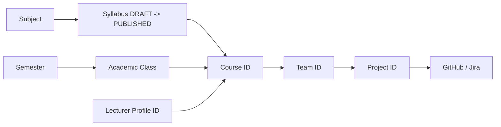

# SAGA Frontend API Integration Guide (Hướng Dẫn Tích Hợp API Chuẩn Chỉnh)

Tài liệu quy chuẩn ngắn gọn, chuẩn xác dành cho lập trình viên Frontend (FE) để tích hợp toàn bộ API của hệ thống SAGA từ đầu đến cuối.

---

## 1. Nguyên Tắc Cốt Lõi & Quy Chuẩn Request

### 1.1. Session & Xác thực (Không dùng JWT Bearer)
- Hệ thống sử dụng **Session Cookie Redis** (tên cookie: `SAGA_SESSION`).
- Mọi request từ Frontend **BẮT BUỘC** phải có cấu hình `credentials: "include"`.
- **KHÔNG GỬI** header `Authorization: Bearer <token>` (Backend không phát hành JWT Bearer).
- Vai trò người dùng (`role`) do Backend quản lý trong Session. **KHÔNG** tự ý gửi field `role` trong payload request.

### 1.2. Bảo vệ CSRF (Bắt buộc cho các thao tác ghi)
- Mọi request thay đổi dữ liệu (`POST`, `PUT`, `PATCH`, `DELETE`) **bắt buộc** phải đính kèm Header:
  ```http
  X-XSRF-TOKEN: <opaque-csrf-token>
  ```
- Lấy token này từ API `GET /api/auth/csrf` lúc khởi động ứng dụng hoặc đọc từ cookie `XSRF-TOKEN`.

### 1.3. Content-Type
- **JSON Request:** `Content-Type: application/json`
- **File Upload (Excel Roster/Team):** `multipart/form-data` với tên form-data field chính xác là **`file`**.
- **File Download (Template):** Nhận blob `application/vnd.openxmlformats-officedocument.spreadsheetml.sheet`.

### 1.4. Cấu trúc phản hồi lỗi chuẩn (Error Envelope)
Tất cả các lỗi nghiệp vụ đều trả về dạng JSON:
```json
{
  "code": "INVALID_CREDENTIALS",
  "message": "Authentication failed."
}
```
> FE phải parse trường **`code`** để hiển thị thông báo/điều hướng phù hợp, không phân tích chuỗi `message`.

---

## 2. Bản Đồ Chuỗi ID & Quan Hệ Dữ Liệu (ID Chains)

Để gọi API chính xác, FE cần lưu trữ và truyền đúng các chuỗi định danh (UUID) theo luồng:



- `subjectId` -> Tạo/Publish `syllabusVersionId`
- `semesterId` -> Tạo `academicClassId`
- `academicClassId` + `subjectId` + `syllabusVersionId` + `lecturerId` -> `courseId`
- `courseId` -> Roster sinh viên -> Phân nhóm `teamId`
- `courseId` + `teamId` (Chỉ Leader) -> `projectId`
- `projectId` -> Kết nối `github` và `jira`

---

## 3. State Machine Điều Hướng Cho Giao Diện Sinh Viên (Student Flow)

Giao diện sinh viên được điều hướng động dựa trên trạng thái dữ liệu thực tế từ Backend:

| FE State | Điều kiện nhận biết | Hành vi & Nút bấm hiển thị | Endpoint gọi tiếp theo |
| :--- | :--- | :--- | :--- |
| **`NO_ACTIVE_COURSES`** | `GET /api/student/courses` trả về mảng rỗng `[]` | Thông báo: "Chưa có môn học nào đang mở". Chờ Admin ghi danh. | Poll lại `GET /api/student/courses` |
| **`ACTIVE_COURSE_NO_TEAM`** | Môn học đang chọn có `teamId == null` | Thông báo: "Đang chờ Giảng viên phân nhóm". | Không gọi POST Project (nếu gọi `.../team` sẽ bị `404`). |
| **`TEAM_NO_PROJECT` (Leader)** | `teamId != null && projectId == null` và `GET .../team` trả về `myRole == "LEADER"` | **Hiển thị nút "Tạo Dự Án"** | `GET /api/student/project-types` rồi `POST /api/student/courses/{courseId}/project` |
| **`TEAM_NO_PROJECT` (Member)** | `teamId != null && projectId == null` và `myRole == "MEMBER"` | Thông báo: "Đang chờ Trưởng nhóm khởi tạo dự án". | `GET .../project` sẽ trả về `404` cho đến khi Leader tạo xong. |
| **`PROJECT_NO_GITHUB`** | `projectId != null` và `summary.github == null` | Leader: **Nút "Kết nối GitHub"**<br>Member: Thông báo "Chưa kết nối GitHub" | `POST /api/projects/{projectId}/integrations/github/connect` |
| **`PROJECT_GITHUB_NO_REPOS`** | `summary.github != null` nhưng danh sách `repositories` rỗng | Leader: **Nút "Chọn Repositories"** | `GET .../github/repositories` sau đó `PUT .../github/repositories` |
| **`PROJECT_NO_JIRA`** | `summary.github.status == "ACTIVE"` nhưng `summary.jira == null` | Leader: **Nút "Kết nối Jira"**<br>Member: Thông báo "Chưa kết nối Jira" | `POST .../jira/connect` (hoặc `POST /api/integrations/jira/link` cho tài khoản cá nhân trước) |
| **`PROJECT_FULLY_CONFIGURED`** | Cả `github.status` và `jira.status` đều là `"ACTIVE"` | Hiển thị Dashboard & Summary tích hợp hoàn tất | `GET /api/projects/{projectId}/integrations` để theo dõi trạng thái |

> **Lưu ý quan trọng:** `myRole` không nằm ở `GET /api/student/courses`. FE bắt buộc lấy `myRole` từ `GET /api/student/courses/{courseId}/team`.

---

## 4. Danh Mục API Chi Tiết Theo Phân Hệ

### 4.1. Phân Hệ Xác Thực & Phiên Làm Việc (Authentication)

#### 1. Lấy CSRF Token
- **Endpoint:** `GET /api/auth/csrf`
- **Quyền:** Mọi người dùng (Public)
- **Response (200):**
  ```json
  {
    "parameterName": "_csrf",
    "headerName": "X-XSRF-TOKEN",
    "token": "token-value-abc"
  }
  ```

#### 2. Kiểm tra phiên đăng nhập hiện tại
- **Endpoint:** `GET /api/auth/me`
- **Response (200):**
  ```json
  {
    "authenticated": true,
    "user": {
      "id": "uuid",
      "email": "student@fpt.edu.vn",
      "fullName": "Nguyen Van A",
      "role": "STUDENT"
    },
    "passwordSetupRequired": false
  }
  ```

#### 3. Đăng nhập mật khẩu cục bộ (Local Login)
- **Endpoint:** `POST /api/auth/login`
- **Request Body:**
  ```json
  {
    "identifier": "admin",
    "password": "mypassword"
  }
  ```
- **Response (200):** Tương tự cấu trúc `GET /api/auth/me`.

#### 4. Đăng ký tài khoản Sinh viên (Public Register)
- **Endpoint:** `POST /api/auth/register`
- **Quy tắc:** Chỉ chấp nhận email cá nhân (Gmail, Outlook,...), **không** chấp nhận email tổ chức FPT.
- **Request Body:**
  ```json
  {
    "email": "student.personal@gmail.com",
    "fullName": "Tran Van B",
    "studentCode": "SE170001",
    "password": "securePassword123",
    "confirmPassword": "securePassword123"
  }
  ```
- **Response (201):** `{ "registered": true, "user": { ... } }`

#### 5. Đăng nhập Google (Dành cho Sinh viên/Giảng viên FPT)
- **Cơ chế:** Điều hướng trực tiếp trình duyệt đến:
  ```http
  GET /oauth2/authorization/google
  ```
- Sau khi xác thực xong, Backend redirect về `/` hoặc trang chỉ định. Nếu là lần đầu đăng nhập tài khoản FPT, gọi tiếp `GET /api/auth/me` sẽ thấy `passwordSetupRequired: true`.

#### 6. Thiết lập mật khẩu lần đầu (Sau khi login Google)
- **Endpoint:** `POST /api/auth/password/setup`
- **Request Body:**
  ```json
  {
    "newPassword": "myNewPassword123",
    "confirmPassword": "myNewPassword123"
  }
  ```
- **Response (200):** Session được mở khóa đầy đủ quyền truy cập.

#### 7. Đăng xuất
- **Endpoint:** `POST /api/auth/logout`
- **Response (200):** Hủy cookie session.

---

### 4.2. Phân Hệ Quản Trị Viên (Admin Academic Setup & Roster)

#### 1. Quản lý Môn học (Subject)
- `POST /api/admin/subjects`: Tạo môn học mới.
  ```json
  { "code": "SWP391", "nameEnglish": "Software Development Project", "nameVietnamese": "Đồ án phát triển phần mềm" }
  ```
- `GET /api/admin/subjects`: Tìm kiếm/liệt kê môn học (query param: `?code=SWP391` hoặc `?status=ACTIVE`).
- `GET /api/admin/subjects/{subjectId}`: Xem chi tiết môn học.

#### 2. Quản lý Đề cương (Syllabus)
- `POST /api/admin/subjects/{subjectId}/syllabi`: Khởi tạo phiên bản đề cương nháp (DRAFT).
- `PUT /api/admin/subjects/{subjectId}/syllabi/{syllabusVersionId}/structure`: Cập nhật cấu trúc học thuật (Milestones, Assessments, Criteria).
- `POST /api/admin/subjects/{subjectId}/syllabi/{syllabusVersionId}/publish`: Phát hành chính thức đề cương (chuyển sang `PUBLISHED` để gán vào Course).

#### 3. Quản lý Học kỳ (Semester) & Lớp hành chính (Class)
- `POST /api/admin/semesters`: Tạo học kỳ mới (`code`, `name`, `startDate`, `endDate`).
- `GET /api/admin/semesters`: Danh sách học kỳ.
- `PUT /api/admin/semesters/active`: Kích hoạt học kỳ hiện tại (`{ "semesterId": "uuid" }`).
- `POST /api/admin/classes`: Tạo lớp học phần (`{ "semesterId": "uuid", "classCode": "SE1705", "name": "SE1705" }`).

#### 4. Tạo Khóa học (Course)
- `POST /api/admin/courses`:
  ```json
  {
    "academicClassId": "uuid-class",
    "subjectId": "uuid-subject",
    "syllabusVersionId": "uuid-syllabus-published",
    "lecturerId": "uuid-lecturer-profile",
    "courseCode": "SWP391-SE1705-FA26",
    "name": "SWP391 · SE1705"
  }
  ```

#### 5. Quản lý Danh sách Sinh viên Khóa học (Roster Import)
- `GET /api/admin/courses/{courseId}/roster/template`: Tải file Excel mẫu.
- `GET /api/admin/courses/{courseId}/roster`: Danh sách sinh viên đã vào lớp hoặc đang chờ mời.
- `POST /api/admin/courses/{courseId}/roster/import/preview`: Tải file Excel lên xem trước (Form-data: `file: <binary>`). Nhận về:
  ```json
  {
    "previewToken": "opaque-token",
    "summary": { "totalRows": 30, "validRows": 30, "invalidRows": 0, "existingAccounts": 25, "newInvitations": 5 }
  }
  ```
- `POST /api/admin/courses/{courseId}/roster/import/confirm`: Xác nhận import:
  ```json
  { "previewToken": "opaque-token" }
  ```

---

### 4.3. Phân Hệ Giảng Viên (Lecturer Management & Teams)

#### 1. Quản lý Khóa học của Giảng viên
- `GET /api/lecturer/courses`: Danh sách khóa học được phân công giảng dạy.
- `GET /api/lecturer/courses/{courseId}`: Xem chi tiết một khóa học.
- `GET /api/lecturer/courses/{courseId}/roster`: Danh sách sinh viên chính thức (`ACTIVE`) trong lớp.

#### 2. Phân chia Nhóm sinh viên (Team Import)
- `GET /api/lecturer/courses/{courseId}/teams/template`: Tải file mẫu phân chia nhóm.
- `POST /api/lecturer/courses/{courseId}/teams/import/preview`: Tải file Excel phân nhóm lên xem trước (Form-data: `file: <binary>`). Nhận về `previewToken` và danh sách thành viên/vai trò (`LEADER`, `MEMBER`).
- `POST /api/lecturer/courses/{courseId}/teams/import/confirm`: Xác nhận lưu nhóm vào hệ thống:
  ```json
  { "previewToken": "opaque-token" }
  ```
- `GET /api/lecturer/courses/{courseId}/teams`: Danh sách các nhóm và thành viên trong lớp.

---

### 4.4. Phân Hệ Sinh Viên (Student Course, Team & Project)

#### 1. Thông tin Khóa học & Nhóm của Sinh viên
- `GET /api/student/courses`: Liệt kê các môn học đang theo học kỳ hiện tại (`status == ACTIVE`). Response chứa `courseId`, `teamId`, `projectId`.
- `GET /api/student/courses/{courseId}/team`: Xem thông tin nhóm, danh sách thành viên và vai trò cá nhân (`myRole: "LEADER"` hoặc `"MEMBER"`).
- `GET /api/student/courses/{courseId}/project`: Xem thông tin đồ án/dự án của nhóm (nếu chưa tạo sẽ trả về `404 PROJECT_NOT_FOUND`).

#### 2. Tạo Dự Án (Chỉ dành cho Team Leader)
- `GET /api/student/project-types`: Lấy danh mục các loại đồ án được phép tạo.
- `POST /api/student/courses/{courseId}/project`:
  ```json
  {
    "name": "SAGA Learning Platform",
    "description": "Nền tảng hỗ trợ đánh giá minh chứng đồ án",
    "projectTypeId": "uuid-project-type"
  }
  ```
  *(Thành viên thường `MEMBER` gọi endpoint này sẽ nhận lỗi `403 ONLY_LEADER_CAN_CREATE_PROJECT`).*

---

### 4.5. Phân Hệ Tích Hợp Công Cụ Đồ Án (GitHub & Jira Integrations)

> Các API tích hợp yêu cầu **`projectId`** (lấy từ thông tin dự án sau khi tạo).

#### 1. Tích Hợp GitHub (GitHub App)
- `POST /api/projects/{projectId}/integrations/github/connect`: Khởi tạo liên kết GitHub App. Trả về `authorizationUrl` để mở popup/redirect người dùng cài đặt App vào Organization/Tài khoản GitHub.
- `GET /api/projects/{projectId}/integrations/github/repositories`: Liệt kê danh sách các repository mà GitHub App được cấp quyền truy cập.
- `PUT /api/projects/{projectId}/integrations/github/repositories`: Chọn các repository theo dõi cho dự án:
  ```json
  {
    "selectedRepositories": [
      { "repositoryId": 1338790015, "repoFullName": "Saga-Learning-to-Hero/saga-fe", "defaultBranch": "dev" }
    ]
  }
  ```
  *(Trả về `204 No Content` khi thành công).*
- `DELETE /api/projects/{projectId}/integrations/github`: Hủy kết nối GitHub của dự án.

#### 2. Tích Hợp Jira Software (Atlassian OAuth)
- `POST /api/integrations/jira/link`: (Tùy chọn) Liên kết tài khoản Jira cá nhân của sinh viên.
- `POST /api/projects/{projectId}/integrations/jira/connect`: Bắt đầu luồng OAuth Jira cho nhóm. Trả về `authorizationUrl` đến Atlassian.
- `GET /api/projects/{projectId}/integrations/jira/sites`: Danh sách Jira Cloud Sites (Domains) có quyền truy cập.
- `GET /api/projects/{projectId}/integrations/jira/projects?cloudId={cloudId}`: Danh sách Jira Projects trên site đã chọn.
- `GET /api/projects/{projectId}/integrations/jira/boards?cloudId={cloudId}&jiraProjectId={jiraProjectId}`: Danh sách Scrum/Kanban Boards thuộc project.
- `PUT /api/projects/{projectId}/integrations/jira`: Lưu cấu hình Jira chính thức cho nhóm:
  ```json
  {
    "cloudId": "cloud-uuid",
    "jiraProjectId": "10001",
    "jiraProjectKey": "SAGA",
    "boardId": 1
  }
  ```
  *(Trả về `204 No Content` khi thành công).*
- `DELETE /api/projects/{projectId}/integrations/jira`: Hủy cấu hình Jira của dự án.

#### 3. Báo Cáo Tổng Hợp Trạng Thái Tích Hợp (Integration Summary)
- **Endpoint:** `GET /api/projects/{projectId}/integrations`
- **Mục đích:** Cung cấp toàn bộ trạng thái kết nối GitHub & Jira để hiển thị Badge/Card trạng thái trên FE.
- **Response (200):**
  ```json
  {
    "projectId": "uuid-project",
    "github": {
      "accountLogin": "Saga-Learning-to-Hero",
      "status": "ACTIVE",
      "repositories": [
        { "fullName": "Saga-Learning-to-Hero/saga-fe", "defaultBranch": "dev" }
      ]
    },
    "jira": {
      "cloudId": "cloud-uuid",
      "projectKey": "SAGA",
      "projectName": "SAGA Management",
      "boardName": "SAGA Board",
      "status": "ACTIVE"
    }
  }
  ```

---

## 5. Bảng Mã Lỗi Nghiệp Vụ Điển Hình (Error Code Handling)

| Mã lỗi (`code`) | HTTP Status | Ý nghĩa nghiệp vụ & Cách FE xử lý |
| :--- | :---: | :--- |
| `INVALID_CREDENTIALS` | 401 | Tên đăng nhập hoặc mật khẩu không chính xác. |
| `PASSWORD_SETUP_REQUIRED` | 403 | Tài khoản Google lần đầu chưa tạo mật khẩu cục bộ. Chuyển sang `/auth/setup-password`. |
| `ACCESS_DENIED` | 403 | Sai quyền hạn vai trò (ví dụ: Student vào API Admin). Chuyển về Role Dashboard. |
| `EMAIL_ALREADY_EXISTS` | 409 | Email đăng ký đã tồn tại trong hệ thống. |
| `INSTITUTIONAL_EMAIL_USE_GOOGLE` | 400 | Email đuôi `@fpt.edu.vn` hoặc `@fe.edu.vn` bắt buộc phải đăng nhập qua Google OAuth. |
| `PASSWORD_ALREADY_SET` | 409 | Tài khoản đã thiết lập mật khẩu trước đó rồi, không thể setup lại. |
| `TEAM_NOT_FOUND` | 404 | Sinh viên chưa được xếp nhóm trong môn học. Hiển thị trạng thái chờ giảng viên. |
| `PROJECT_NOT_FOUND` | 404 | Nhóm chưa tạo dự án. Nếu là Leader -> hiện form tạo; nếu là Member -> hiện thông báo chờ. |
| `PROJECT_ALREADY_EXISTS` | 409 | Nhóm đã có dự án rồi, không thể tạo thêm. |
| `ONLY_LEADER_CAN_CREATE_PROJECT`| 403 | Chỉ tài khoản có vai trò `LEADER` trong nhóm mới được quyền tạo dự án. |
| `GITHUB_NOT_CONFIGURED` | 400 | Chưa hoàn thành kết nối GitHub App cho dự án. |
| `JIRA_NOT_CONFIGURED` | 400 | Chưa hoàn thành kết nối Jira cho dự án. |
| `CSRF_TOKEN_MISSING` / `INVALID`| 403 | Thiếu hoặc sai header `X-XSRF-TOKEN`. Cần gọi lại `GET /api/auth/csrf`. |
| `SESSION_STORE_UNAVAILABLE` | 503 | Cụm Redis backend gặp sự cố. Báo lỗi dịch vụ tạm thời gián đoạn. |

---

## 6. Phạm Vi Triển Khai & Danh Sách API Tuyệt Đối Chưa Gọi (Out-of-Scope)

### 6.1. Các tính năng Backend **đã hoàn thiện** cho FE
- Đăng nhập (Local / Google), Đăng ký, Đổi/Tạo mật khẩu, CSRF.
- Quản lý Học thuật Admin (Subject, Syllabus, Semester, Class, Course).
- Import Roster sinh viên & Phân nhóm sinh viên bằng Excel qua Preview Token.
- Khám phá môn học sinh viên, xem nhóm, xem vai trò.
- Team Leader khởi tạo dự án.
- Tích hợp GitHub App (Chọn Repo) & Jira Software (Chọn Site, Project, Board).

### 6.2. Các tính năng **CHƯA triển khai** (Backend chưa có endpoint - Không tự ý bịa API)
- Quên mật khẩu / Gửi mail khôi phục mật khẩu.
- Sinh viên chỉnh sửa hoặc xóa Project (`PATCH`/`DELETE .../project` - Không có).
- Webhook nhận dữ liệu từ GitHub/Jira (`/api/webhooks/**` là endpoint nội bộ nhận event, không dùng cho giao diện).
- SSE Stream hoặc WebSocket đẩy realtime.
- Đồ thị / SNA / XAI và Bảng chấm điểm đánh giá tự động (Đang trong giai đoạn xây dựng ở Phase tiếp theo).
