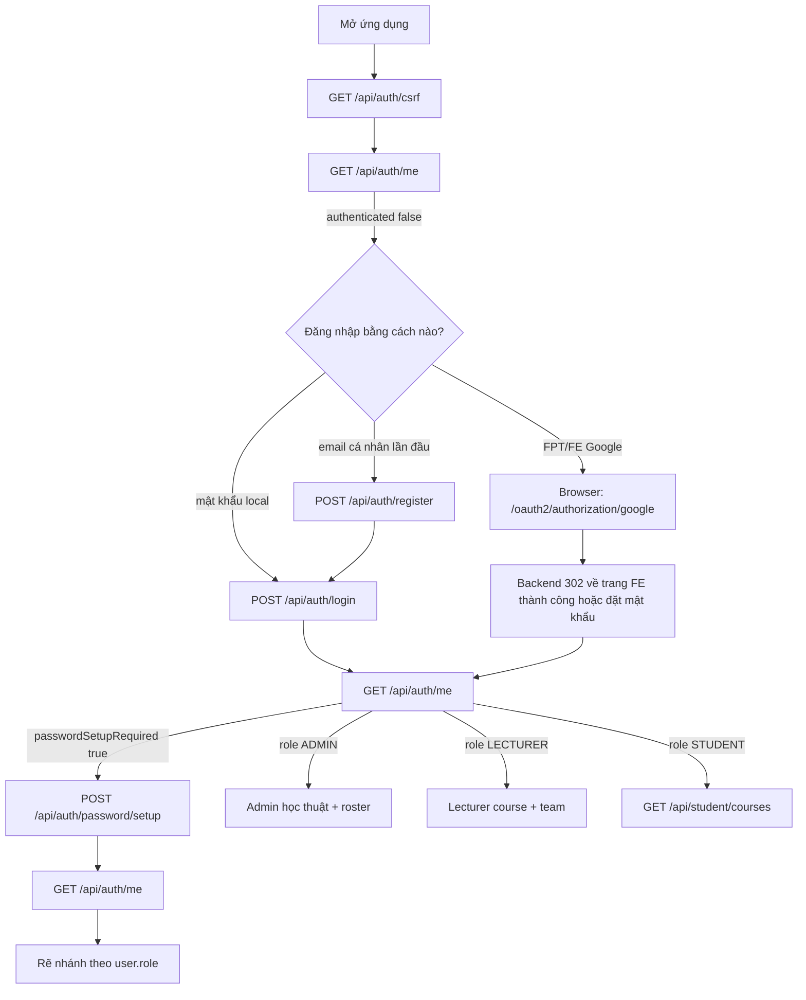

# SAGA Frontend API — Hướng dẫn tích hợp từng bước

Tài liệu này hướng dẫn Frontend gọi API saga-be theo đúng thứ tự nghiệp vụ,
từ đăng nhập cho đến khi Team Leader hoàn tất kết nối GitHub và Jira cho Project.

Tài liệu **chỉ mô tả các API đang tồn tại trong source backend hiện tại**. Nếu API chưa có, hướng dẫn ghi **Chưa được triển khai / Not implemented** — không bịa endpoint.

Milestone sản phẩm hiện tại dừng tại:

```text
Project đã tồn tại
+ Đã chọn GitHub repositories
+ Đã chọn Jira site / project / board
+ Cả hai integration hiện trên GET /api/projects/{projectId}/integrations
```

**Không** xây dashboard webhook, task board, contribution monitoring, hay UI assessment trên backend này như thể những phần đó đã có.

Catalog contract đi kèm (ngắn hơn, không phải tutorial): `docs/FRONTEND_API_INTEGRATION.md`.

Công cụ cho developer (mặc định local):

```text
http://localhost:8080/                 trang landing cho developer
http://localhost:8080/swagger-ui.html  Thử API + copy cookie CSRF
http://localhost:8080/v3/api-docs      OpenAPI JSON
```

---

## Cách sử dụng tài liệu này

1. Đọc **Quy tắc request dùng chung** một lần.
2. Làm theo **Part A** để xác thực và biết `role`.
3. Rẽ nhánh theo role: Admin → Part C–D. Lecturer → Part E. Student → Part F–J.
4. Dùng **Part K** như luồng copy-paste.
5. Dùng **Part L** mỗi khi không chắc phải gửi ID nào.

> **Cảnh báo — không hard-code ID lấy từ Swagger, file này, hoặc database của teammate.**
>
> Mọi UUID và identifier GitHub/Jira trong ví dụ bên dưới chỉ là **DEMO EXAMPLE ONLY**.
> Frontend phải luôn copy ID từ response API ngay trước đó.

### Ví dụ demo (không phải nguồn authority)

| Tên | Giá trị demo |
| --- | --- |
| `SUBJECT_ID` | `94ced810-3c75-4bfb-b188-c48c2f29651b` |
| `SYLLABUS_ID` | `799bceba-46dc-4713-8161-0192d01275d2` |
| `SEMESTER_ID` | `b1c6e936-18cd-4b2b-a455-0d78f536dffe` |
| `CLASS_ID` | `63ae5684-036b-41bb-a205-2ae39f642c1b` |
| `COURSE_ID` | `2bf1c497-71d4-43f2-a683-b74b7ad74327` |
| `TEAM_ID` | `43098af7-0f8c-4597-beb7-e09e70a5c7ad` |
| `PROJECT_ID` | `f05f57e1-c885-4c32-9a03-50062c6dff10` |
| GitHub repo saga-fe | `repositoryId = 1338790015`, `role = FRONTEND` |
| GitHub repo saga-be | `repositoryId = 1339720224`, `role = BACKEND` |
| Jira `cloudId` | `aeb21465-f2da-4923-b356-f6f1cfa4fd13` |
| Jira project | `id = 10067`, `key = SAGA`, `name = Saga Learning to Hero` |
| Jira board | `id = 68`, `name = SAGA board` |

> **Cảnh báo — `courseId` không phải `projectId`.**
>
> `2bf1c497-71d4-43f2-a683-b74b7ad74327` là **course**.
> `f05f57e1-c885-4c32-9a03-50062c6dff10` là **project**.
> Hai ID này không bao giờ hoán đổi cho nhau được.

---

## Quy tắc request dùng chung

Đọc phần này trước mọi endpoint.

### Transport

- Base path là `/api`. **Không** có prefix `/v1`.
- Xác thực là **server Redis session**, không phải Bearer JWT.
- Sau login, browser nhận cookie HttpOnly `SAGA_SESSION`.
- Frontend **phải** gửi `credentials: "include"` trên mọi request (kể cả CSRF và `/me`).
- **Không** lưu SAGA access token trong `localStorage`. Backend không cấp token đó.
- **Không** gửi `Authorization: Bearer ...` cho SAGA API.
- **Không** gửi `role` trong bất kỳ request body nào. Role lấy từ MySQL.

### CSRF

1. Gọi `GET /api/auth/csrf` (public).
2. Backend set cookie `XSRF-TOKEN` (JS đọc được) và trả `{ parameterName, token, headerName }`.
3. Mọi `POST`, `PUT`, `PATCH`, `DELETE` phải gửi header `X-XSRF-TOKEN` với token đó.
4. `GET` không cần CSRF header.
5. CSRF thiếu/sai → `403` `{ "code": "ACCESS_DENIED", "message": "Access denied." }`.

Swagger UI tự copy `XSRF-TOKEN`. SPA thật phải tự làm việc này.

### CORS

Origin được phép lấy từ `SAGA_AUTH_FRONTEND_ORIGINS` (code default `http://localhost:3000`). Credentials được phép. `*` không hợp lệ khi dùng cookie.

Request header được phép: `Content-Type`, `X-XSRF-TOKEN`, `X-Requested-With`.

### Content-Type

- Ghi JSON: `Content-Type: application/json`
- Roster / team preview: `multipart/form-data`, tên field **`file`**
- Tải XLSX: response `application/vnd.openxmlformats-officedocument.spreadsheetml.sheet`

### Error envelope

Mọi lỗi API đã document đều có dạng:

```json
{ "code": "INVALID_CREDENTIALS", "message": "Authentication failed." }
```

Parse `code`. Đừng parse nội dung exception Java.

Bean-validation / JSON không đọc được → `400 REQUEST_INVALID` (`"Request is invalid."`).

Redis session store chết → `503 SESSION_STORE_UNAVAILABLE`.

### Thời hạn session

Tên cookie: `SAGA_SESSION`. Timeout mặc định: `SAGA_SESSION_TIMEOUT` / `12h`.

### Role (backend là authority)

| DB role | Spring authority | Path được phép |
| --- | --- | --- |
| `ADMIN` | `ROLE_ADMIN` | `/api/admin/**` và `/api/lecturer/**` (support bypass). **Không** `/api/student/**`. |
| `LECTURER` | `ROLE_LECTURER` | `/api/lecturer/**` |
| `STUDENT` | `ROLE_STUDENT` | `/api/student/**` cộng các API project-integration đã authenticated |

Sai role trên path → `403 ACCESS_DENIED`.

Chưa đăng nhập mà gọi path bảo vệ → `401 INVALID_CREDENTIALS`.

Khi `passwordSetupRequired=true`, chỉ `/api/auth/me`, `/api/auth/csrf`, `POST /api/auth/password/setup`, `POST /api/auth/logout` (cộng login/register/docs/OAuth public) được phép. API khác → `403 PASSWORD_SETUP_REQUIRED`.

---

# PART A — Xác thực từ đầu

User vừa mở frontend. Chưa có session.



---

## A1. Lấy CSRF

### Mục đích

Frontend gọi API này để lấy CSRF token, nhờ đó các request POST/PUT/PATCH/DELETE sau được backend chấp nhận.

### Ai gọi API này

Mọi browser / SPA. Không cần role.

### Điều kiện trước khi gọi

Không có.

### Endpoint

`GET /api/auth/csrf`

### Tham số đường dẫn

Không có.

### Tham số query

Không có.

### Header / xác thực

Không cần session. Vẫn gửi `credentials: "include"` để cookie `XSRF-TOKEN` được lưu.

### Request body chính xác

Không có.

### Ví dụ request

```http
GET /api/auth/csrf
```

### Response thành công mong đợi

`200`

```json
{
  "parameterName": "_csrf",
  "token": "<opaque-token>",
  "headerName": "X-XSRF-TOKEN"
}
```

Cookie `XSRF-TOKEN` cũng được set. Dùng JSON `token` hoặc giá trị cookie — chúng giống nhau.

### Cần lưu giá trị nào cho bước tiếp theo

Lưu `token` (hoặc đọc cookie `XSRF-TOKEN`) cho mọi request ghi.

### API gọi tiếp theo

`GET /api/auth/me` để biết session đã tồn tại chưa.

### Lỗi thường gặp

Endpoint này public và không trả lỗi auth trong sử dụng bình thường.

---

## A2. Đọc session hiện tại

### Mục đích

Frontend gọi API này để hỏi backend ai đang đăng nhập và `role` nào đang được lưu trên **MySQL**.

### Ai gọi API này

Mọi caller. Public: caller ẩn danh nhận `authenticated: false`, không phải 401.

### Điều kiện trước khi gọi

Gọi CSRF trước nếu bước kế là request ghi. GET này không bắt buộc CSRF.

### Endpoint

`GET /api/auth/me`

### Tham số đường dẫn

Không có.

### Tham số query

Không có.

### Header / xác thực

`credentials: "include"`. Cookie `SAGA_SESSION` được gửi tự động nếu đã có.

### Request body chính xác

Không có.

### Response thành công mong đợi

Luôn `200`.

Đã xác thực:

```json
{
  "authenticated": true,
  "passwordSetupRequired": false,
  "user": {
    "id": "00000000-0000-0000-0000-000000000001",
    "email": "admin@saga.local",
    "username": "admin",
    "fullName": "System Admin",
    "avatarUrl": null,
    "role": "ADMIN"
  }
}
```

Ẩn danh:

```json
{
  "authenticated": false,
  "passwordSetupRequired": false,
  "user": null
}
```

`user.role` là một trong `ADMIN`, `LECTURER`, `STUDENT`.

### Cần lưu giá trị nào cho bước tiếp theo

- `authenticated`
- `passwordSetupRequired`
- `user.role`
- `user.id` (chỉ để hiển thị / audit — không bao giờ gửi như authority)

### API gọi tiếp theo

- `authenticated=false` → local login, Google, hoặc register
- `passwordSetupRequired=true` → `POST /api/auth/password/setup`
- `role=ADMIN` → Part C
- `role=LECTURER` → Part E
- `role=STUDENT` → `GET /api/student/courses` (Part F)

### Lỗi thường gặp

GET này không có lỗi. Nó không trả 401 khi ẩn danh.

---

## A3. Đăng nhập mật khẩu local

### Mục đích

Frontend gọi API này để tạo server session từ email/username + password.

### Ai gọi API này

ADMIN (username/password), LECTURER hoặc STUDENT đã có mật khẩu local.

### Điều kiện trước khi gọi

Đã gọi `GET /api/auth/csrf`. Đã có CSRF header.

### Endpoint

`POST /api/auth/login`

### Tham số đường dẫn

Không có.

### Tham số query

Không có.

### Header / xác thực

```text
Content-Type: application/json
X-XSRF-TOKEN: <csrf token>
credentials: include
```

Endpoint public. Không gửi `role`.

`identifier` chứa `@` được coi là email; ngược lại là username.

### Request body chính xác

```json
{
  "identifier": "admin",
  "password": "example-password"
}
```

Ví dụ email Student:

```json
{
  "identifier": "student.personal@example.com",
  "password": "example-password"
}
```

### Response thành công mong đợi

`200` — cùng shape với `GET /api/auth/me` khi đã authenticated. Cookie `SAGA_SESSION` được set.

Khi Student login, invitation PENDING khớp (email + StudentCode) được claim âm thầm thành enrollment ACTIVE. FE không gọi API claim riêng.

### Cần lưu giá trị nào cho bước tiếp theo

`user.role`. Sau đó rẽ nhánh.

### API gọi tiếp theo

`GET /api/auth/me` (khuyến nghị) rồi API dashboard đầu tiên theo role.

### Lỗi thường gặp

| HTTP | Code | Ý nghĩa | FE nên làm |
| --- | --- | --- | --- |
| 401 | `INVALID_CREDENTIALS` | Sai identifier/password | Hiện lỗi login. Không retry mù. |
| 403 | `ACCESS_DENIED` | CSRF thiếu/sai, hoặc bị từ chối | Gọi lại `GET /api/auth/csrf`, rồi login lại. |
| 403 | `ACCOUNT_DISABLED` | Tài khoản bị khóa | Dừng. Không retry. |
| 403 | `PASSWORD_SETUP_REQUIRED` | Session Google bị hạn chế | Đưa user sang màn hình set password. |

API quên mật khẩu: **Chưa được triển khai / Not implemented**.

---

## A4. Đăng ký Student công khai

### Mục đích

Tạo tài khoản `STUDENT` cho email **cá nhân**. **Không** mở session.

### Ai gọi API này

Sinh viên email cá nhân chưa đăng nhập (kiểu K19+). Không bao giờ lecturer/admin.

### Điều kiện trước khi gọi

Đã có CSRF token. Student biết `studentCode` thật. FE **không** được suy ra StudentCode từ phần local-part của email.

### Endpoint

`POST /api/auth/register`

### Header / xác thực

Cùng quy tắc CSRF + JSON như login. Public.

### Request body chính xác

```json
{
  "email": "student.personal@example.com",
  "fullName": "Example Student",
  "studentCode": "SE123456",
  "password": "example-password",
  "confirmPassword": "example-password"
}
```

Client không được gửi `role`. Server luôn tạo `STUDENT`.

Email tổ chức `@fpt.edu.vn` / `@fe.edu.vn` (và các Google hosted domain đã cấu hình) bị từ chối.

### Response thành công mong đợi

`201`

```json
{
  "registered": true,
  "user": {
    "id": "aaaaaaaa-bbbb-cccc-dddd-eeeeeeeeeeee",
    "email": "student.personal@example.com",
    "fullName": "Example Student",
    "role": "STUDENT"
  }
}
```

Invitation PENDING khớp email + StudentCode được claim tự động. Không tạo team membership ở bước này.

### Cần lưu giá trị nào cho bước tiếp theo

Email vừa đăng ký. Tiếp theo phải login.

### API gọi tiếp theo

`POST /api/auth/login` với email + password đó.

### Lỗi thường gặp

| HTTP | Code | Ý nghĩa | FE nên làm |
| --- | --- | --- | --- |
| 400 | `INSTITUTIONAL_EMAIL_USE_GOOGLE` | Email FPT/FE | Đưa sang Google login. |
| 400 | `PASSWORD_POLICY_VIOLATION` | Vi phạm policy mật khẩu | Hiện policy (min 10, max 128). |
| 400 | `PASSWORD_CONFIRMATION_MISMATCH` | Hai mật khẩu khác nhau | Yêu cầu nhập lại. |
| 400 | `INVALID_REGISTRATION_DATA` | Validation khác | Sửa field. |
| 400 | `REQUEST_INVALID` | Bean validation | Sửa JSON. |
| 409 | `EMAIL_ALREADY_REGISTERED` | Email đã tồn tại | Đề nghị login. |
| 409 | `STUDENT_CODE_ALREADY_EXISTS` | StudentCode đã tồn tại | Hỏi mã chính thức / login. |
| 403 | `ACCESS_DENIED` | CSRF | Lấy lại CSRF. |

---

## A5. Đăng nhập Google / onboarding

### Mục đích

Student FPT hoặc Lecturer đăng nhập Google. Backend provision/link tài khoản và set `SAGA_SESSION`.

### Ai gọi API này

STUDENT / LECTURER thuộc hosted domain được phép (`fpt.edu.vn`, `fe.edu.vn` mặc định). Google **không** provision ADMIN.

### Điều kiện trước khi gọi

Google client đã cấu hình trên backend. Nếu `GOOGLE_CLIENT_ID` trống, Google login không bật.

### Endpoint

Đây là **điều hướng browser**, không phải `fetch`:

```text
GET {API_ORIGIN}/oauth2/authorization/google
```

Provider callback (backend sở hữu, đăng ký trên Google Cloud Console):

```text
{API_ORIGIN}/login/oauth2/code/google
```

FE không được implement callback đó.

### Tham số query

FE không tự bịa query. Spring OAuth2 sở hữu request.

### Header / xác thực

Full-page redirect. Cookie do backend set khi quay lại.

### Request body chính xác

Không có.

### Hành vi thành công mong đợi

Backend `302` tới một trong:

| Điều kiện | Env redirect | Code default |
| --- | --- | --- |
| Đã có password | `SAGA_AUTH_GOOGLE_SUCCESS_URL` | `http://localhost:3000/dashboard` |
| Lần đầu Google STUDENT/LECTURER, `password_hash` NULL | `SAGA_AUTH_GOOGLE_PASSWORD_SETUP_URL` | `http://localhost:3000/auth/setup-password` |
| Thất bại | `SAGA_AUTH_GOOGLE_FAILURE_URL?error={CODE}` | `http://localhost:3000/login?error=...` |

Giá trị query `error` khi thất bại gồm `GOOGLE_ACCOUNT_NOT_ELIGIBLE`, `GOOGLE_EMAIL_NOT_VERIFIED`, `GOOGLE_DOMAIN_NOT_ALLOWED`, `GOOGLE_IDENTITY_CONFLICT`.

### Cần lưu giá trị nào cho bước tiếp theo

Không lấy ID từ URL Google redirect, trừ path FE đã cấu hình. Sau đó gọi `GET /api/auth/me`.

### API gọi tiếp theo

`GET /api/auth/me`. Nếu `passwordSetupRequired=true`, gọi `POST /api/auth/password/setup`.

### Lỗi thường gặp

Hiện trên FE qua query `error=CODE`, không phải JSON body trên URL bắt đầu Google.

---

## A6. Đặt mật khẩu local lần đầu sau Google

### Mục đích

Google STUDENT/LECTURER đặt mật khẩu SAGA để sau này dùng `POST /api/auth/login`.

### Ai gọi API này

STUDENT hoặc LECTURER đã authenticated với `passwordSetupRequired=true`. ADMIN không dùng được.

### Điều kiện trước khi gọi

`SAGA_SESSION` hợp lệ từ Google. Đã có CSRF token.

### Endpoint

`POST /api/auth/password/setup`

### Request body chính xác

```json
{
  "newPassword": "example-password",
  "confirmPassword": "example-password"
}
```

### Response thành công mong đợi

`200` `AuthMeResponse` với `passwordSetupRequired: false`.

### Cần lưu giá trị nào cho bước tiếp theo

`user.role` — lúc này họ vào được sản phẩm.

### API gọi tiếp theo

Dashboard theo role (Part C / E / F).

### Lỗi thường gặp

| HTTP | Code | Ý nghĩa | FE nên làm |
| --- | --- | --- | --- |
| 401 | `INVALID_CREDENTIALS` | Không có session | Login Google lại. |
| 400 | `PASSWORD_ALREADY_SET` | Hash đã tồn tại | Đưa về dashboard. |
| 400 | `PASSWORD_POLICY_VIOLATION` / `PASSWORD_CONFIRMATION_MISMATCH` | Policy | Sửa field. |
| 403 | `ACCESS_DENIED` | CSRF hoặc không được phép | Lấy lại CSRF / dừng. |

---

## A7. Đăng xuất

### Mục đích

Hủy Redis session và xóa cookie.

### Ai gọi API này

Mọi browser đang (hoặc từng) có session.

### Endpoint

`POST /api/auth/logout`

Path public, **bắt buộc CSRF**.

### Request body chính xác

Không có.

### Response thành công mong đợi

**`204 No Content` là response thành công và không có body.**

Cookie `SAGA_SESSION` và `XSRF-TOKEN` bị xóa.

### API gọi tiếp theo

`GET /api/auth/csrf` rồi hiện màn hình login.

### Lỗi thường gặp

| HTTP | Code | Ý nghĩa | FE nên làm |
| --- | --- | --- | --- |
| 403 | `ACCESS_DENIED` | CSRF | Lấy lại CSRF, retry logout. |

---

## A8. Xác thực step-up tùy chọn (không thuộc milestone)

Các API này tồn tại và **không** cần cho luồng course / team / project / GitHub / Jira:

| Endpoint | Trạng thái |
| --- | --- |
| `POST /api/auth/reauth/password` | Đã triển khai. Body `{ "password": "..." }`. Trả `{ "stepUp": true, "expiresAt": "..." }`. Dùng sau cho task evidence confirm. Không thuộc milestone này. |
| `POST /api/auth/reauth/webauthn` | Tồn tại; hiện trả `400 WEBAUTHN_DISABLED`. |

Không xây UI tạo project của Student quanh reauth.

---

## Chuỗi bootstrap FE sau login (endpoint thật)

```text
GET  /api/auth/csrf
GET  /api/auth/me
        │
        ├─ role ADMIN     → GET /api/admin/subjects  (hoặc semesters/courses đã có)
        ├─ role LECTURER  → GET /api/lecturer/courses
        └─ role STUDENT   → GET /api/student/courses
```

Không có endpoint `/api/dashboard`.

---

# PART B — Ma trận phân quyền

Phân quyền hiện tại đúng như source. Lecturer **không** tạo Project. Team Leader mới tạo.

| Hành động | ADMIN | LECTURER | STUDENT MEMBER | STUDENT LEADER |
| --- | --- | --- | --- | --- |
| Catalog học thuật (Subject / Syllabus structure / publish) | Có | Không (`403 ACCESS_DENIED` trên `/api/admin/**`) | Không | Không |
| Tạo Semester / Class / Course | Có | Không | Không | Không |
| Roster template / preview / confirm | Có | Không | Không | Không |
| Liệt kê course được gán | Support: `GET /api/lecturer/courses` trả **mọi** course chưa xóa | Có — chỉ course được gán | Không | Không |
| Đọc roster ACTIVE | Qua admin roster (gồm invitation) | `GET /api/lecturer/courses/{courseId}/roster` chỉ ACTIVE | Không | Không |
| Import / confirm team | Support qua path lecturer | Có | Không | Không |
| Liệt kê course mình đang enroll | Không (`/api/student/**` chỉ STUDENT) | Không | Có | Có |
| Đọc team của mình | Không | Lecturer xem danh sách team trong course được gán | Có | Có |
| Tạo Project | Không qua `/api/student/**`. ADMIN bypass integration không phải API tạo project | **Không** | `403 NOT_TEAM_LEADER` | Có |
| Đọc Project | Không qua path student | Chỉ thấy `projectId` trên list team | Có | Có |
| Kết nối / cấu hình GitHub | ADMIN bypass trên write integration | Không | `403 NOT_TEAM_LEADER` | Có |
| Kết nối / cấu hình Jira | ADMIN bypass trên write integration | Không | `403 NOT_TEAM_LEADER` | Có |
| Đọc integration summary | ADMIN bypass | Không có API summary lecturer/student trừ khi là member của project | Có (cần `projectId`) | Có |

Tóm tắt ownership sản phẩm:

- **ADMIN** — thiết lập academic/course + roster.
- **LECTURER** — course được gán, roster ACTIVE, gán team. `Team.projectId` có thể vẫn `null`.
- **STUDENT TEAM LEADER** — tạo Project, cấu hình GitHub, cấu hình Jira.
- **STUDENT MEMBER** — đọc team / project / integration summary. Không cấu hình.

---

# PART C — Admin thiết lập dữ liệu học thuật

Phân cấp trong backend hiện tại:

```text
Subject                         subjectId
  └─ versioned Syllabus         syllabusId  (path name: syllabusVersionId)
       ├─ Learning Outcomes
       ├─ Learning Units
       ├─ Phases
       │    ├─ Activities
       │    └─ Deliverables
Semester                        semesterId
  └─ Academic Class             classId     (create field: academicClassId)
       └─ Course                courseId    (Admin/Lecturer JSON field: id)
            └─ pinned PUBLISHED syllabus
```

> **Cảnh báo:** Admin/Lecturer `CourseResponse.id` **chính là** course id.
> Student `StudentCourseResponse.courseId` dùng tên field khác cho cùng khái niệm.
> Không field nào là `projectId`.

Controller hiện tại **không** có `DELETE` cho subject, syllabus, semester, class, hay course.

**Chưa được triển khai / Not implemented:** `GET /api/admin/lecturers` (hoặc bất kỳ lecturer directory nào). Tạo course cần `lecturerId` = `lecturer_profile.id` (xem C10).

Mọi Admin write: session + CSRF + `Content-Type: application/json`. Role: **ADMIN**.

---

## C1. Tạo Subject

### Mục đích

Thêm Subject vào catalog (không phải một course đang dạy).

### Ai gọi API này

ADMIN.

### Điều kiện trước khi gọi

Session Admin.

### Endpoint

`POST /api/admin/subjects`

### Request body chính xác

```json
{
  "code": "SWP391",
  "nameEnglish": "Software Development Project",
  "nameVietnamese": "Đồ án phát triển phần mềm"
}
```

`nameVietnamese` là tùy chọn.

### Response thành công mong đợi

`201`

```json
{
  "id": "94ced810-3c75-4bfb-b188-c48c2f29651b",
  "code": "SWP391",
  "nameEnglish": "Software Development Project",
  "nameVietnamese": "Đồ án phát triển phần mềm",
  "status": "ACTIVE",
  "createdAt": "2026-09-01T00:00:00",
  "updatedAt": "2026-09-01T00:00:00",
  "syllabi": []
}
```

`id` demo ở trên chỉ là **DEMO EXAMPLE ONLY**.

### Cần lưu giá trị nào cho bước tiếp theo

Lưu `response.id` thành `subjectId`. Dùng khi tạo syllabus và tạo course.

### API gọi tiếp theo

`POST /api/admin/subjects/{subjectId}/syllabi`

### Lỗi thường gặp

| HTTP | Code | Ý nghĩa | FE nên làm |
| --- | --- | --- | --- |
| 400 | `SUBJECT_CODE_INVALID` | Code rỗng/sai sau trim | Sửa code. |
| 409 | `SUBJECT_CODE_DUPLICATE` | Code đã tồn tại | Dùng subject có sẵn (`GET /api/admin/subjects?code=SWP391`). |
| 400 | `REQUEST_INVALID` | Thiếu field bắt buộc | Sửa JSON. |
| 403 | `ACCESS_DENIED` | Không phải ADMIN hoặc CSRF | Dừng hoặc lấy lại CSRF. |

---

## C2. Liệt kê / lấy / cập nhật Subject

### Mục đích

Tìm subject đã có thay vì tạo trùng.

### Ai gọi API này

ADMIN.

### Endpoints

| Method | Path | Query | Thành công |
| --- | --- | --- | --- |
| `GET` | `/api/admin/subjects` | tùy chọn `code`, `status` (`ACTIVE`/`INACTIVE`), `q` | `200` array `SubjectResponse` |
| `GET` | `/api/admin/subjects/{subjectId}` | — | `200` subject + syllabi summaries |
| `PATCH` | `/api/admin/subjects/{subjectId}` | — | `200` subject đã cập nhật |

### Tham số đường dẫn

`subjectId` — lấy từ create/list field `id`.

### PATCH body

```json
{
  "code": "SWP391",
  "nameEnglish": "Software Development Project",
  "nameVietnamese": "Đồ án phát triển phần mềm",
  "status": "ACTIVE"
}
```

Mọi field đều tùy chọn. `status` là `ACTIVE` hoặc `INACTIVE`.

### Cần lưu giá trị nào

`id` → `subjectId`. Từ `syllabi[].id` lồng bên trong → `syllabusId` nếu đã PUBLISHED.

### API gọi tiếp theo

Tạo syllabus nếu chưa có, hoặc publish, hoặc nhảy sang semester/class/course.

### Lỗi thường gặp

`404 SUBJECT_NOT_FOUND`, `409 SUBJECT_CODE_DUPLICATE`, `400 SUBJECT_STATUS_INVALID`.

---

## C3. Tạo phiên bản Syllabus DRAFT

### Mục đích

Tạo syllabus có version dưới một subject. Version mới bắt đầu ở `DRAFT`.

### Ai gọi API này

ADMIN.

### Điều kiện trước khi gọi

`subjectId` từ C1/C2.

### Endpoint

`POST /api/admin/subjects/{subjectId}/syllabi`

### Tham số đường dẫn

`subjectId` — `SubjectResponse.id`.

### Request body chính xác

Field bắt buộc là `versionLabel`. Các field còn lại là metadata tùy chọn.

```json
{
  "externalSyllabusId": null,
  "versionLabel": "v1.0",
  "titleEnglish": "SWP391 Syllabus",
  "titleVietnamese": null,
  "credits": 3,
  "level": null,
  "learningTeachingMethod": null,
  "timeAllocation": null,
  "prerequisites": null,
  "description": null,
  "studentDuties": null,
  "tools": null,
  "textbooks": null,
  "referenceMaterials": null,
  "gradingScale": null
}
```

### Response thành công mong đợi

`201` `SyllabusSummaryResponse`:

```json
{
  "id": "799bceba-46dc-4713-8161-0192d01275d2",
  "subjectId": "94ced810-3c75-4bfb-b188-c48c2f29651b",
  "externalSyllabusId": null,
  "versionLabel": "v1.0",
  "status": "DRAFT",
  "titleEnglish": "SWP391 Syllabus",
  "titleVietnamese": null,
  "credits": 3,
  "publishedAt": null,
  "createdAt": "2026-09-01T00:00:00",
  "updatedAt": "2026-09-01T00:00:00"
}
```

### Cần lưu giá trị nào cho bước tiếp theo

Lưu `id` thành `syllabusId` / `syllabusVersionId`. Dùng cho PUT structure, publish, và `CreateCourseRequest.syllabusVersionId`.

### API gọi tiếp theo

`PUT /api/admin/subjects/{subjectId}/syllabi/{syllabusVersionId}/structure`

### Lỗi thường gặp

`404 SUBJECT_NOT_FOUND`, `400 SYLLABUS_VERSION_LABEL_INVALID`, `409 SYLLABUS_VERSION_LABEL_DUPLICATE`, `409 SYLLABUS_EXTERNAL_ID_DUPLICATE`.

---

## C4. Liệt kê / lấy / cập nhật syllabus

| Method | Path | Thành công |
| --- | --- | --- |
| `GET` | `/api/admin/subjects/{subjectId}/syllabi` | `200` array summary |
| `GET` | `/api/admin/subjects/{subjectId}/syllabi/{syllabusVersionId}` | `200` `SyllabusDetailResponse` (outcomes, units, phases) |
| `PATCH` | `/api/admin/subjects/{subjectId}/syllabi/{syllabusVersionId}` | `200` summary; chỉ metadata DRAFT |

`PATCH` dùng `PatchSyllabusRequest` (cùng họ metadata tùy chọn như create). Version đã publish từ chối sửa structure/metadata bằng `SYLLABUS_PUBLISHED_IMMUTABLE`.

---

## C5. Thay thế cấu trúc học thuật DRAFT

### Mục đích

Gán learning outcomes, units, và phases cho syllabus DRAFT trong một transaction. Course chỉ pin được syllabus **PUBLISHED**, nên bước này phải xảy ra trước publish.

### Ai gọi API này

ADMIN.

### Điều kiện trước khi gọi

`syllabusVersionId` đang `DRAFT`.

### Endpoint

`PUT /api/admin/subjects/{subjectId}/syllabi/{syllabusVersionId}/structure`

### Request body chính xác

`learningOutcomes` và `phases` là list bắt buộc. `learningUnits` có thể rỗng. `orderIndex` phải `> 0`. Code được tham chiếu trên unit/phase/deliverable phải tồn tại trong `learningOutcomes`.

```json
{
  "learningOutcomes": [
    {
      "code": "LO1",
      "name": "Deliver a working product increment",
      "description": null,
      "orderIndex": 1
    }
  ],
  "learningUnits": [
    {
      "code": "AGILE_DELIVERY",
      "name": "Agile delivery",
      "description": "Plan and ship increments",
      "orderIndex": 1,
      "learningOutcomeCodes": ["LO1"]
    }
  ],
  "phases": [
    {
      "code": "IMPLEMENTATION",
      "name": "Implementation",
      "description": null,
      "orderIndex": 1,
      "learningOutcomeCodes": ["LO1"],
      "activities": [],
      "deliverables": []
    }
  ]
}
```

### Response thành công mong đợi

`200` `SyllabusDetailResponse` gồm `learningOutcomes`, `learningUnits`, `phases` đã sắp thứ tự.

### Cần lưu giá trị nào

Cùng `syllabusVersionId`. Structure không tạo id mới.

### API gọi tiếp theo

`POST /api/admin/subjects/{subjectId}/syllabi/{syllabusVersionId}/publish`

### Lỗi thường gặp

`404 SYLLABUS_NOT_FOUND`, `409 SYLLABUS_NOT_DRAFT` / `SYLLABUS_PUBLISHED_IMMUTABLE`, `400 ACADEMIC_STRUCTURE_INVALID`, `400 ACADEMIC_CODE_DUPLICATE`, `400 LEARNING_OUTCOME_REFERENCE_INVALID`, `400 ORDER_INDEX_INVALID`.

---

## C6. Publish và archive syllabus

### Mục đích

Publish biến version thành immutable và đủ điều kiện pin lên Course. Archive chỉ cho `PUBLISHED`; bản đã archive vẫn đọc được nhưng không pin được làm syllabus course mới.

### Ai gọi API này

ADMIN.

### Endpoints

`POST /api/admin/subjects/{subjectId}/syllabi/{syllabusVersionId}/publish` — không body.

`POST /api/admin/subjects/{subjectId}/syllabi/{syllabusVersionId}/archive` — không body.

### Response thành công mong đợi

`200` `SyllabusDetailResponse` với `status: "PUBLISHED"` hoặc `"ARCHIVED"` và `publishedAt` được set sau publish.

Publish yêu cầu ít nhất một learning outcome và một phase.

### Cần lưu giá trị nào

`id` của syllabus **PUBLISHED** → `syllabusVersionId` khi tạo course.

### API gọi tiếp theo

Tạo hoặc tái sử dụng Semester → Class → Course.

### Lỗi thường gặp

`400 SYLLABUS_PUBLISH_INVALID`, `409 SYLLABUS_NOT_DRAFT`, `409 SYLLABUS_PUBLISHED_IMMUTABLE`, `400 SYLLABUS_ARCHIVE_INVALID`.

---

## C7. Tạo / liệt kê / lấy / cập nhật Semester

### Mục đích

Tạo học kỳ. Subject/syllabus độc lập với semester.

### Ai gọi API này

ADMIN.

### Endpoint

`POST /api/admin/semesters`

### Request body chính xác

```json
{
  "code": "FA26",
  "name": "Fall 2026",
  "startDate": "2026-09-01",
  "endDate": "2026-12-31"
}
```

`code` được trim và uppercase. `startDate` phải trước `endDate`.

### Response thành công mong đợi

`201`

```json
{
  "id": "b1c6e936-18cd-4b2b-a455-0d78f536dffe",
  "code": "FA26",
  "name": "Fall 2026",
  "startDate": "2026-09-01",
  "endDate": "2026-12-31",
  "active": false,
  "createdAt": "2026-09-01T00:00:00",
  "updatedAt": "2026-09-01T00:00:00"
}
```

`active` phản ánh setting singleton của platform, không phải cột trên mọi row.

### Các API semester khác

| Method | Path | Body / ghi chú | Thành công |
| --- | --- | --- | --- |
| `GET` | `/api/admin/semesters` | — | `200` array |
| `GET` | `/api/admin/semesters/{semesterId}` | — | `200` |
| `PATCH` | `/api/admin/semesters/{semesterId}` | tùy chọn `code`, `name`, `startDate`, `endDate` | `200` |
| `GET` | `/api/admin/semesters/active` | — | `200` semester **hoặc JSON `null`** nếu chưa set |
| `PUT` | `/api/admin/semesters/active` | `{ "semesterId": "<uuid>" }` | `200` |

### Cần lưu giá trị nào

`id` → `semesterId`. Dùng khi tạo class (`semesterId`) và filter list course.

### API gọi tiếp theo

`POST /api/admin/classes`

### Lỗi thường gặp

`400 SEMESTER_CODE_INVALID`, `409 SEMESTER_CODE_DUPLICATE`, `400 SEMESTER_DATE_RANGE_INVALID`, `404 SEMESTER_NOT_FOUND`.

---

## C8. Tạo / liệt kê / lấy / cập nhật Academic Class

### Mục đích

Tạo class thuộc một semester. Class **không** phải course.

### Ai gọi API này

ADMIN.

### Endpoint

`POST /api/admin/classes`

### Request body chính xác

```json
{
  "semesterId": "b1c6e936-18cd-4b2b-a455-0d78f536dffe",
  "classCode": "SE1705",
  "name": "SE1705"
}
```

`name` là tùy chọn. Unique theo `(semesterId, classCode)`.

### Response thành công mong đợi

`201`

```json
{
  "id": "63ae5684-036b-41bb-a205-2ae39f642c1b",
  "semesterId": "b1c6e936-18cd-4b2b-a455-0d78f536dffe",
  "semesterCode": "FA26",
  "classCode": "SE1705",
  "name": "SE1705",
  "createdAt": "2026-09-01T00:00:00",
  "updatedAt": "2026-09-01T00:00:00"
}
```

### Các API class khác

| Method | Path | Ghi chú | Thành công |
| --- | --- | --- | --- |
| `GET` | `/api/admin/classes` | tùy chọn `?semesterId=` | `200` array |
| `GET` | `/api/admin/classes/{classId}` | `classId` = `id` khi create | `200` |
| `PATCH` | `/api/admin/classes/{classId}` | tùy chọn `classCode`, `name` | `200` |

### Cần lưu giá trị nào

`id` → `classId` / `academicClassId` khi tạo course.

### API gọi tiếp theo

`POST /api/admin/courses`

### Lỗi thường gặp

`400 ACADEMIC_CLASS_SEMESTER_REQUIRED`, `404 SEMESTER_NOT_FOUND`, `400 ACADEMIC_CLASS_CODE_INVALID`, `409 ACADEMIC_CLASS_CODE_DUPLICATE`, `404 ACADEMIC_CLASS_NOT_FOUND`.

---

## C9. Tên ID trước khi tạo Course

Giữ các ID này tách biệt:

| Tên sẽ gửi | Lấy từ đâu | Không phải |
| --- | --- | --- |
| `academicClassId` | `POST/GET /api/admin/classes` → `id` | `courseId`, `classCode` |
| `subjectId` | `POST/GET /api/admin/subjects` → `id` | `syllabusId` |
| `syllabusVersionId` | `id` syllabus đã PUBLISHED | `subjectId` |
| `lecturerId` | `CourseResponse.lecturerId` (profile) | `lecturerUserId` |

Ở thời điểm này vẫn chưa có project.

---

## C10. Tạo Course

### Mục đích

Tạo offering giảng dạy: một class + một subject + một syllabus **PUBLISHED** được pin + một lecturer.

API này trả **`courseId`**, không phải project.

### Ai gọi API này

ADMIN.

### Điều kiện trước khi gọi

- `academicClassId` từ C8 `id`
- `subjectId` từ C1 `id`
- `syllabusVersionId` từ `id` syllabus **PUBLISHED**
- `lecturerId` = **`lecturer_profile.id`**, không phải `user.id`

### Endpoint

`POST /api/admin/courses`

### Request body chính xác

```json
{
  "academicClassId": "63ae5684-036b-41bb-a205-2ae39f642c1b",
  "subjectId": "94ced810-3c75-4bfb-b188-c48c2f29651b",
  "syllabusVersionId": "799bceba-46dc-4713-8161-0192d01275d2",
  "lecturerId": "<lecturer-profile-uuid>",
  "courseCode": "SWP391-SE1705-FA26",
  "name": "SWP391 · SE1705"
}
```

`courseCode` và `name` là tùy chọn. Tên mặc định là `{subjectCode} · {classCode}`.

> **API gap:** Không có `GET /api/admin/lecturers`.
> `lecturerId` phải lấy từ `CourseResponse.lecturerId` có sẵn, id bootstrap/profile đã biết, hoặc nguồn ngoài API.
> **Không** gửi `CourseResponse.lecturerUserId` như `lecturerId`. Đó là hai UUID khác nhau.
> Lecturer không hợp lệ / inactive → `400 COURSE_LECTURER_INVALID`.

### Response thành công mong đợi

`201` `CourseResponse` (field `id` là course id):

```json
{
  "id": "2bf1c497-71d4-43f2-a683-b74b7ad74327",
  "courseCode": "SWP391-SE1705-FA26",
  "name": "SWP391 · SE1705",
  "academicClassId": "63ae5684-036b-41bb-a205-2ae39f642c1b",
  "classCode": "SE1705",
  "className": "SE1705",
  "semesterId": "b1c6e936-18cd-4b2b-a455-0d78f536dffe",
  "semesterCode": "FA26",
  "semesterName": "Fall 2026",
  "subjectId": "94ced810-3c75-4bfb-b188-c48c2f29651b",
  "subjectCode": "SWP391",
  "subjectName": "Software Development Project",
  "syllabusVersionId": "799bceba-46dc-4713-8161-0192d01275d2",
  "syllabusVersionLabel": "v1.0",
  "syllabusStatus": "PUBLISHED",
  "lecturerId": "<lecturer-profile-uuid>",
  "lecturerUserId": "<user-account-uuid>",
  "lecturerEmail": "lecturer@fe.edu.vn",
  "lecturerFullName": "Example Lecturer",
  "createdAt": "2026-09-01T00:00:00",
  "updatedAt": "2026-09-01T00:00:00"
}
```

### Cần lưu giá trị nào cho bước tiếp theo

Lưu `response.id` thành `courseId`. Nó được dùng bởi:

- `GET/POST /api/admin/courses/{courseId}/roster/**`
- Lecturer `GET /api/lecturer/courses/{courseId}`
- Student `GET /api/student/courses/{courseId}/team`
- Student `GET/POST /api/student/courses/{courseId}/project`

Nó **không bao giờ** dùng làm `{projectId}` trên `/api/projects/{projectId}/integrations/**`.

### API gọi tiếp theo

`GET /api/admin/courses/{courseId}/roster/template`

### Lỗi thường gặp

| HTTP | Code | Ý nghĩa | FE nên làm |
| --- | --- | --- | --- |
| 404 | `ACADEMIC_CLASS_NOT_FOUND` / `SUBJECT_NOT_FOUND` / `SYLLABUS_NOT_FOUND` | Sai id | Fetch lại catalog. |
| 400 | `COURSE_SYLLABUS_NOT_PUBLISHED` | Syllabus còn DRAFT | Publish trước. |
| 400 | `COURSE_SYLLABUS_ARCHIVED` | Đang pin bản ARCHIVED | Chọn bản PUBLISHED. |
| 400 | `COURSE_SYLLABUS_SUBJECT_MISMATCH` | Syllabus không thuộc subject đó | Sửa id. |
| 400 | `SUBJECT_STATUS_INVALID` | Subject INACTIVE | Kích hoạt subject. |
| 400 | `COURSE_LECTURER_INVALID` | Không phải lecturer profile ACTIVE | Dùng `lecturer_profile.id`. |
| 409 | `COURSE_DUPLICATE` | Trùng `(academicClassId, subjectId)` | GET course đã có. |

---

## C11. Liệt kê / lấy / cập nhật Course

| Method | Path | Ghi chú | Thành công |
| --- | --- | --- | --- |
| `GET` | `/api/admin/courses` | tùy chọn `semesterId`, `academicClassId`, `subjectId`, `lecturerId` | `200` array |
| `GET` | `/api/admin/courses/{courseId}` | path là `CourseResponse.id` | `200` |
| `PATCH` | `/api/admin/courses/{courseId}` | tùy chọn `lecturerId`, `syllabusVersionId`, `courseCode`, `name` | `200` |

Đổi pin syllabus bị từ chối bằng `409 COURSE_SYLLABUS_IMMUTABLE` nếu đã có enrollment hoặc project.

---

# PART D — Admin quản lý danh sách sinh viên của Course

Chỉ ADMIN. Path `{courseId}` là course duy nhất bị mutate. Excel không đổi sang course khác.

Preview TTL: `saga.roster.preview-ttl` / `SAGA_ROSTER_PREVIEW_TTL`, **mặc định 15 phút**.

Dung lượng tối đa: `saga.roster.max-file-bytes` / `SAGA_ROSTER_MAX_FILE_BYTES`, **mặc định 2097152 (2MB)**.

---

## D1. Tải roster template

### Mục đích

Lấy file XLSX chính thức để Admin điền.

### Ai gọi API này

ADMIN.

### Điều kiện trước khi gọi

`courseId` từ `POST/GET /api/admin/courses` field `id`.

### Endpoint

`GET /api/admin/courses/{courseId}/roster/template`

### Tham số đường dẫn

`courseId` — course id, **không** phải project id.

### Header / xác thực

Session cookie. GET: không CSRF.

### Request body chính xác

Không có.

### Response thành công mong đợi

`200` binary XLSX. Filename `Danh_Sach_SV.xlsx`.

### Hợp đồng Excel

Tên sheet (chính xác): **`Danh_Sach_SV`**

| A | B | C | D | E | F |
| --- | --- | --- | --- | --- | --- |
| No | Class | FullName | StudentCode | Email | MemberCode |

- `No` chỉ để hiển thị.
- `Class` phải bằng `classCode` của academic class thuộc course.
- `MemberCode` chỉ dùng lúc preview; không persist.
- CSV / không phải XLSX bị từ chối.

### Cần lưu giá trị nào

File đã tải. Không có id mới.

### API gọi tiếp theo

Điền workbook, rồi `POST /api/admin/courses/{courseId}/roster/import/preview`.

### Lỗi thường gặp

`404 COURSE_NOT_FOUND`.

---

## D2. Đọc roster hiện tại

### Mục đích

Xem enrollment và invitation PENDING sau confirm (hoặc trước lần import mới).

### Ai gọi API này

ADMIN.

### Endpoint

`GET /api/admin/courses/{courseId}/roster`

### Response thành công mong đợi

`200`

```json
{
  "courseId": "2bf1c497-71d4-43f2-a683-b74b7ad74327",
  "classCode": "SE1705",
  "semesterCode": "FA26",
  "subjectCode": "SWP391",
  "enrolledCount": 1,
  "pendingInvitationCount": 1,
  "entries": [
    {
      "kind": "ENROLLMENT",
      "enrollmentId": "aaaaaaaa-aaaa-aaaa-aaaa-aaaaaaaaaaaa",
      "invitationId": null,
      "studentUserId": "bbbbbbbb-bbbb-bbbb-bbbb-bbbbbbbbbbbb",
      "studentCode": "SE111111",
      "fullName": "Alpha Leader",
      "email": "alpha@gmail.com",
      "enrollmentStatus": "ACTIVE",
      "invitationStatus": null,
      "accountState": "REGISTERED"
    },
    {
      "kind": "INVITATION",
      "enrollmentId": null,
      "invitationId": "cccccccc-cccc-cccc-cccc-cccccccccccc",
      "studentUserId": null,
      "studentCode": "SE222222",
      "fullName": "Beta Member",
      "email": "beta@gmail.com",
      "enrollmentStatus": null,
      "invitationStatus": "PENDING",
      "accountState": "NOT_REGISTERED"
    }
  ]
}
```

Đã có account → enrollment ACTIVE. Chưa có account → invitation PENDING. **Không tạo user giả**.

### Cần lưu giá trị nào

Optional: `studentCode` / email cho UI support. Lecturer import team dùng enrollment ACTIVE, không dùng list invitation Admin này.

### API gọi tiếp theo

Nếu trống/thiếu: preview + confirm. Nếu đủ, lecturer có thể gán team.

### Lỗi thường gặp

`404 COURSE_NOT_FOUND`.

---

## D3. Preview import roster

### Mục đích

Validate workbook **mà không** ghi enrollment. Trả preview token dùng một lần.

### Ai gọi API này

ADMIN.

### Điều kiện trước khi gọi

XLSX đúng D1. CSRF.

### Endpoint

`POST /api/admin/courses/{courseId}/roster/import/preview`

`Content-Type: multipart/form-data`  
Tên part: **`file`**

### Response thành công mong đợi

`200`

```json
{
  "previewToken": "<opaque-token>",
  "courseId": "2bf1c497-71d4-43f2-a683-b74b7ad74327",
  "classCode": "SE1705",
  "summary": {
    "totalRows": 2,
    "validRows": 2,
    "invalidRows": 0,
    "existingAccounts": 1,
    "newInvitations": 1,
    "alreadyEnrolled": 0,
    "alreadyInvited": 0
  },
  "rows": [
    {
      "rowNumber": 2,
      "classCode": "SE1705",
      "fullName": "Alpha Leader",
      "studentCode": "SE111111",
      "email": "alpha@gmail.com",
      "memberCode": null,
      "action": "READY_ENROLL",
      "errors": [],
      "warnings": []
    }
  ]
}
```

### Hành động từng dòng (enum hiện tại)

| Action | Ý nghĩa |
| --- | --- |
| `READY_ENROLL` | Đã có account STUDENT → confirm sẽ tạo/kích hoạt enrollment ACTIVE |
| `READY_INVITE` | Chưa có account → confirm tạo invitation PENDING (không có user row) |
| `ALREADY_ENROLLED` | Đã ACTIVE trong course này |
| `ALREADY_INVITED` | Đã có invitation còn hiệu lực |
| `INVALID` | Không apply được row |
| `CONFLICT` | Xung đột identity/class |

Confirm bị từ chối khi còn row `INVALID` hoặc `CONFLICT`.

### Quy tắc preview token

- Gắn với **Admin user này + courseId này**
- Lưu trong Redis
- TTL **15 phút** mặc định (`SAGA_ROSTER_PREVIEW_TTL`)
- **Dùng một lần** — bị consume khi confirm thành công
- Sai actor/course → `403 ROSTER_PREVIEW_MISMATCH`
- Thiếu/hết hạn → `400 ROSTER_PREVIEW_EXPIRED`

### Cần lưu giá trị nào

Chỉ `previewToken`. Không persist lâu trên FE.

### API gọi tiếp theo

Nếu không có row chặn: `POST /api/admin/courses/{courseId}/roster/import/confirm`.

### Lỗi thường gặp

| HTTP | Code | Ý nghĩa | FE nên làm |
| --- | --- | --- | --- |
| 400 | `ROSTER_FILE_INVALID` | Không phải XLSX / sai sheet/cột | Tải lại template. |
| 400 | `ROSTER_FILE_TOO_LARGE` | Vượt giới hạn | Giảm dung lượng. |
| 404 | `COURSE_NOT_FOUND` | Sai courseId | Fetch lại courses. |

---

## D4. Confirm import roster

### Mục đích

Apply preview trong một transaction: enroll student đã có account, invite phần còn lại, enqueue mail.

### Ai gọi API này

ADMIN.

### Endpoint

`POST /api/admin/courses/{courseId}/roster/import/confirm`

### Request body chính xác

```json
{
  "previewToken": "<token-from-preview>"
}
```

### Response thành công mong đợi

`200`

```json
{
  "courseId": "2bf1c497-71d4-43f2-a683-b74b7ad74327",
  "enrolled": 1,
  "invited": 1,
  "unchanged": 0,
  "emailsEnqueued": 2,
  "confirmedAt": "2026-09-01T00:00:00"
}
```

### Cần lưu giá trị nào

Không có id mới. Roster đã bền. Student chỉ xuất hiện trên `GET /api/student/courses` sau khi có enrollment ACTIVE (đã có account, hoặc sau khi register/Google-claim invitation).

### API gọi tiếp theo

`GET /api/admin/courses/{courseId}/roster` để refresh UI. Luồng Lecturer là login khác.

### Lỗi thường gặp

| HTTP | Code | Ý nghĩa | FE nên làm |
| --- | --- | --- | --- |
| 400 | `ROSTER_PREVIEW_INVALID` | Token trống | Preview lại. |
| 400 | `ROSTER_PREVIEW_EXPIRED` | Hết TTL hoặc đã dùng | Upload preview lại. |
| 403 | `ROSTER_PREVIEW_MISMATCH` | Admin/course khác | Preview lại đúng admin + course này. |
| 400 | `ROSTER_CONFIRM_BLOCKED` | Còn row INVALID/CONFLICT | Sửa workbook, preview lại. |

API HTTP thêm student thủ công: **Chưa được triển khai / Not implemented**.

---

# PART E — Lecturer quản lý Course và Team

Lecturer chỉ thao tác course mà `course.instructor.userAccount.id` trùng session user. Course của lecturer khác → `403 LECTURER_COURSE_FORBIDDEN`.

ADMIN được dùng `/api/lecturer/**` như support bypass và thấy **mọi** course chưa xóa trên list.

Lecturer **không** tạo course, không enroll student, **không tạo Project**.

Team preview TTL dùng lại `saga.roster.preview-ttl` (**15m** mặc định). Dung lượng file dùng lại giới hạn roster 2MB.

---

## E1. Liệt kê course của tôi

### Mục đích

Dashboard Lecturer. Tìm các `courseId` mà lecturer được quản lý.

### Ai gọi API này

LECTURER (hoặc ADMIN support).

### Điều kiện trước khi gọi

Session Lecturer. GET không cần CSRF.

### Endpoint

`GET /api/lecturer/courses`

### Tham số path / query

Không có.

### Response thành công mong đợi

`200` array `CourseResponse` (cùng shape Admin; **`id` chính là courseId**).

List rỗng là `200 []` khi lecturer chưa được gán course.

### Cần lưu giá trị nào

`response[].id` → `courseId` cho mọi API lecturer tiếp theo.

### API gọi tiếp theo

`GET /api/lecturer/courses/{courseId}`

### Lỗi thường gặp

`401 INVALID_CREDENTIALS`, `403 ACCESS_DENIED` (không phải LECTURER/ADMIN).

---

## E2. Lấy một course được gán

### Mục đích

Header course cho màn hình quản lý team.

### Ai gọi API này

LECTURER được gán course đó, hoặc ADMIN.

### Endpoint

`GET /api/lecturer/courses/{courseId}`

### Tham số đường dẫn

`courseId` từ E1 `id`. Không phải `projectId`.

### Response thành công mong đợi

`200` `CourseResponse`.

### API gọi tiếp theo

`GET /api/lecturer/courses/{courseId}/roster`

### Lỗi thường gặp

`403 LECTURER_COURSE_FORBIDDEN`, `404 COURSE_NOT_FOUND`.

---

## E3. Roster ACTIVE

### Mục đích

Hiện sinh viên lecturer được xếp vào team. **Chỉ enrollment ACTIVE.** Không invitation, không `WITHDRAWN`, không `COMPLETED`.

### Ai gọi API này

LECTURER / ADMIN support.

### Endpoint

`GET /api/lecturer/courses/{courseId}/roster`

### Response thành công mong đợi

`200`

```json
{
  "courseId": "2bf1c497-71d4-43f2-a683-b74b7ad74327",
  "classCode": "SE1705",
  "enrolledCount": 2,
  "entries": [
    {
      "courseEnrollmentId": "dddddddd-dddd-dddd-dddd-dddddddddddd",
      "studentProfileId": "eeeeeeee-eeee-eeee-eeee-eeeeeeeeeeee",
      "studentCode": "SE111111",
      "fullName": "Alpha Leader",
      "email": "alpha@gmail.com",
      "classCode": "SE1705"
    }
  ]
}
```

Nếu Admin chỉ mời student chưa register, list này rỗng. Import team yêu cầu roster ACTIVE đầy đủ.

### Cần lưu giá trị nào

`courseEnrollmentId` hữu ích khi debug. Cột nhận diện trên XLSX là `StudentCode`; backend resolve sang enrollment ACTIVE.

### API gọi tiếp theo

`GET /api/lecturer/courses/{courseId}/teams/template`

### Lỗi thường gặp

`403 LECTURER_COURSE_FORBIDDEN`, `404 COURSE_NOT_FOUND`.

---

## E4. Tải team template

### Mục đích

XLSX chính thức, prefill từ roster ACTIVE và membership hiện tại.

### Ai gọi API này

LECTURER / ADMIN support.

### Endpoint

`GET /api/lecturer/courses/{courseId}/teams/template`

### Response thành công mong đợi

`200` XLSX. Filename `Team_Assignment.xlsx`.

### Hợp đồng Excel

Tên sheet (chính xác): **`Team_Assignment`**

Cột (chính xác): `No`, `Class`, `FullName`, `StudentCode`, `Email`, `TeamNo`, `TeamName`, `TeamRole`

- Cột nhận diện sinh từ roster ACTIVE. Sửa name/email/class bị từ chối.
- Được sửa: `TeamNo`, `TeamName`, `TeamRole`.
- `TeamNo` là số nguyên dương và là identity canonical của team trong course.
- Các row cùng `TeamNo` phải cùng `TeamName`.
- Dropdown / input `TeamRole` được phép: **`Leader`** hoặc **`Member`** (nhãn Excel). Backend lưu `LEADER` / `MEMBER`.
- `MENTOR` **không** phải input Excel hợp lệ.
- Workbook là **toàn bộ desired state**: mọi enrollment ACTIVE hiện tại phải xuất hiện đúng một lần. Bỏ sót student ACTIVE sẽ chặn confirm.

### Cần lưu giá trị nào

File.

### API gọi tiếp theo

`POST /api/lecturer/courses/{courseId}/teams/import/preview`

### Lỗi thường gặp

`403 LECTURER_COURSE_FORBIDDEN`. `400 TEAM_FILE_INVALID` dành cho upload, không phải GET này.

---

## E5. Preview import team

### Mục đích

Validate desired team state mà không ghi `team` / `team_member`.

### Ai gọi API này

LECTURER / ADMIN support.

### Endpoint

`POST /api/lecturer/courses/{courseId}/teams/import/preview`

Tên multipart field: **`file`**. Bắt buộc CSRF.

### Response thành công mong đợi

`200`

```json
{
  "previewToken": "<opaque-token>",
  "courseId": "2bf1c497-71d4-43f2-a683-b74b7ad74327",
  "classCode": "SE1705",
  "hasBlockingErrors": false,
  "blockingErrors": [],
  "summary": {
    "totalRows": 2,
    "validRows": 2,
    "invalidRows": 0,
    "readyCreate": 1,
    "readyAssign": 1,
    "readyReassign": 0,
    "alreadyAssigned": 0,
    "blockingErrorCount": 0
  },
  "rows": [
    {
      "rowNumber": 2,
      "courseEnrollmentId": "dddddddd-dddd-dddd-dddd-dddddddddddd",
      "classCode": "SE1705",
      "fullName": "Alpha Leader",
      "studentCode": "SE111111",
      "email": "alpha@gmail.com",
      "teamNo": 1,
      "teamName": "SAGA Team",
      "teamRole": "Leader",
      "action": "READY_CREATE",
      "errors": [],
      "warnings": []
    }
  ]
}
```

### Hành động từng dòng (enum hiện tại)

| Action | Ý nghĩa |
| --- | --- |
| `READY_CREATE` | Team `(course, teamNo)` sẽ được tạo |
| `READY_ASSIGN` | Student sẽ được thêm vào team có sẵn/mới |
| `READY_REASSIGN` | Student sẽ chuyển team và/hoặc role |
| `ALREADY_ASSIGNED` | Đã khớp desired state |
| `INVALID` | Không apply được |
| `CONFLICT` | Xung đột identity / một student một team / trùng tên / trùng role |

`hasBlockingErrors` là true khi có row `INVALID`/`CONFLICT` hoặc thiếu một student ACTIVE.

### Validation đang được enforce

- Đúng một `Leader` mỗi `TeamNo`
- Một student thuộc đúng một team
- Bắt buộc roster ACTIVE đầy đủ
- Được phép reassignment (`READY_REASSIGN`)
- Upload lại giống hệt là idempotent sau confirm

### Preview token

Redis key `saga:team:preview:{token}`, gắn **actor user id + course id**, TTL **15m**, dùng một lần. Sai actor/course → `403 TEAM_PREVIEW_MISMATCH`.

### Cần lưu giá trị nào

`previewToken`.

### API gọi tiếp theo

`POST /api/lecturer/courses/{courseId}/teams/import/confirm`

### Lỗi thường gặp

`400 TEAM_FILE_INVALID`, `400 TEAM_FILE_TOO_LARGE`, `403 LECTURER_COURSE_FORBIDDEN`.

---

## E6. Confirm import team

### Mục đích

Tạo/cập nhật team và membership trong một transaction. **Không tạo Project.** `projectId` vẫn `null`.

### Ai gọi API này

LECTURER / ADMIN support.

### Endpoint

`POST /api/lecturer/courses/{courseId}/teams/import/confirm`

### Request body chính xác

```json
{
  "previewToken": "<token-from-preview>"
}
```

### Response thành công mong đợi

`200`

```json
{
  "courseId": "2bf1c497-71d4-43f2-a683-b74b7ad74327",
  "createdTeams": 1,
  "updatedTeams": 0,
  "assignedMembers": 2,
  "reassignedMembers": 0,
  "updatedRoles": 0,
  "unchanged": 0,
  "emailsEnqueued": 2,
  "confirmedAt": "2026-09-01T00:00:00"
}
```

Membership thay đổi sẽ enqueue mail `TEAM_ASSIGNED`. Row không đổi thì không enqueue.

### Cần lưu giá trị nào

Không bắt buộc. Bước sau refresh danh sách team.

### API gọi tiếp theo

`GET /api/lecturer/courses/{courseId}/teams`

### Lỗi thường gặp

| HTTP | Code | Ý nghĩa | FE nên làm |
| --- | --- | --- | --- |
| 400 | `TEAM_PREVIEW_INVALID` | Thiếu token | Preview lại. |
| 400 | `TEAM_PREVIEW_EXPIRED` | TTL / đã dùng | Preview lại. |
| 403 | `TEAM_PREVIEW_MISMATCH` | Lecturer/course khác | Preview lại. |
| 400 | `TEAM_CONFIRM_BLOCKED` | Có row chặn | Sửa workbook. |
| 400 | `TEAM_LEADER_INVALID` | Vi phạm đúng một Leader | Sửa cột Leader. |

---

## E7. Liệt kê team

### Mục đích

Hiện team sau confirm. `projectId` **có thể null**.

### Ai gọi API này

LECTURER / ADMIN support.

### Endpoint

`GET /api/lecturer/courses/{courseId}/teams`

### Response thành công mong đợi

`200`

```json
{
  "courseId": "2bf1c497-71d4-43f2-a683-b74b7ad74327",
  "teams": [
    {
      "teamId": "43098af7-0f8c-4597-beb7-e09e70a5c7ad",
      "teamNo": 1,
      "teamName": "SAGA Team",
      "projectId": null,
      "members": [
        {
          "courseEnrollmentId": "dddddddd-dddd-dddd-dddd-dddddddddddd",
          "studentProfileId": "eeeeeeee-eeee-eeee-eeee-eeeeeeeeeeee",
          "studentCode": "SE111111",
          "fullName": "Alpha Leader",
          "email": "alpha@gmail.com",
          "role": "LEADER"
        },
        {
          "courseEnrollmentId": "ffffffff-ffff-ffff-ffff-ffffffffffff",
          "studentProfileId": "99999999-9999-9999-9999-999999999999",
          "studentCode": "SE222222",
          "fullName": "Beta Member",
          "email": "beta@gmail.com",
          "role": "MEMBER"
        }
      ]
    }
  ]
}
```

Member được sắp LEADER trước, rồi `studentCode`.

`projectId = null` là bình thường. UI Lecturer **không** được hiện “Tạo Project”. Đó là việc của Team Leader sau khi Student login.

### Cần lưu giá trị nào

`teamId` để hiển thị. Student lấy cùng id từ `GET /api/student/courses`.

### API gọi tiếp theo

Không còn API trong slice Lecturer. Student tiếp tục ở Part F–J.

### Lỗi thường gặp

`403 LECTURER_COURSE_FORBIDDEN`.

Route Lecturer tạo project (`POST /api/lecturer/.../project`): **Chưa được triển khai / Not implemented**.

---

# PART F — Student khởi tạo dashboard

Sau khi STUDENT login (và set password nếu cần), đây là **API dashboard đầu tiên**. Không có query. Chỉ dùng identity session.

---

## F1. Liệt kê course ACTIVE của tôi

### Mục đích

Frontend gọi API này để lấy `courseId` của chính student đó, và biết team/project đã có chưa.

### Ai gọi API này

Chỉ STUDENT. ADMIN/LECTURER → `403 ACCESS_DENIED` (path yêu cầu `ROLE_STUDENT`).

### Điều kiện trước khi gọi

Session STUDENT. Phải có `StudentProfile` (tạo lúc register hoặc Google student onboarding).

### Endpoint

`GET /api/student/courses`

### Tham số path / query

Không có. Không gửi `userId`, `studentProfileId`, hay email.

### Header / xác thực

Session cookie. GET: không CSRF. `credentials: "include"`.

### Request body chính xác

Không có.

### Ví dụ request dùng demo data hiện tại

ID demo bên dưới chỉ là **DEMO EXAMPLES ONLY**. FE phải dùng đúng những gì GET này trả về lúc runtime.

```http
GET /api/student/courses
```

### Response thành công mong đợi

`200` array `StudentCourseResponse`.

```json
[
  {
    "courseId": "2bf1c497-71d4-43f2-a683-b74b7ad74327",
    "courseCode": "SWP391-SE1705-FA26",
    "subjectCode": "SWP391",
    "subjectName": "Software Development Project",
    "classCode": "SE1705",
    "semesterCode": "FA26",
    "semesterName": "Fall 2026",
    "enrollmentStatus": "ACTIVE",
    "teamId": "43098af7-0f8c-4597-beb7-e09e70a5c7ad",
    "teamNo": 1,
    "teamName": "SAGA Team",
    "projectId": "f05f57e1-c885-4c32-9a03-50062c6dff10"
  }
]
```

Tên field chính xác từ `StudentCourseResponse`: `courseId`, `courseCode`, `subjectCode`, `subjectName`, `classCode`, `semesterCode`, `semesterName`, `enrollmentStatus`, `teamId`, `teamNo`, `teamName`, `projectId`.

`enrollmentStatus` luôn là `ACTIVE` trên endpoint này. Enrollment `WITHDRAWN` / `COMPLETED` bị bỏ.

Không có enrollment ACTIVE → **`200 []`**. Đó không phải `404`.

### Các trạng thái trên payload này

| Điều kiện | Ý nghĩa |
| --- | --- |
| `teamId == null` | Lecturer chưa gán student vào team |
| `teamId != null && projectId == null` | Team đã có; Leader chưa tạo Project |
| `projectId != null` | Project đã có. Dùng **id này** trên `/api/projects/{projectId}/...` |

### Cần lưu giá trị nào cho bước tiếp theo

Lưu `courseId`. Nó sẽ được dùng bởi:

- `GET /api/student/courses/{courseId}/team`
- `GET /api/student/courses/{courseId}/project`
- `POST /api/student/courses/{courseId}/project`

Nếu `projectId` khác null, cũng lưu để gọi API integration. Không bịa id.

### API gọi tiếp theo

`GET /api/student/courses/{courseId}/team`

### Lỗi thường gặp

| HTTP | Code | Ý nghĩa | FE nên làm |
| --- | --- | --- | --- |
| 403 | `STUDENT_COURSE_FORBIDDEN` | User này không có `StudentProfile` | Dừng. Account không phải student profile. |
| 403 | `ACCESS_DENIED` | Không phải STUDENT | Sai portal. |
| 401 | `INVALID_CREDENTIALS` | Không có session | Login. |

---

> **Cảnh báo**
>
> COURSE_ID demo: `2bf1c497-71d4-43f2-a683-b74b7ad74327`
>
> PROJECT_ID demo: `f05f57e1-c885-4c32-9a03-50062c6dff10`
>
> Chúng **không** hoán đổi cho nhau được.

---

# PART G — Student xem Team của mình

---

## G1. Lấy team của tôi trong một course

### Mục đích

Load team của chính student, role, members, và `projectId` có thể null.

### Ai gọi API này

STUDENT đang ACTIVE trong course đó (Leader hoặc Member).

### Điều kiện trước khi gọi

Lấy `courseId` từ `GET /api/student/courses`. Enrollment ACTIVE.

### Endpoint

`GET /api/student/courses/{courseId}/team`

### Tham số đường dẫn

`courseId` — từ student course list. **Không** phải `teamId`. **Không** phải `projectId`.

### Tham số query

Không có. Identity lấy từ session.

### Response thành công mong đợi

`200` `StudentTeamResponse`

```json
{
  "teamId": "43098af7-0f8c-4597-beb7-e09e70a5c7ad",
  "teamNo": 1,
  "teamName": "SAGA Team",
  "myRole": "LEADER",
  "projectId": null,
  "members": [
    {
      "studentCode": "SE111111",
      "fullName": "Alpha Leader",
      "role": "LEADER"
    },
    {
      "studentCode": "SE222222",
      "fullName": "Beta Member",
      "role": "MEMBER"
    }
  ]
}
```

Chỉ các field thật: `teamId`, `teamNo`, `teamName`, `myRole`, `projectId`, `members[]` với `studentCode`, `fullName`, `role`.

Email member **không** được trả.

`myRole` là `LEADER` hoặc `MEMBER`.

### Leader vs Member làm gì tiếp theo

| `myRole` | `projectId` | Bước tiếp |
| --- | --- | --- |
| `LEADER` | `null` | `GET /api/student/project-types` rồi `POST /api/student/courses/{courseId}/project` |
| `LEADER` | khác null | `GET /api/student/courses/{courseId}/project` rồi integrations |
| `MEMBER` | `null` | Hiện chờ. **Không** POST project. `GET project` → `404 PROJECT_NOT_FOUND` |
| `MEMBER` | khác null | `GET project` + `GET /api/projects/{projectId}/integrations` |

### Cần lưu giá trị nào

`teamId`, `myRole`, `projectId`.

### API gọi tiếp theo

Leader chưa có project → Part H. Ai đã có project → Part I–J / summary.

### Lỗi thường gặp

| HTTP | Code | Ý nghĩa | FE nên làm |
| --- | --- | --- | --- |
| 403 | `STUDENT_COURSE_FORBIDDEN` | Không ACTIVE trong course này | Đừng retry bằng id student khác. List lại `GET /api/student/courses`. |
| 404 | `TEAM_NOT_FOUND` | ACTIVE trong course nhưng chưa được gán team | Hiện “Đang chờ lecturer gán team”. Khớp `teamId == null` trên course list. |

---

# PART H — Team Leader tạo Project

Repository URL **không** gửi ở đây. GitHub/Jira là API sau, cần `projectId` vừa trả về.

---

## H1. Liệt kê project types

### Mục đích

Catalog tùy chọn cho form tạo project.

### Ai gọi API này

STUDENT.

### Endpoint

`GET /api/student/project-types`

### Response thành công mong đợi

`200` array `{ id, code, name, description }`.

Code seed V1: `DESIGN_ARCHITECTURE`, `RESEARCH`, `TESTER`, `DOCUMENT`.

`criteria_config` **không** được trả.

### Cần lưu giá trị nào

Optional `id` thành `projectTypeId`. Có thể bỏ / `null` khi create.

### API gọi tiếp theo

`POST /api/student/courses/{courseId}/project` (Leader) hoặc bỏ qua nếu Member.

### Lỗi thường gặp

`403 ACCESS_DENIED` nếu không phải STUDENT.

---

## H2. Đọc project của team

### Mục đích

Load project sau khi đã tồn tại (Leader hoặc Member).

### Ai gọi API này

Team Leader hoặc Member đang ACTIVE.

### Endpoint

`GET /api/student/courses/{courseId}/project`

### Tham số đường dẫn

`courseId` từ student course list.

### Response thành công mong đợi

`200` `StudentProjectResponse` (xem H3).

### Cần lưu giá trị nào

`projectId` — authority cho **mọi** call `/api/projects/{projectId}/integrations/**`.

### API gọi tiếp theo

`GET /api/projects/{projectId}/integrations` hoặc GitHub connect nếu là Leader.

### Lỗi thường gặp

| HTTP | Code | Ý nghĩa | FE nên làm |
| --- | --- | --- | --- |
| 404 | `PROJECT_NOT_FOUND` | Team có, project chưa tạo | Leader: hiện nút Tạo Project. Member: chờ. |
| 404 | `TEAM_NOT_FOUND` | Chưa có team | Chờ lecturer. |
| 403 | `STUDENT_COURSE_FORBIDDEN` | Inactive / chưa enroll | List lại courses. |

---

## H3. Tạo project (chỉ LEADER)

### Mục đích

Tạo Project của team. Server tự suy course, team, và `createdBy` từ session.

### Ai gọi API này

Chỉ **TEAM LEADER** đang ACTIVE.

MEMBER → `403 NOT_TEAM_LEADER`.

### Điều kiện trước khi gọi

- Session STUDENT
- Enrollment ACTIVE trong `{courseId}`
- Đã được gán team
- `myRole == LEADER`
- Team chưa có project

### Endpoint

`POST /api/student/courses/{courseId}/project`

### Tham số đường dẫn

`courseId` từ `GET /api/student/courses`.

### Header / xác thực

Session + CSRF + `Content-Type: application/json`.

### Request body chính xác

DTO hiện tại `CreateStudentProjectRequest`:

```json
{
  "name": "SAGA Learning Platform",
  "projectTypeId": null,
  "description": "Capstone product for SWP391"
}
```

Quy tắc từ source:

- `name` bắt buộc, trim, max 255, rỗng → `400 PROJECT_NAME_INVALID` hoặc `400 REQUEST_INVALID`
- `projectTypeId` tùy chọn (`null` được phép). Id lạ → `404 PROJECT_TYPE_NOT_FOUND`
- `description` tùy chọn
- **Không** gửi `teamId`, `projectId`, `courseId`, `createdByUserId`, hoặc `repositoryUrl`

### Response thành công mong đợi

`201`

```json
{
  "projectId": "f05f57e1-c885-4c32-9a03-50062c6dff10",
  "courseId": "2bf1c497-71d4-43f2-a683-b74b7ad74327",
  "teamId": "43098af7-0f8c-4597-beb7-e09e70a5c7ad",
  "teamNo": 1,
  "teamName": "SAGA Team",
  "name": "SAGA Learning Platform",
  "description": "Capstone product for SWP391",
  "projectType": null,
  "createdBy": {
    "userId": "bbbbbbbb-bbbb-bbbb-bbbb-bbbbbbbbbbbb",
    "fullName": "Alpha Leader"
  },
  "createdAt": "2026-09-04T01:30:00"
}
```

Nếu chọn type, `projectType` là `{ id, code, name }` (nested summary không có description).

Không có Project PATCH/DELETE trong slice này.

### Cần lưu giá trị nào cho bước tiếp theo

**Lưu `projectId`.** Nó trở thành authority cho mọi API GitHub/Jira phía sau.

`GET /api/student/courses` và `GET .../team` cũng sẽ bắt đầu trả `projectId` này.

### API gọi tiếp theo

Khuyến nghị: link personal Jira identity trước (`POST /api/integrations/jira/link`) nếu Leader chưa link, rồi:

`POST /api/projects/{projectId}/integrations/github/connect`

### Lỗi thường gặp

| HTTP | Code | Ý nghĩa | FE nên làm |
| --- | --- | --- | --- |
| 403 | `NOT_TEAM_LEADER` | MEMBER cố tạo | Ẩn nút. Dừng. |
| 403 | `STUDENT_COURSE_FORBIDDEN` | Không ACTIVE | List lại courses. |
| 404 | `TEAM_NOT_FOUND` | Chưa có team | Chờ lecturer. |
| 409 | `PROJECT_ALREADY_EXISTS` | Tạo lần hai | `GET` project đã có. |
| 404 | `PROJECT_TYPE_NOT_FOUND` | Catalog id sai | Fetch lại types hoặc gửi `null`. |
| 400 | `PROJECT_NAME_INVALID` / `REQUEST_INVALID` | Tên trống/thiếu | Sửa form. |

---

# PART I — Tích hợp GitHub từng bước

### Điều kiện trước khi gọi

- User hiện tại là Team Leader ACTIVE (hoặc ADMIN bypass)
- Team đã có Project
- Đã biết `projectId` từ create/GET project / student course list

Mọi path dùng **`projectId`**, không bao giờ `courseId`.

---

## I0. Tùy chọn — link personal GitHub identity

Personal link **không** phải kết nối repository của team. Nó lưu GitHub identity của user trên tài khoản SAGA.

| Bước | Endpoint | Thành công |
| --- | --- | --- |
| Bắt đầu | `POST /api/integrations/github/link?returnPath=` tùy chọn | `200` `{ authorizationUrl, state }` |
| Provider callback | `GET /api/integrations/github/oauth/callback?code&state` | Backend `302` — **không gọi từ SPA** |
| Liệt kê | `GET /api/integrations/me` | `200` `{ identities: [...] }` |
| Primary | `PATCH /api/integrations/github/{identityId}/primary` | `200` `{ "primary": true }` (Map chưa typed) |
| Unlink | `DELETE /api/integrations/github/{identityId}` | **`204 No Content` là response thành công và không có body.** |

`LinkedIdentityResponse`: `id`, `provider`, `providerSubject`, `login`, `displayName`, `primary`, `status`, `linkedAt`.

Cài GitHub App cho team có thể làm mà không cần personal link này. Personal Jira link **bắt buộc** trước khi team Jira callback thành công (xem J0).

---

## I1. Bắt đầu kết nối GitHub App

### Mục đích

Tạo OAuth/install `state` và trả URL cài GitHub App.

### Ai gọi API này

Team Leader ACTIVE.

### Endpoint

`POST /api/projects/{projectId}/integrations/github/connect`

### Tham số đường dẫn

`projectId` từ create/read project. **Không** phải `courseId`.

### Tham số query

`returnPath` tùy chọn. Nếu có, **phải** là relative path bắt đầu bằng `/`, không được bắt đầu `//` và không chứa `://` hoặc `\`. Giá trị không an toàn bị bỏ qua.

Nếu `returnPath` hợp lệ được nhận, **backend** sau đó redirect tới `SAGA_PUBLIC_BASE_URL + returnPath` (**API public base**, không phải FE origin).

Để về trang success của frontend, **bỏ `returnPath`** và cấu hình `SAGA_INTEGRATION_SUCCESS_URL` (default `http://localhost:3000/integrations/success`).

### Header / xác thực

Session + CSRF. Không body.

### Request body chính xác

Không có.

### Response thành công mong đợi

`200`

```json
{
  "authorizationUrl": "https://github.com/apps/<app-slug>/installations/new?state=...",
  "state": "<opaque-state>"
}
```

### Hướng dẫn cho FE

1. Mở `authorizationUrl` trên browser (full navigation hoặc popup).
2. User cài / cấu hình GitHub App trên org/repo mà SAGA cần thấy.
3. GitHub redirect về callback **do backend sở hữu**. FE không bịa `state`.
4. Backend verify installation, rồi `302` về FE success URL.

Không expose hoặc gửi private key, JWT, hay client secret của GitHub App. Những thứ đó ở lại server.

### Backend callback (không phải FE API)

Path production mà GitHub App setup URL dùng:

```text
GET /api/integrations/github/setup/callback?state={state}&installation_id={id}&code={optional}
```

Còn một handler thứ hai:

```text
GET /api/projects/{projectId}/integrations/github/setup/callback?state&installation_id&code
```

FE **không** được gọi cả hai. GitHub gọi backend. Cả hai hoàn tất install rồi redirect.

### Cần lưu giá trị nào

Không persist `state` để tái sử dụng. Backend consume nó.

Sau khi redirect về FE, bạn đã có `projectId`.

### API gọi tiếp theo

Sau khi user về trang success của FE:

`GET /api/projects/{projectId}/integrations/github/repositories`

### Lỗi thường gặp

| HTTP | Code | Ý nghĩa | FE nên làm |
| --- | --- | --- | --- |
| 403 | `NOT_TEAM_LEADER` | Member | Ẩn Connect. |
| 403 | `INTEGRATION_FORBIDDEN` | Không phải member ACTIVE của team project này, hoặc thiếu team | Kiểm tra lại `projectId`. Không truyền `courseId`. |
| 401 | `INVALID_CREDENTIALS` | Mất session lúc OAuth | Login lại, bắt đầu connect lại. |
| 503 | `INTEGRATION_UNAVAILABLE` | GitHub chưa cấu hình | Dừng. Lỗi backend/env. |

Lỗi lúc callback FE có thể thấy sau khi redirect `SAGA_INTEGRATION_FAILURE_URL`: `GITHUB_INSTALLATION_INVALID`, `GITHUB_INSTALLATION_NOT_AUTHORIZED`, `OAUTH_STATE_INVALID`, `OAUTH_STATE_EXPIRED`. Bắt đầu lại từ POST này. Không tái sử dụng `state` cũ.

OAuth state TTL: `SAGA_OAUTH_STATE_TTL`, **mặc định 10 phút**.

---

## I2. Liệt kê repository của installation

### Mục đích

Liệt kê repo mà GitHub App installation đã verify nhìn thấy. FE copy `id` số sang PUT `repositoryId`.

### Ai gọi API này

Team Leader ACTIVE.

### Điều kiện trước khi gọi

Cài GitHub App đã xong (callback I1 thành công).

### Endpoint

`GET /api/projects/{projectId}/integrations/github/repositories`

### Response thành công mong đợi

`200` array `RepoSummary`:

```json
[
  {
    "id": 1338790015,
    "name": "saga-fe",
    "fullName": "Saga-Learning-to-Hero/saga-fe",
    "owner": "Saga-Learning-to-Hero",
    "defaultBranch": "main",
    "privateRepo": true
  },
  {
    "id": 1339720224,
    "name": "saga-be",
    "fullName": "Saga-Learning-to-Hero/saga-be",
    "owner": "Saga-Learning-to-Hero",
    "defaultBranch": "main",
    "privateRepo": true
  }
]
```

Id demo chỉ là **DEMO EXAMPLES ONLY**. Sao chép `id` từ **response này**.

### Cần lưu giá trị nào

`id` của từng repo được chọn → field PUT `repositoryId`.

Không gửi `fullName` / `name` / `owner` như authority khi chọn.

### API gọi tiếp theo

`PUT /api/projects/{projectId}/integrations/github/repositories`

### Lỗi thường gặp

| HTTP | Code | Ý nghĩa | FE nên làm |
| --- | --- | --- | --- |
| 400 | `GITHUB_INSTALLATION_INVALID` | Chưa có installation đã verify | Làm lại I1. |
| 409 | `INTEGRATION_REVOKED` | Installation không ACTIVE | Connect lại. |
| 403 | `NOT_TEAM_LEADER` / `INTEGRATION_FORBIDDEN` | Sai actor | Dừng. |

---

## I3. Chọn repository

### Mục đích

Lưu repo nào của installation thuộc SAGA project này, kèm role tùy chọn.

### Ai gọi API này

Team Leader ACTIVE.

### Endpoint

`PUT /api/projects/{projectId}/integrations/github/repositories`

### Request body chính xác

DTO typed hiện tại `SelectGitHubRepositoryRequest[]`:

```json
[
  {
    "repositoryId": 1338790015,
    "role": "FRONTEND"
  },
  {
    "repositoryId": 1339720224,
    "role": "BACKEND"
  }
]
```

Quy tắc từ source:

- `repositoryId` **bắt buộc** (`Long`, GitHub numeric id)
- `role` **tùy chọn**. Enum: `FRONTEND` | `BACKEND` | `OTHER`
- Bỏ / `null` role thì `repository_role` không set
- `frontend`, `FE`, hoặc string lạ → `400 REQUEST_INVALID`
- Id không nằm trong list installation → `403 GITHUB_REPOSITORY_NOT_ACCESSIBLE`

### Response thành công mong đợi

**`204 No Content` là response thành công và không có body.**

### Cần lưu giá trị nào

Không có. Xác nhận qua summary.

### API gọi tiếp theo

`GET /api/projects/{projectId}/integrations`

### Lỗi thường gặp

| HTTP | Code | Ý nghĩa | FE nên làm |
| --- | --- | --- | --- |
| 400 | `REQUEST_INVALID` | Thiếu `repositoryId` hoặc `role` sai | Sửa JSON. |
| 400 | `GITHUB_INSTALLATION_INVALID` | Chưa install | Làm lại I1. |
| 403 | `GITHUB_REPOSITORY_NOT_ACCESSIBLE` | Id không thuộc installation | GET lại repos, copy `id`. |
| 403 | `NOT_TEAM_LEADER` | Member | Dừng. |

---

## I4. Xác nhận GitHub trên summary

### Mục đích

Xác nhận installation + repo đã chọn. Member cũng gọi được GET này.

### Ai gọi API này

Team Leader hoặc Member đang ACTIVE (có ADMIN bypass).

### Endpoint

`GET /api/projects/{projectId}/integrations`

### Response thành công mong đợi (GitHub đã cấu hình, Jira chưa)

`200`

```json
{
  "github": {
    "installationId": 12345678,
    "accountLogin": "Saga-Learning-to-Hero",
    "status": "ACTIVE",
    "repositories": [
      {
        "id": "11111111-1111-1111-1111-111111111111",
        "repositoryId": 1338790015,
        "fullName": "Saga-Learning-to-Hero/saga-fe",
        "role": "FRONTEND",
        "status": "ACTIVE"
      },
      {
        "id": "22222222-2222-2222-2222-222222222222",
        "repositoryId": 1339720224,
        "fullName": "Saga-Learning-to-Hero/saga-be",
        "role": "BACKEND",
        "status": "ACTIVE"
      }
    ]
  },
  "jira": null
}
```

`github` là `null` khi chưa lưu installation. Sau connect nhưng trước PUT, `github` có thể tồn tại với `repositories: []`.

Field summary DTO (thật):

- `github.installationId`, `accountLogin`, `status`, `repositories[]`
- `repositories[].id` — UUID row SAGA (không phải GitHub numeric id)
- `repositories[].repositoryId` — GitHub numeric id
- `repositories[].fullName`, `role`, `status`
- `jira` — xem Part J. Mỗi bên có thể `null`.

### Cần lưu giá trị nào

`github.status` và các `repositoryId` đã chọn cho UI. Tiếp tục Jira với cùng `projectId`.

### API gọi tiếp theo

`POST /api/projects/{projectId}/integrations/jira/connect`

### Lỗi thường gặp

| HTTP | Code | Ý nghĩa | FE nên làm |
| --- | --- | --- | --- |
| 403 | `INTEGRATION_FORBIDDEN` | Không phải member ACTIVE của project | Kiểm tra `projectId` vs `courseId`. |
| 401 | `INVALID_CREDENTIALS` | Mất session | Login lại. |

---

## I5. Ngắt GitHub (tùy chọn)

### Mục đích

Leader thu hồi kết nối GitHub.

### Ai gọi API này

Team Leader ACTIVE.

### Endpoint

`DELETE /api/projects/{projectId}/integrations/github`

### Response thành công mong đợi

**`204 No Content` là response thành công và không có body.**

Không bắt buộc cho milestone hiện tại.

---

# PART J — Tích hợp Jira từng bước

### Điều kiện trước khi gọi

Team Leader ACTIVE + đã có `projectId`.

Pending Jira token và OAuth `state` dùng chung TTL `SAGA_OAUTH_STATE_TTL`, **mặc định 10 phút**.

Nếu GET/PUT sau đó trả `OAUTH_STATE_EXPIRED`, **phải bắt đầu lại từ `POST .../jira/connect`**. Không tái sử dụng authorization cũ.

---

## J0. Link personal Jira identity trước

Team Jira callback từ chối kết nối trừ khi user SAGA này đã có personal Jira identity **active** khớp Atlassian `accountId`.

Lỗi nếu bỏ qua: `403 JIRA_ACCOUNT_NOT_LINKED_TO_CURRENT_USER` ("Link this Jira account in your SAGA profile first.").

### Mục đích

Gắn tài khoản Atlassian của Leader với user SAGA.

### Ai gọi API này

Cùng user sẽ là Team Leader (thường STUDENT). Mọi user đã authenticated đều link được.

### Endpoint

`POST /api/integrations/jira/link`

Query tùy chọn: `returnPath` (cùng quy tắc an toàn như GitHub; nên bỏ và dùng `SAGA_INTEGRATION_SUCCESS_URL`).

### Response thành công mong đợi

`200`

```json
{
  "authorizationUrl": "https://auth.atlassian.com/authorize?...",
  "state": "<opaque-state>"
}
```

FE mở `authorizationUrl`. Atlassian redirect về personal callback **do backend sở hữu**:

```text
GET /api/integrations/jira/oauth/callback?code&state
```

Đó **không** phải team callback. Env URL callback provider: `SAGA_JIRA_OAUTH_CALLBACK_URL` (personal).

Sau đó `GET /api/integrations/me` phải có Jira identity (`provider: "JIRA"`, `primary`, `status`).

Primary / unlink:

- `PATCH /api/integrations/jira/{identityId}/primary` → `200 { "primary": true }` (Map chưa typed)
- `DELETE /api/integrations/jira/{identityId}` → **`204 No Content` là response thành công và không có body.**

### API gọi tiếp theo

`POST /api/projects/{projectId}/integrations/jira/connect`

---

## J1. Bắt đầu team Jira OAuth

### Mục đích

Bắt đầu OAuth Jira Cloud **của team** cho project này. Lưu `state` và sau callback lưu pending token ngắn hạn.

### Ai gọi API này

Team Leader ACTIVE.

### Endpoint

`POST /api/projects/{projectId}/integrations/jira/connect`

### Tham số đường dẫn

`projectId` từ create/read project. **Không** phải `courseId`.

### Tham số query

`returnPath` tùy chọn — cùng quy tắc GitHub connect. Nên bỏ; dùng `SAGA_INTEGRATION_SUCCESS_URL`.

### Header / xác thực

Session + CSRF. Không body.

### Request body chính xác

Không có.

### Response thành công mong đợi

`200`

```json
{
  "authorizationUrl": "https://auth.atlassian.com/authorize?...",
  "state": "<opaque-state>"
}
```

### Hướng dẫn cho FE

Mở `authorizationUrl` trên browser. Không bịa `state`.

Atlassian redirect về team callback **do backend sở hữu**:

```text
GET /api/integrations/jira/team/callback?code&state
```

FE không được implement hay gọi path này. Tên env: `SAGA_JIRA_TEAM_OAUTH_CALLBACK_URL`.

Nếu env trống, backend fallback `SAGA_PUBLIC_BASE_URL` + `/api/integrations/jira/team/callback`.

Sau thành công backend `302` về trang success FE. Pending token sống **10 phút** mặc định.

### Cần lưu giá trị nào

Cùng `projectId`. Không tái sử dụng `state`.

### API gọi tiếp theo

Sau khi user về FE:

`GET /api/projects/{projectId}/integrations/jira/sites`

### Lỗi thường gặp

| HTTP | Code | Ý nghĩa | FE nên làm |
| --- | --- | --- | --- |
| 403 | `NOT_TEAM_LEADER` | Member | Ẩn Connect. |
| 403 | `INTEGRATION_FORBIDDEN` | Sai project / inactive | Kiểm tra `projectId`. |
| 403 | `JIRA_ACCOUNT_NOT_LINKED_TO_CURRENT_USER` | Chưa link personal Jira | Làm J0, rồi bắt đầu lại J1. |
| 403 | `JIRA_SITE_NOT_ACCESSIBLE` | Không có Jira site nào | User phải grant một site. |
| 400 | `OAUTH_STATE_EXPIRED` / `OAUTH_STATE_INVALID` | State đã consume/hết hạn | Bắt đầu lại J1. Không tái sử dụng URL cũ. |
| 503 | `INTEGRATION_UNAVAILABLE` | Jira chưa cấu hình / thiếu encryption key | Dừng. Backend/env. |

---

## J2. Liệt kê Jira sites

### Mục đích

Liệt kê Atlassian Cloud site mà pending token truy cập được. `id` của site item trở thành `cloudId`.

### Ai gọi API này

Team Leader ACTIVE (khi pending auth còn sống).

### Điều kiện trước khi gọi

Callback J1 thành công trong TTL.

### Endpoint

`GET /api/projects/{projectId}/integrations/jira/sites`

### Tham số query

Không có.

### Response thành công mong đợi

`200` array `AccessibleResource`: `{ id, url, name }`. Field `name` ở đây là **tên site Jira**, không phải tên Jira project.

```json
[
  {
    "id": "aeb21465-f2da-4923-b356-f6f1cfa4fd13",
    "url": "https://example.atlassian.net",
    "name": "<site-name-from-Jira>"
  }
]
```

`id` demo chỉ là **DEMO EXAMPLE ONLY**.

### Cần lưu giá trị nào

`id` → `cloudId`.

### API gọi tiếp theo

`GET /api/projects/{projectId}/integrations/jira/projects?cloudId={cloudId}`

### Lỗi thường gặp

`400 OAUTH_STATE_EXPIRED` — bắt đầu lại J1.  
`403 NOT_TEAM_LEADER` / `INTEGRATION_FORBIDDEN`.

---

## J3. Liệt kê Jira project trên một site

### Mục đích

Liệt kê Jira project của cloud đã chọn. Sao chép `id` vào PUT `jiraProjectId`. `key` / `name` chỉ để hiển thị.

### Ai gọi API này

Team Leader ACTIVE.

### Endpoint

`GET /api/projects/{projectId}/integrations/jira/projects`

### Tham số query

| Tên | Bắt buộc | Nguồn |
| --- | --- | --- |
| `cloudId` | Có | Site `id` từ J2 |

### Response thành công mong đợi

`200` array `{ id, key, name }`

```json
[
  {
    "id": "10067",
    "key": "SAGA",
    "name": "Saga Learning to Hero"
  }
]
```

### Cần lưu giá trị nào

`jiraProjectId = "10067"` từ `id`.

**Không** gửi `projectKey` làm authority khi PUT. DTO hiện tại không nhận `projectKey`. Server lấy key thật từ Jira bằng `jiraProjectId`.

### API gọi tiếp theo

`GET /api/projects/{projectId}/integrations/jira/boards?cloudId={cloudId}&jiraProjectId={jiraProjectId}`

### Lỗi thường gặp

`400 OAUTH_STATE_EXPIRED` — bắt đầu lại J1.  
`403 JIRA_SITE_NOT_ACCESSIBLE` — `cloudId` không nằm trong site được phép. GET lại sites.  
`403 JIRA_PROJECT_NOT_ACCESSIBLE` — về sau ở board/PUT nếu project biến mất.

---

## J4. Liệt kê Jira board

### Mục đích

Liệt kê board của Jira project đó. Sao chép `id` vào PUT `boardId` (tùy chọn).

### Ai gọi API này

Team Leader ACTIVE.

### Endpoint

`GET /api/projects/{projectId}/integrations/jira/boards`

### Tham số query

| Tên | Bắt buộc | Nguồn |
| --- | --- | --- |
| `cloudId` | Có | J2 `id` |
| `jiraProjectId` | Có | J3 `id` |

### Response thành công mong đợi

`200` array `{ id, name, type }`

```json
[
  {
    "id": "68",
    "name": "SAGA board",
    "type": "simple"
  }
]
```

### Cần lưu giá trị nào

`boardId = "68"` từ `id`. Optional nếu team không có board.

### API gọi tiếp theo

`PUT /api/projects/{projectId}/integrations/jira`

### Lỗi thường gặp

`400 OAUTH_STATE_EXPIRED` — bắt đầu lại J1.  
`403 JIRA_PROJECT_NOT_ACCESSIBLE` — sai `jiraProjectId`. GET lại projects.  
`403 JIRA_BOARD_NOT_ACCESSIBLE` — trên PUT nếu board id sai.

---

## J5. Lưu lựa chọn Jira

### Mục đích

Lưu cloud + Jira project + board tùy chọn cho SAGA project này. Consume pending token.

### Ai gọi API này

Team Leader ACTIVE.

### Endpoint

`PUT /api/projects/{projectId}/integrations/jira`

### Request body chính xác

DTO typed hiện tại `SelectJiraIntegrationRequest`:

```json
{
  "cloudId": "aeb21465-f2da-4923-b356-f6f1cfa4fd13",
  "jiraProjectId": "10067",
  "boardId": "68"
}
```

Quy tắc từ source:

- `cloudId` bắt buộc (`@NotBlank`)
- `jiraProjectId` bắt buộc (`@NotBlank`)
- `boardId` tùy chọn (bỏ hoặc `null`)
- JSON field là **`boardId`**, không phải `jiraBoardId`
- **Không** gửi `projectKey`

Thiếu field bắt buộc → `400 REQUEST_INVALID`.

### Response thành công mong đợi

**`204 No Content` là response thành công và không có body.**

### Cần lưu giá trị nào

Không có. Xác nhận qua summary. `projectKey` xuất hiện trên summary sau khi server load từ Jira.

### API gọi tiếp theo

`GET /api/projects/{projectId}/integrations`

### Lỗi thường gặp

| HTTP | Code | Ý nghĩa | FE nên làm |
| --- | --- | --- | --- |
| 400 | `OAUTH_STATE_EXPIRED` | Pending token hết/đã dùng | Bắt đầu lại từ `POST .../jira/connect`. |
| 400 | `REQUEST_INVALID` | Thiếu `cloudId` / `jiraProjectId` | Sửa JSON. |
| 403 | `JIRA_SITE_NOT_ACCESSIBLE` | Sai `cloudId` | GET lại sites. |
| 403 | `JIRA_PROJECT_NOT_ACCESSIBLE` | Sai `jiraProjectId` | GET lại projects. |
| 403 | `JIRA_BOARD_NOT_ACCESSIBLE` | Sai `boardId` | GET lại boards hoặc bỏ `boardId`. |
| 403 | `NOT_TEAM_LEADER` | Member | Dừng. |
| 503 | `INTEGRATION_UNAVAILABLE` | Chưa cấu hình token encryption | Dừng. Backend/env. |

`JIRA_TOKEN_REFRESH_FAILED` có trong error enum cho refresh về sau. Save thất bại thì restart-connect, không retry im lặng cùng PUT.

---

## J6. Integration summary kết hợp

### Mục đích

Một read model cho GitHub + Jira. Đây là checkpoint sản phẩm hiện tại.

### Ai gọi API này

Team Leader hoặc Member đang ACTIVE.

### Endpoint

`GET /api/projects/{projectId}/integrations`

### Response thành công mong đợi (trạng thái demo mong muốn hiện tại)

`200` `ProjectIntegrationsResponse`

```json
{
  "github": {
    "installationId": 12345678,
    "accountLogin": "Saga-Learning-to-Hero",
    "status": "ACTIVE",
    "repositories": [
      {
        "id": "11111111-1111-1111-1111-111111111111",
        "repositoryId": 1338790015,
        "fullName": "Saga-Learning-to-Hero/saga-fe",
        "role": "FRONTEND",
        "status": "ACTIVE"
      },
      {
        "id": "22222222-2222-2222-2222-222222222222",
        "repositoryId": 1339720224,
        "fullName": "Saga-Learning-to-Hero/saga-be",
        "role": "BACKEND",
        "status": "ACTIVE"
      }
    ]
  },
  "jira": {
    "cloudId": "aeb21465-f2da-4923-b356-f6f1cfa4fd13",
    "siteName": "<site-name-from-Jira>",
    "projectKey": "SAGA",
    "boardId": "68",
    "status": "ACTIVE"
  }
}
```

Field Jira summary (thật): `cloudId`, `siteName`, `projectKey`, `boardId`, `status`. Summary DTO **không** có `jiraProjectId`.

`siteName` lấy từ Jira site (`GET .../jira/sites` field `name`), **không** phải `name` của Jira project. Không giả định site trùng tên project `Saga Learning to Hero`.

Khi một bên chưa kết nối, property đó là JSON `null`.

### Cần lưu giá trị nào

Chỉ UI state. Milestone xong khi GitHub `status` là `ACTIVE` kèm repo đã chọn **và** Jira `status` là `ACTIVE`.

### API gọi tiếp theo

Không còn API trong milestone hiện tại. Member dùng GET này như trang trạng thái chỉ đọc.

### Lỗi thường gặp

Giống I4 (`INTEGRATION_FORBIDDEN` nếu nhét `courseId` vào `{projectId}`).

---

## J7. Ngắt Jira (tùy chọn)

`DELETE /api/projects/{projectId}/integrations/jira`

**`204 No Content` là response thành công và không có body.**

Chưa kết nối → `404 INTEGRATION_REVOKED`.

Không bắt buộc cho milestone.

---

# PART K — Luồng end-to-end đầy đủ

Mọi UUID bên dưới chỉ là **DEMO EXAMPLE ONLY**. Thay bằng giá trị runtime.

---

## Luồng 1 — Admin chuẩn bị một course

```text
GET  /api/auth/csrf
POST /api/auth/login                         { identifier, password } → role ADMIN
GET  /api/auth/me

GET  /api/admin/subjects?code=SWP391
     hoặc POST /api/admin/subjects           → lưu subjectId

POST /api/admin/subjects/{subjectId}/syllabi → lưu syllabusId
PUT  /api/admin/subjects/{subjectId}/syllabi/{syllabusId}/structure
POST /api/admin/subjects/{subjectId}/syllabi/{syllabusId}/publish
     đầu vào:  subjectId
     đầu ra:   syllabusId đã PUBLISHED

GET  /api/admin/semesters
     hoặc POST /api/admin/semesters          → lưu semesterId
PUT  /api/admin/semesters/active             { semesterId }   (tùy chọn)

POST /api/admin/classes                      { semesterId, classCode }
     đầu vào:  semesterId
     đầu ra:   classId  (response.id)

POST /api/admin/courses
     đầu vào:  academicClassId=classId, subjectId, syllabusVersionId=syllabusId, lecturerId
     đầu ra:   courseId = response.id          ← KHÔNG phải projectId

GET  /api/admin/courses/{courseId}/roster/template
POST /api/admin/courses/{courseId}/roster/import/preview   multipart file
     đầu ra:   previewToken
POST /api/admin/courses/{courseId}/roster/import/confirm   { previewToken }
GET  /api/admin/courses/{courseId}/roster
```

---

## Luồng 2 — Lecturer tạo team

```text
GET  /api/auth/csrf
POST /api/auth/login                         → role LECTURER
GET  /api/auth/me

GET  /api/lecturer/courses                   → lưu courseId = item.id
GET  /api/lecturer/courses/{courseId}
GET  /api/lecturer/courses/{courseId}/roster          chỉ ACTIVE
GET  /api/lecturer/courses/{courseId}/teams/template
POST /api/lecturer/courses/{courseId}/teams/import/preview   multipart file
     đầu ra:   previewToken
POST /api/lecturer/courses/{courseId}/teams/import/confirm   { previewToken }
GET  /api/lecturer/courses/{courseId}/teams
     đầu ra:   teamId, projectId=null
```

Lecturer dừng ở đây. Không gọi student project API.

---

## Luồng 3 — Student Member

```text
GET  /api/auth/csrf
POST /api/auth/login                         → role STUDENT
GET  /api/auth/me
GET  /api/student/courses                    → lưu courseId, teamId, projectId

GET  /api/student/courses/{courseId}/team    → myRole=MEMBER

GET  /api/student/courses/{courseId}/project
     nếu projectId == null → 404 PROJECT_NOT_FOUND (chờ)
     nếu đã có projectId   → lưu projectId

GET  /api/projects/{projectId}/integrations  (chỉ đọc)
```

Member **không** được gọi:

- `POST /api/student/courses/{courseId}/project`
- các write `POST/PUT/DELETE /api/projects/{projectId}/integrations/**`

Những call đó trả `403 NOT_TEAM_LEADER`.

---

## Luồng 4 — Student Team Leader (copy-paste)

Thay demo ID bằng giá trị từ response **ngay trước đó của bạn**.

```text
GET  /api/auth/csrf
POST /api/auth/login
GET  /api/auth/me                                          → role STUDENT

GET  /api/student/courses
     lưu courseId   ví dụ 2bf1c497-71d4-43f2-a683-b74b7ad74327

GET  /api/student/courses/{courseId}/team
     lưu teamId, myRole
     bắt buộc myRole == LEADER

# Nếu projectId == null:
GET  /api/student/project-types
POST /api/student/courses/{courseId}/project
{
  "name": "SAGA Learning Platform",
  "projectTypeId": null,
  "description": "Capstone product for SWP391"
}
     lưu projectId  ví dụ f05f57e1-c885-4c32-9a03-50062c6dff10

# Personal Jira identity (bắt buộc trước team Jira callback)
POST /api/integrations/jira/link
     mở authorizationUrl → backend callback → FE success
GET  /api/integrations/me

# GitHub
POST /api/projects/{projectId}/integrations/github/connect
     mở authorizationUrl → cài GitHub App → backend callback → FE success
GET  /api/projects/{projectId}/integrations/github/repositories
     copy item.id → repositoryId
PUT  /api/projects/{projectId}/integrations/github/repositories
[
  { "repositoryId": 1338790015, "role": "FRONTEND" },
  { "repositoryId": 1339720224, "role": "BACKEND" }
]
     204 No Content
GET  /api/projects/{projectId}/integrations
     xác nhận github.status == ACTIVE và đã có repositories

# Jira team
POST /api/projects/{projectId}/integrations/jira/connect
     mở authorizationUrl → Atlassian → backend /api/integrations/jira/team/callback → FE success
GET  /api/projects/{projectId}/integrations/jira/sites
     lưu cloudId = item.id
GET  /api/projects/{projectId}/integrations/jira/projects?cloudId={cloudId}
     lưu jiraProjectId = item.id
GET  /api/projects/{projectId}/integrations/jira/boards?cloudId={cloudId}&jiraProjectId={jiraProjectId}
     lưu boardId = item.id
PUT  /api/projects/{projectId}/integrations/jira
{
  "cloudId": "aeb21465-f2da-4923-b356-f6f1cfa4fd13",
  "jiraProjectId": "10067",
  "boardId": "68"
}
     204 No Content
GET  /api/projects/{projectId}/integrations
     github ACTIVE + jira ACTIVE  → hoàn tất milestone
```

Nếu PUT Jira trả `OAUTH_STATE_EXPIRED`, quay lại `POST .../jira/connect`. Không lặp PUT với pending auth cũ.

---

# PART L — Cheat sheet chuỗi ID / luồng dữ liệu

```mermaid
flowchart TD
  subject[Subject subjectId] --> syllabus[Syllabus syllabusId]
  syllabus --> course[Course courseId]
  semester[Semester semesterId] --> class[Academic Class classId]
  class --> course
  lecturer[lecturerId - profile] --> course
  course --> team[Team teamId]
  team --> project[Project projectId]
  project --> gh[GitHub repositoryId]
  project --> cloud[Jira cloudId]
  cloud --> jp[jiraProjectId]
  jp --> board[boardId]
```

Phiên bản text:

```text
Subject
  subjectId
      ↓
Syllabus
  syllabusId  (JSON/path: syllabusVersionId)
      ↓
Course
  courseId    (Admin/Lecturer field: id ; Student field: courseId)
      ↓
Team
  teamId
      ↓
Project
  projectId
      ├─ GitHub repositoryId   (GET repos field: id)
      └─ Jira cloudId          (GET sites field: id)
             ↓
          jiraProjectId        (GET projects field: id)
             ↓
          boardId              (GET boards field: id)
```

| ID | API nguồn | Được dùng bởi | Ví dụ demo only |
| --- | --- | --- | --- |
| `subjectId` | `POST/GET /api/admin/subjects` → `id` | syllabus CRUD, `CreateCourseRequest.subjectId` | `94ced810-3c75-4bfb-b188-c48c2f29651b` |
| `syllabusId` / `syllabusVersionId` | `POST .../syllabi` → `id` | structure, publish, `CreateCourseRequest.syllabusVersionId` | `799bceba-46dc-4713-8161-0192d01275d2` |
| `semesterId` | `POST/GET /api/admin/semesters` → `id` | `POST /api/admin/classes`, filter list course, `PUT /semesters/active` | `b1c6e936-18cd-4b2b-a455-0d78f536dffe` |
| `classId` / `academicClassId` | `POST/GET /api/admin/classes` → `id` | `CreateCourseRequest.academicClassId` | `63ae5684-036b-41bb-a205-2ae39f642c1b` |
| `lecturerId` | `CourseResponse.lecturerId` (profile id). **Không có list API** | `POST/PATCH /api/admin/courses` | — |
| `courseId` | Admin/Lecturer `CourseResponse.id` hoặc Student `courseId` | roster, lecturer teams, student team/project | `2bf1c497-71d4-43f2-a683-b74b7ad74327` |
| `teamId` | Lecturer teams / student courses / student team | hiển thị; server tự suy team khi tạo project | `43098af7-0f8c-4597-beb7-e09e70a5c7ad` |
| `projectId` | `POST/GET .../project` → `projectId`; cũng có trên student course/team | **mọi** `/api/projects/{projectId}/integrations/**` | `f05f57e1-c885-4c32-9a03-50062c6dff10` |
| `repositoryId` | `GET .../github/repositories` → `id` | `PUT .../github/repositories` `repositoryId` | `1338790015` / `1339720224` |
| `cloudId` | `GET .../jira/sites` → `id` | Jira projects/boards/PUT | `aeb21465-f2da-4923-b356-f6f1cfa4fd13` |
| `jiraProjectId` | `GET .../jira/projects` → `id` | query boards + PUT | `10067` |
| `boardId` | `GET .../jira/boards` → `id` | PUT `boardId` (tùy chọn) | `68` |
| `previewToken` | roster hoặc team `import/preview` | chỉ `import/confirm` tương ứng | ephemeral, 15m |
| `identityId` | `GET /api/integrations/me` → `identities[].id` | personal primary/unlink | — |
| `projectTypeId` | `GET /api/student/project-types` → `id` | body tạo project tùy chọn | — |

---

# PART M — Xử lý lỗi thường gặp

Mọi lỗi dùng `{ "code", "message" }`.

| HTTP | Code | Ý nghĩa | Vì sao FE thấy | Nên làm gì |
| --- | --- | --- | --- | --- |
| 401 | `INVALID_CREDENTIALS` | Không có session, hoặc login sai | Thiếu cookie; login fail | Login lại. Không retry write. |
| 403 | `ACCESS_DENIED` | Sai role **hoặc** CSRF fail | Lecturer gọi `/api/student/**`; thiếu `X-XSRF-TOKEN` | Kiểm tra role. GET lại CSRF. |
| 403 | `PASSWORD_SETUP_REQUIRED` | User Google chưa có mật khẩu local | Gọi API sản phẩm quá sớm | `POST /api/auth/password/setup`. |
| 403 | `ACCOUNT_DISABLED` | Tài khoản bị khóa | Login | Dừng. |
| 403 | `STUDENT_COURSE_FORBIDDEN` | Không ACTIVE trong course, hoặc không có student profile | Sai `courseId`; withdrawn | `GET /api/student/courses` và dùng đúng id đó. |
| 403 | `LECTURER_COURSE_FORBIDDEN` | Course không gán cho lecturer này | Đoán courseId khác | `GET /api/lecturer/courses`. |
| 403 | `NOT_TEAM_LEADER` | Member gọi write chỉ Leader | Tạo project hoặc cấu hình integration | Ẩn nút. Dừng. |
| 403 | `INTEGRATION_FORBIDDEN` | Không phải member ACTIVE của team **của project** | **Truyền `courseId` vào chỗ `projectId`**, hoặc inactive | Dùng `projectId` từ student API. |
| 404 | `TEAM_NOT_FOUND` | Chưa có team membership | Lecturer chưa gán | Chờ. |
| 404 | `PROJECT_NOT_FOUND` | Có team, chưa có project | Leader chưa tạo | Leader: POST create. Member: chờ. |
| 409 | `PROJECT_ALREADY_EXISTS` | Tạo lần hai | Double-submit | GET project đã có. |
| 400 | `PROJECT_NAME_INVALID` / `REQUEST_INVALID` | JSON sai / tên trống / enum sai | Body sai | Sửa payload. |
| 404 | `PROJECT_TYPE_NOT_FOUND` | Type id không tồn tại | Catalog cũ | GET lại types hoặc gửi `null`. |
| 400 | `GITHUB_INSTALLATION_INVALID` | Chưa verify App install | Bỏ callback / install fail | Bắt đầu lại GitHub connect. |
| 403 | `GITHUB_INSTALLATION_NOT_AUTHORIZED` | GitHub user không dùng được install đó | Sai GitHub user | Cài lại với org admin. |
| 403 | `GITHUB_REPOSITORY_NOT_ACCESSIBLE` | `repositoryId` không thuộc installation | Gõ tên hoặc id cũ | GET lại repos; copy `id`. |
| 409 | `INTEGRATION_REVOKED` | GitHub install không ACTIVE | Đã disconnect / suspended | Connect lại. |
| 400 | `OAUTH_STATE_EXPIRED` | State hoặc pending Jira token hết hạn/đã dùng | Chờ > ~10 phút, hoặc PUT hai lần | Bắt đầu lại `POST .../jira/connect` hoặc GitHub connect. **Không retry PUT cũ.** |
| 400 | `OAUTH_STATE_INVALID` | State lệch / sai user | Bịa state; khác browser | Connect lại trong cùng browser session. |
| 403 | `JIRA_ACCOUNT_NOT_LINKED_TO_CURRENT_USER` | Thiếu personal Jira identity | Bỏ J0 | `POST /api/integrations/jira/link`, rồi bắt đầu lại team connect. |
| 403 | `JIRA_SITE_NOT_ACCESSIBLE` | `cloudId` không được phép | Site sai/cũ | GET lại sites. |
| 403 | `JIRA_PROJECT_NOT_ACCESSIBLE` | Project không thuộc site | Gửi `key` như id, hoặc cũ | GET lại projects; dùng `id`. |
| 403 | `JIRA_BOARD_NOT_ACCESSIBLE` | Không thấy board | Gửi `jiraBoardId` hoặc id cũ | GET lại boards hoặc bỏ. |
| 503 | `INTEGRATION_UNAVAILABLE` | Provider tắt hoặc thiếu encryption key | Env | Dừng. Không phải FE retry. |
| 400 | roster/team `*_PREVIEW_EXPIRED` | Token TTL 15m hoặc đã dùng | Confirm chậm | Preview lại. |
| 403 | roster/team `*_PREVIEW_MISMATCH` | Token gắn actor/course khác | Chia sẻ token | Preview lại đúng user. |
| 400 | `ROSTER_CONFIRM_BLOCKED` / `TEAM_CONFIRM_BLOCKED` | Còn row INVALID/CONFLICT | Workbook sai | Sửa file. |
| 400 | `REQUEST_INVALID` | Validation / JSON không đọc được | `role: "frontend"`, thiếu field | Sửa type. |

### Lỗi developer hay mắc nhất

**SAI** — nhét `courseId` vào path project:

```text
POST /api/projects/2bf1c497-71d4-43f2-a683-b74b7ad74327/integrations/github/connect
```

`2bf1c497-...` là **course**. Kết quả điển hình: `403 INTEGRATION_FORBIDDEN` (không có team cho id đó).

**ĐÚNG:**

```text
POST /api/projects/f05f57e1-c885-4c32-9a03-50062c6dff10/integrations/github/connect
```

`f05f57e1-...` là **project**, từ `POST/GET /api/student/courses/{courseId}/project` hoặc `GET /api/student/courses`.

Retry vs restart vs dừng:

- CSRF / 401 → xác thực lại, không bịa token
- `OAUTH_STATE_EXPIRED` → **bắt đầu lại OAuth** từ connect POST
- `NOT_TEAM_LEADER` / sai role → **dừng** (UX), không poll
- Preview hết hạn → **preview lại**, rồi confirm

---

# PART N — OAuth callback và frontend redirect

Hai URL khác nhau. Đừng trộn.

```text
Browser
  → GitHub App / Atlassian authorize
  → backend Railway (or local) callback   ← provider callback (backend-owned)
  → backend finishes OAuth / install
  → 302 to FE success page                ← frontend redirect (not a provider callback)
```

`http://localhost:3000/integrations/success` là **trang frontend**, không phải URL đăng ký với GitHub/Atlassian làm OAuth callback.

### URL phía Frontend (cấu hình trên FE + env backend khớp)

| Tên env | Mục đích | Code default |
| --- | --- | --- |
| `SAGA_AUTH_FRONTEND_ORIGINS` | CORS allow-list (phân tách bằng dấu phẩy) | `http://localhost:3000` |
| `SAGA_AUTH_GOOGLE_SUCCESS_URL` | Sau Google, đã có password | `http://localhost:3000/dashboard` |
| `SAGA_AUTH_GOOGLE_PASSWORD_SETUP_URL` | Sau Google, cần set password | `http://localhost:3000/auth/setup-password` |
| `SAGA_AUTH_GOOGLE_FAILURE_URL` | Google fail + `?error=CODE` | `http://localhost:3000/login` |
| `SAGA_INTEGRATION_SUCCESS_URL` | Sau GitHub App / Jira OAuth thành công | `http://localhost:3000/integrations/success` |
| `SAGA_INTEGRATION_FAILURE_URL` | Sau integration OAuth thất bại | `http://localhost:3000/integrations/failure` |

**Localhost default vẫn còn trong `application.properties`.** Production phải override. FE phải implement các path đó.

### Provider callback chỉ thuộc backend (đăng ký tại GitHub / Atlassian / Google)

| Tên env | Path điển hình | URL của ai |
| --- | --- | --- |
| `SAGA_PUBLIC_BASE_URL` | API origin; default `http://localhost:8080` | Backend |
| `SAGA_GITHUB_SETUP_CALLBACK_URL` | `/api/integrations/github/setup/callback` | Backend — GitHub App setup |
| `SAGA_GITHUB_OAUTH_CALLBACK_URL` | `/api/integrations/github/oauth/callback` | Backend — personal GitHub |
| `SAGA_JIRA_TEAM_OAUTH_CALLBACK_URL` | `/api/integrations/jira/team/callback` | Backend — **team** Jira |
| `SAGA_JIRA_OAUTH_CALLBACK_URL` | `/api/integrations/jira/oauth/callback` | Backend — **personal** Jira |
| Google Cloud redirect | `/login/oauth2/code/google` | Backend |

`SAGA_JIRA_TEAM_OAUTH_CALLBACK_URL` default trong config là **rỗng**. Trống → `SAGA_PUBLIC_BASE_URL` + `/api/integrations/jira/team/callback`.

TTL không phải secret: `SAGA_OAUTH_STATE_TTL` default `10m`.

### Không in và không ship

client secret, refresh token, private key / PEM / JWT, webhook secret, access token, `SAGA_INTEGRATION_TOKEN_ENCRYPTION_KEY`, mật khẩu bootstrap admin.

`returnPath` trên connect/link, nếu được nhận, được nối vào **`SAGA_PUBLIC_BASE_URL`**, không phải FE origin. Bỏ field này cho luồng SPA success-page thông thường.

---

# PART O — State machine gợi ý cho Frontend

Chỉ suy ra từ field response hiện có. Backend không có enum cho tên màn hình này.

| FE state | Biết bằng cách nào | Nút | Endpoint tiếp theo |
| --- | --- | --- | --- |
| `NO_ACTIVE_COURSES` | `GET /api/student/courses` → `[]` | Không (chờ / liên hệ admin) | Poll lại `GET /api/student/courses` |
| `ACTIVE_COURSE_NO_TEAM` | course đang chọn `teamId == null` | Không: “Đang chờ lecturer gán team” | Không POST project. `GET .../team` sẽ là `404 TEAM_NOT_FOUND` |
| `TEAM_NO_PROJECT` + Leader | `teamId != null && projectId == null` và `GET .../team` `myRole == LEADER` | **Tạo Project** | `GET /api/student/project-types` rồi `POST /api/student/courses/{courseId}/project` |
| `TEAM_NO_PROJECT` + Member | cùng id, `myRole == MEMBER` | Không: “Đang chờ team leader tạo project” | `GET .../project` là `404` cho tới khi được tạo |
| `PROJECT_NO_GITHUB` | `projectId != null` và summary `github == null` | Leader: **Kết nối GitHub**. Member: chỉ đọc “GitHub chưa kết nối” | `POST /api/projects/{projectId}/integrations/github/connect` |
| `PROJECT_GITHUB_CONNECTED_NO_REPOS` | `github != null` và `repositories` rỗng | Leader: **Chọn repositories** | `GET .../github/repositories` rồi PUT |
| `PROJECT_GITHUB_CONFIGURED_NO_JIRA` | GitHub `status == ACTIVE` có repos, `jira == null` | Leader: **Kết nối Jira**. Member: “Jira chưa kết nối” | Personal `POST /api/integrations/jira/link` nếu cần, rồi `POST .../jira/connect` |
| `PROJECT_GITHUB_AND_JIRA_CONFIGURED` | `github.status == ACTIVE` (có repos) **và** `jira.status == ACTIVE` | Không còn nút cho milestone này. Hiện summary. | `GET /api/projects/{projectId}/integrations` để refresh |

`myRole` **không** có trên `GET /api/student/courses`. Đọc từ `GET /api/student/courses/{courseId}/team`.

Ẩn nút Leader với Member chỉ là UX. Backend vẫn là authority.

---

# PART P — Quy tắc bảo mật dành cho Frontend

- Không tin, không log, không hiện secret (token, PEM, client secret, webhook secret).
- Không gửi `userId` / `studentProfileId` của người khác như authority. Session mới là authority.
- Không suy `StudentCode` từ email.
- Không hard-code `projectId` / `courseId` / repo / Jira id từ tài liệu này hoặc Swagger.
- ID phải đến từ API response của môi trường đang chạy.
- Không dùng UI Member để lộ nút chỉ dành cho Leader.
- FE ẩn nút chỉ là UX; backend vẫn là authority.
- CSRF + `credentials: "include"` bắt buộc trên write.
- OAuth `state` không được FE bịa.
- Provider callback thuộc backend. FE chỉ implement **trang** success/failure.
- Không gửi Bearer SAGA JWT. Không có loại token đó.
- Không gửi `role` trong body login/register/project.
- `returnPath` phải là relative path an toàn hoặc bỏ trống.

---

# PART Q — Trạng thái triển khai hiện tại

Đã đối chiếu với controller/DTO hiện tại:

| Năng lực | Trạng thái |
| --- | --- |
| Xác thực / onboarding (local + Google + CSRF session) | **Đã triển khai** |
| Admin academic runtime (subject, syllabus, semester, class, course) | **Đã triển khai** |
| Admin course roster (template / preview / confirm) | **Đã triển khai** |
| Lecturer quản lý team (course được gán, roster ACTIVE, XLSX) | **Đã triển khai** |
| Student khám phá course `GET /api/student/courses` | **Đã triển khai** |
| Student xem team của mình | **Đã triển khai** |
| Team Leader tạo project | **Đã triển khai** |
| Kết nối GitHub App | **Đã triển khai** |
| Chọn GitHub repository (typed PUT, 204) | **Đã triển khai** |
| Link personal GitHub/Jira identity | **Đã triển khai** |
| Jira team OAuth | **Đã triển khai** |
| Chọn Jira site / project / board (typed PUT, 204) | **Đã triển khai** |
| Integration summary | **Đã triển khai** |
| Lecturer tạo Project | **Chưa được triển khai / Not implemented** |
| Student PATCH/DELETE project | **Chưa được triển khai / Not implemented** |
| Thư mục lecturer của Admin | **Chưa được triển khai / Not implemented** |
| Quên mật khẩu | **Chưa được triển khai / Not implemented** |
| API thêm student thủ công | **Chưa được triển khai / Not implemented** |
| SSE / graph snapshot | **Chưa được triển khai / Not implemented** |
| Hợp đồng phân trang | **Chưa được triển khai / Not implemented** |

### Tồn tại như nền tảng backend — **không** thuộc milestone FE này

| Surface | Hiện tại thực sự làm gì |
| --- | --- |
| `POST /api/webhooks/github`, `POST /api/webhooks/jira` | Provider ingest + kiểm tra chữ ký. CSRF bị ignore. **Không phải FE API.** Không có activity timeline cho FE. |
| `POST /api/tasks/{taskId}/work-sessions/**`, `POST .../contribution-confirmations` | Có endpoint evidence thô. **Không** có task list, dashboard, hay assessment API để FE dùng như sản phẩm. |
| `POST /api/auth/reauth/password` | Xác thực step-up cho evidence confirm về sau. Không cần cho integrations. |
| `POST /api/admin/dev/email-test` | Smoke test ADMIN local/dev only. |

---

# Phần backend dự kiến làm tiếp theo

**CHƯA ĐƯỢC TRIỂN KHAI / NOT IMPLEMENTED YET** như sản phẩm frontend.

```text
GitHub / Jira webhook
    → Task / Commit / Activity Projection
        → Lecturer Contribution Monitoring
            → Assessment
```

Không coi webhook receipt, `TaskEvidenceController`, hay reauth là workflow student/lecturer đã ship.

Khi các slice đó có, tutorial này mới được mở rộng — đừng bịa list/dashboard endpoint lúc này.

---

## API được ghi rõ là Chưa được triển khai (đừng gọi)

- Quên mật khẩu / xác minh sở hữu email
- `GET /api/admin/lecturers` (hoặc user directory)
- `POST /api/lecturer/courses/{courseId}/project`
- `PATCH` / `DELETE /api/student/courses/{courseId}/project`
- Dashboard activity student/lecturer
- Assessment / continuous scoring API
- SSE event stream
- Graph snapshot/delta API
- WebAuthn step-up (`POST /api/auth/reauth/webauthn` trả `WEBAUTHN_DISABLED`)
