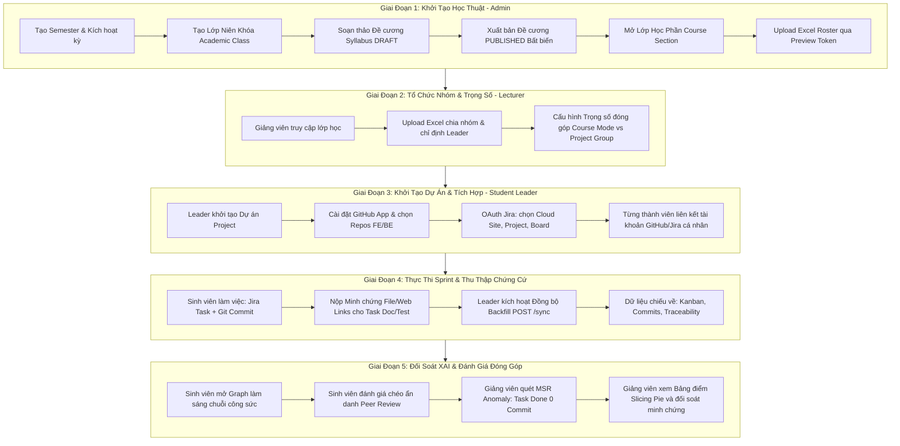

# Kiến Trúc Tổng Thể, Luồng Nghiệp Vụ Cốt Lõi & Kịch Bản Demo Đồ Án Tốt Nghiệp SAGA

> **Tài liệu chuẩn mực phục vụ Bảo vệ Đồ án Tốt nghiệp (Capstone Defense Guide)**  
> **Dự án:** SAGA (Student Achievement & Governance Analytics)  
> **Phạm vi:** Kết nối đồng bộ xuyên suốt giữa **Backend (`saga-be`)** và **Frontend (`saga-fe`)**

---

## 1. Bối Cảnh Thực Tế & Triết Lý Giải Pháp (The Problem & The Hook)

### 🚨 Nỗi đau lớn nhất trong các đồ án tốt nghiệp CNTT (FPT University):
1. **Vấn nạn "Free-rider" (Ký sinh đồ án)**: Trong nhóm 4–5 sinh viên, luôn có nguy cơ 1–2 thành viên lười biếng, ỷ lại nhưng cuối kỳ vẫn muốn nhận điểm ngang bằng với người gánh team.
2. **"Báo cáo khống" trên Jira**: Sinh viên kéo các thẻ công việc sang `DONE` vào đêm trước buổi bảo vệ Sprint mà thực chất không hề có dòng mã nguồn, bài kiểm thử hay tài liệu thực tế nào được bàn giao.
3. **Giảng viên bị quá tải giám sát**: Một giảng viên phụ trách 5–10 nhóm với hàng trăm commits và hàng nghìn đầu việc, không thể đủ thời gian đọc từng dòng Git commit để phân định công sức ai làm nhiều ai làm ít.
4. **Xung đột nội bộ khi chấm điểm chéo (Peer Review cảm tính)**: Sinh viên chấm điểm cho nhau dựa trên mức độ thân thiết thay vì dựa trên minh chứng năng lực thực tế.

### 💡 Triết lý giải pháp của SAGA: "Minh Bạch Dựa Trên Dữ Liệu (Data-Driven Transparency)"
Hệ thống SAGA không dựa vào lời khai báo chủ quan, mà tự động thu thập và đối soát **Minh chứng kỹ thuật thực tế (Empirical Evidence)** từ:
- **Jira Software**: Sprint, Epic, User Story, Task, Trạng thái bàn giao.
- **GitHub**: Commit log, Thay đổi dòng code ($+/-$), Pull Request reviews, Tần suất push.
- **Đồ thị Tri thức Neo4j & Cytoscape.js**: Nối chuỗi minh chứng bất biến:
  $$\text{(:Student)} \xrightarrow{\text{[:ASSIGNED\_TO]}} \text{(:JiraTask)} \xleftarrow{\text{[:IMPLEMENTS]}} \text{(:Commit)}$$
- **Mô hình Cổ phần Động Slicing Pie**: Đánh giá tỷ lệ phần trăm đóng góp công bằng theo 4 nhóm trọng số công việc (Code, Test, Doc, Research) kết hợp hệ số đồng đẳng $P$.

---

## 2. Bản Đồ 5 Giai Đoạn Vận Hành Cốt Lõi (End-to-End Main Flow)

Toàn bộ vòng đời của hệ thống SAGA trải qua 5 giai đoạn liên tục:



---

## 3. Cơ Chế Thu Thập & Đối Soát Minh Chứng Toàn Diện (Evidence Engine)

### 📌 A. Minh chứng Kỹ thuật (Code Commits)
- Sinh viên commit code tuân theo quy ước chứa mã Jira Task: `feat: [FE][SAGA-15] Xay dung UI Traceability Graph`.
- Hệ thống backend tự động phân tích biểu thức chính quy (Regex `SAGA-\\d+`), ánh xạ commit vào Task tương ứng và tạo cạnh liên kết `[:IMPLEMENTS]` trên đồ thị Neo4j.

### 📌 B. Minh chứng Phi kỹ thuật (Non-Code Tasks: Document, Testing, Research)
- Với các đầu việc về viết tài liệu (SRS, SDS), kiểm thử (Test Matrix, Test Cases) hoặc nghiên cứu giải pháp (PoC, Benchmark):
- **Phía Sinh viên (`/student/sprint-progress`)**: 
  - Mở thẻ Task trên bảng Kanban ➔ Vào tab **"Tài liệu & Minh chứng" (`TaskEvidencePanel`)**.
  - Cho phép upload file minh chứng (`.pdf`, `.xlsx`, `.docx`, ảnh) và gắn liên kết Web (Figma design, Google Docs, tài liệu đặc tả).
  - Tự động sinh mã băm đối soát bất biến `Evidence Hash`.
- **Phía Giảng viên (`/lecturer/courses/[courseId]/grades`)**:
  - Backend [TaskEvidenceController.java](file:///d:/Capstone/saga%20workspace/saga-be/src/main/java/com/saga/be/controller/TaskEvidenceController.java) và [TaskFileService.java](file:///d:/Capstone/saga%20workspace/saga-be/src/main/java/com/saga/be/service/evidence/TaskFileService.java) cấp quyền `requireCanRead()` cho cả Giảng viên và Sinh viên.
  - Trên màn hình Bảng điểm đóng góp, Giảng viên xem chi tiết tỷ lệ phân bổ của sinh viên ở lát cắt **Document %**, **Testing %** và **Research %**. Nếu task không có file/link, hệ thống tự động gắn cờ cảnh báo `Chưa có minh chứng (NO_EVIDENCE)`.

---

## 4. Cơ Chế Đánh Giá Chéo Đồng Đẳng (Sprint Peer Review)

- **Cửa sổ đánh giá (Peer Review Window)**:
  - Khi Sprint đang diễn ra bình thường: Khóa form để sinh viên tập trung làm việc.
  - **48 giờ trước hạn kết thúc (`endDate - 48h`)**: Mở sớm để nhóm chuẩn bị nghiệm thu Sprint.
  - **Khi Sprint đã kết thúc (`state = closed`)**: Cửa sổ **LUÔN MỞ** (`isSprintClosed = true`) cho phép sinh viên vào đánh giá cho Sprint vừa hoàn thành.
- **Khung Rubric 4 tiêu chí chuẩn hóa**:
  1. *Hoàn thành nhiệm vụ*: Tiến độ và khối lượng công việc được giao.
  2. *Kỹ năng & Đóng góp kỹ thuật*: Chất lượng code, test, tài liệu bàn giao.
  3. *Tinh thần trách nhiệm*: Tính chủ động, đúng hạn, tuân thủ kỷ luật nhóm.
  4. *Phối hợp & Trao đổi*: Mức độ giao tiếp, hỗ trợ đồng đội và review công việc.
- **Nguyên tắc Bảo mật & Ẩn danh**:
  - Hệ thống tự động lọc bỏ bản thân khỏi danh sách cần đánh giá (*Anti self-review*).
  - Mỗi sinh viên chỉ đánh giá một thành viên một lần trong Sprint (*Khóa gửi lặp lại*).
  - Sinh viên **hoàn toàn không xem được điểm số người khác chấm cho mình** để tránh hiềm khích nội bộ.
  - **Giảng viên xem toàn bộ ma trận đánh giá** tại `/lecturer/courses/[courseId]/peer-reviews` để nắm bắt nội tình nhóm.
- **Hệ số đồng đẳng $P$ (Peer Multiplier)**: Điểm đánh giá chéo trung bình được chuẩn hóa thành hệ số $P$ (quanh mốc 1.0) nhân trực tiếp với điểm cơ sở để điều chỉnh tỷ lệ cổ phần Slicing Pie.

---

## 5. Cơ Chế Phát Hiện Gian Lận & Giám Sát Mạng Lưới (XAI & SNA)

### 🚨 A. Bắt lỗi Báo cáo khống (MSR Anomaly Alert — Mining Software Repositories)
- **Định nghĩa**: Task Jira được đánh dấu trạng thái `DONE`, nhưng không có bất kỳ Commit nào liên kết (`0 commits linked`).
- **Vị trí hiển thị trên giao diện Giảng viên (`/lecturer/courses/[id]/graph`)**:
  - **Badge đỏ trên thanh thống kê (Pipeline Stats Bar)**: Hiển thị nổi bật cảnh báo `[ ⚠️ {n} Task hoàn thành chưa có Commit liên kết ]`.
  - **Bộ lọc Anomaly Filter**: Dropdown có tùy chọn **"Hoàn thành chưa có Commit (MSR Anomaly)"** (`DONE_NO_COMMIT`) giúp Giảng viên lọc ngay lập tức danh sách các Task nghi vấn gian lận.
  - **Đồ thị Cytoscape Canvas**: Node task tự động đổi màu cam đỏ nhấp nháy (`animate-pulse`).

### 🚨 B. Phân tích mạng xã hội SNA (Social Network Analysis)
- Dựa trên mạng lưới đánh giá Pull Request và trao đổi công việc trong nhóm:
  - **Key Contributor (Nòng cốt gánh team)**: Thành viên có hệ số trung tâm bậc *Degree Centrality* $> 85\%$, review PR cho hầu hết thành viên khác.
  - **Ghosting Anomaly (Thành viên cô lập/Ký sinh)**: Thành viên có lượt tương tác và review bằng 0 ($Degree Centrality \approx 0$).

---

## 6. Bảng Điểm Đóng Góp Slicing Pie & Đối Soát Minh Chứng

- **Lưu ý nghiệp vụ quan trọng**: Hệ thống SAGA **không chấm điểm thang 10**, mà tự động tính toán **Tỷ lệ phần trăm đóng góp công sức cuối cùng (`Final Contribution Percentage %`)** theo mô hình Slicing Pie. Tỷ lệ % này phản ánh chính xác tỷ trọng đóng góp của từng cá nhân để Giảng viên quy đổi ra điểm đồ án chính thức.
- **Màn hình Bảng điểm đóng góp (`/lecturer/courses/[id]/grades`)**:
  - Hiển thị bảng ma trận minh chứng: Điểm SP, Code %, Testing %, Document %, Research %, Công việc %, Đánh giá chéo $\times P$, Tỷ lệ đóng góp cuối cùng %.
  - Nút **"Minh chứng"**: Mở rộng phân rã chi tiết đóng góp qua từng Sprint và liệt kê các cờ cảnh báo đối soát.
  - Tỷ lệ cuối là dữ liệu canonical do Backend tính từ trọng số, minh chứng và Peer Review. Giảng viên chỉ xem, mở minh chứng và đối soát cảnh báo; FE không cho sửa trực tiếp tỷ lệ này.

---

## 7. Case Study Thực Chiến: Đồ Án "SAGA Platform" (Nhóm 5 - Lớp SWP391)

Dưới đây là kịch bản mô phỏng nhóm sinh viên 4 người với 4 kiểu hành vi điển hình trong đồ án:

```text
┌──────────────────────────────────────────────────────────────────────────────────┐
│                   CASE STUDY NHÓM 5: ĐỒ ÁN SAGA PLATFORM                         │
├──────────────────┬─────────────────┬───────────────────┬─────────────────────────┤
│ 👤 Thành viên A  │ 👤 Thành viên B │ 👤 Thành viên C   │ 👤 Thành viên D         │
│ (Trưởng nhóm)    │ (Frontend Dev)  │ (QA / Tester)     │ (Ký sinh Free-rider)   │
│ Code chính & Lead│ UI & Components │ Viết Test & Doc   │ Báo cáo khống trên Jira │
└──────────────────┴─────────────────┴───────────────────┴─────────────────────────┘
```

### 👤 1. Thành viên A (Team Leader — Nguyễn Văn An):
- **Thực tế**: Kiến trúc sư chính, 52 Commits, 14 Jira Tasks, review 21 PRs.
- **Kết quả SAGA**: Degree Centrality = 0.94 ➔ Nhận huy hiệu **`Key Contributor`**. Tỷ lệ Slicing Pie: **~38%**.

### 👤 2. Thành viên B (Frontend Dev — Trần Thị Bình):
- **Thực tế**: Làm 8 Jira Tasks UI, 28 Commits, đính kèm link Figma.
- **Kết quả SAGA**: 100% Tasks có commits linked đối soát. Tỷ lệ Slicing Pie: **~28%**.

### 👤 3. Thành viên C (QA & Documentation — Lê Hoàng Cường):
- **Thực tế**: Làm 5 Tasks Test Cases và SRS. Ít commit code nhưng **upload file Excel kiểm thử và PDF SRS vào Task Evidence**.
- **Kết quả SAGA**: Hệ thống ghi nhận công sức ở lát cắt **TEST & DOC**, không bị thiệt thòi như các công cụ chỉ đếm dòng code. Tỷ lệ Slicing Pie: **~22%**.

### 🚨 4. Thành viên D (Free-rider / Báo cáo khống — Phạm Văn Dũng):
- **Thực tế**: Không làm gì, trước ngày bảo vệ kéo 3 tasks sang `DONE`. Không có commit, không review PR.
- **SAGA bóc trần**:
  - **MSR Anomaly**: 3 Task DONE nhưng 0 commit trỏ về ➔ Hệ thống gắn cờ đỏ nhấp nháy cảnh báo báo cáo khống.
  - **Ghosting Anomaly**: Degree Centrality = 0.
  - **Peer Review**: Cả nhóm chấm Dũng 1 sao kèm nhận xét không hợp tác.
  - Tỷ lệ Slicing Pie tụt xuống **~12%** theo dữ liệu minh chứng và Peer Review; giảng viên dùng bảng đối soát để giải thích kết quả.

---

## 8. Kịch Bản Trình Bày Demo Trước Hội Đồng (10 – 12 Phút)

| Thời Lượng | Vai Trò & Màn Hình | Thao Tác Trực Tiếp (Screen Action) | Lời Thoại Thuyết Minh (Verbatim Script) |
| :--- | :--- | :--- | :--- |
| **Phút 1 – 2** | **Slide Giới thiệu** | Chiếu slide vấn nạn Free-rider và Báo cáo khống. | *"Kính thưa Hội đồng, trong đồ án nhóm sinh viên, nỗi đau lớn nhất là tình trạng ỷ lại và báo cáo khống trên Jira vào đêm trước buổi bảo vệ. Hệ thống SAGA ra đời với triết lý: **Minh bạch dựa trên Dữ liệu (Data-Driven Transparency)** — Tự động thu thập minh chứng kỹ thuật từ Jira và GitHub, dựng Đồ thị tri thức Neo4j và tính tỷ lệ đóng góp công bằng theo mô hình Slicing Pie."* |
| **Phút 3 – 5** | **Sinh viên An**<br>`/student/graph`<br>`/student/sprint-progress` | 1. Mở Traceability Graph, rê chuột vào tên An ➔ Hiệu ứng **Neighborhood Dimming** làm sáng rực chuỗi: `An ➔ JiraTask ➔ Commit`.<br>2. Bấm vào 1 Commit để xem mã băm, số dòng $+/-$ và link GitHub.<br>3. Mở Task SRS của bạn Cường trên Kanban ➔ Cho xem tab **Tài liệu & Minh chứng** có file PDF/Excel đính kèm. | *"Ở góc nhìn sinh viên, toàn bộ công sức được chứng minh bằng chuỗi liên kết không thể chối cãi: Người làm ➔ Đầu việc Jira ➔ Commit Git thật. Với các đầu việc phi kỹ thuật như tài liệu đặc tả của bạn Cường, hệ thống cho phép đính kèm file minh chứng và băm mã đối soát để ghi nhận công bằng."* |
| **Phút 6 – 7** | **Sinh viên An**<br>`/student/assessment` | 1. Chọn Sprint 3 (trạng thái `Đã đóng · được chấm`).<br>2. Bấm **Đánh giá ngay** cho đồng đội theo Rubric 4 tiêu chí.<br>3. Nhấn gửi ➔ Thẻ chuyển sang `Đã gửi đánh giá`. | *"Vào cuối mỗi Sprint, hệ thống mở cửa sổ Đánh giá chéo ẩn danh. Sinh viên chấm điểm theo Rubric chuẩn hóa và hoàn toàn không thấy người khác chấm mình bao nhiêu sao để tránh gây chia rẽ nội bộ."* |
| **Phút 8 – 10** | **Giảng viên**<br>`/lecturer/courses/[id]/graph`<br>`/lecturer/courses/[id]/grades` | 1. Mở đồ thị giám sát ➔ Chỉ vào Badge đỏ: `Task hoàn thành chưa có Commit`.<br>2. Chọn bộ lọc **MSR Anomaly** để màn hình lọc ngay các task cần đối soát.<br>3. Sang trang Bảng điểm đóng góp ➔ Cho Hội đồng xem bảng Slicing Pie phân bổ % từng người.<br>4. Mở **Minh chứng** để xem phân rã theo Sprint và cảnh báo của thành viên. | *"Ở góc nhìn giảng viên, hệ thống tự động gắn cờ cảnh báo các Task DONE nhưng chưa có Commit liên kết. Bảng đóng góp Slicing Pie trình bày tỷ lệ canonical và cho phép mở minh chứng để giải thích số liệu; giảng viên không chỉnh tay tỷ lệ cuối."* |
| **Phút 11 – 12**| **Slide Kiến trúc** | Chiếu kiến trúc Polyglot Persistence: Spring Boot 4 + MySQL (Source of Truth) + Neo4j (Graph Read Model) + Redis + Next.js 16. | *"SAGA đạt hiệu năng cao nhờ kiến trúc Polyglot: MySQL đảm bảo tính toàn vẹn giao dịch học thuật, Neo4j xử lý truy vấn đồ thị quan hệ trong vài mili-giây, và Next.js 16 mang lại trải nghiệm 60 FPS mượt mà. Nhóm xin sẵn sàng lắng nghe câu hỏi từ Hội đồng."* |

---

## 9. Bộ Giáp Phản Biện Hội Đồng (Defense Q&A Armor)

| Câu hỏi của Thầy/Cô Hội đồng | Câu trả lời chuẩn xác kỹ thuật & nghiệp vụ |
| :--- | :--- |
| **1. Nếu sinh viên dùng bot spam commit hoặc commit vô nghĩa (+1 dòng dấu cách) thì hệ thống có bị lừa không?** | SAGA không đếm số commit đơn thuần. Để commit được tính vào công sức, commit đó phải: (1) Thuộc repository chính thức của dự án, (2) Nằm trên branch hợp lệ, (3) Gắn với Jira Task được giao, và (4) Đi qua hệ số đồng đẳng $P$ từ chính các bạn cùng nhóm chấm điểm chéo. Ngoài ra, Giảng viên có thể xem trực tiếp biến động dòng code $+/-$ và diff trên giao diện đối soát. |
| **2. Tại sao hệ thống lại dùng cả MySQL và Neo4j? Sao không dùng 1 loại DB cho đơn giản?** | Đây là mô hình **Polyglot Persistence chuẩn SE**: MySQL đóng vai trò **Source of Truth** đảm bảo các giao dịch ACID (tài khoản, đề cương, sinh viên, phân nhóm). Nhưng với các truy vấn đồ thị nhiều tầng `(:Student) ➔ (:Task) ➔ (:Commit)` và tính toán hệ số mạng lưới (Degree Centrality), câu lệnh SQL sẽ đòi hỏi hàng chục phép `JOIN` làm nghẽn hệ thống. Neo4j đóng vai trò **Graph Read Model** chuyên biệt, cho tốc độ phản hồi dưới 10ms. |
| **3. Nếu Jira hoặc GitHub bị sập hoặc mất kết nối thì hệ thống có chạy được không?** | Hệ thống áp dụng cơ chế **Chiếu dữ liệu (Projection Read Model)**. Sau mỗi lần đồng bộ, dữ liệu được nạp vào cơ sở dữ liệu nội bộ của SAGA. Khi Jira/GitHub gặp sự cố mạng, sinh viên và giảng viên vẫn tra cứu tiến độ, xem đồ thị và chấm điểm bình thường từ dữ liệu đã lưu trữ. |
